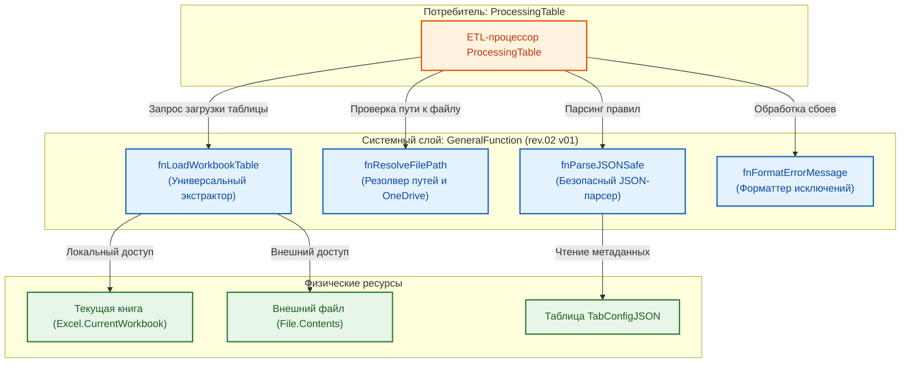

# РУКОВОДСТВО ПО СИСТЕМНЫМ СЕРВИСНЫМ ФУНКЦИЯМ: «GENERALFUNCTION»

---

## 1. ВВЕДЕНИЕ И ПАСПОРТ БИБЛИОТЕКИ

### 1.1. Назначение компонента

Библиотека **`GeneralFunction`** представляет собой низкоуровневый системный слой экосистемы **HorizonBI**, реализованный на языке Power Query (M). Библиотека инкапсулирует базовые платформенные операции, необходимые для бесперебойного функционирования ETL-процессора `ProcessingTable`:

* Универсальный доступ к книгам и таблицам Microsoft Excel с автоматическим разрешением контекста исполнения (текущий открытый файл vs внешний закрытый файл на диске или в OneDrive).
* Проверка целостности файловых путей, нормализация абсолютных и относительных ссылок.
* Низкоуровневая валидация и безопасный парсинг служебных JSON-структур.
* Унифицированное логирование, перехват критических исключений M и форматирование диагностических сообщений об ошибках.

### 1.2. Паспорт компонента

| Параметр                                             | Значение                                                                                                                 |
| :----------------------------------------------------------- | :------------------------------------------------------------------------------------------------------------------------------- |
| **Имя запроса в Power Query**               | `GeneralFunction`                                                                                                              |
| **Текущая версия**                        | `rev.02 v01`                                                                                                                   |
| **Область применения**                | Системная поддержка процессора`ProcessingTable` и вспомогательных скриптов |
| **Тип возвращаемого значения** | Агрегатная запись функций`FunctionRecord = [...]`                                                       |
| **Зависимости**                             | Отсутствуют (базовые функции Power Query Engine)                                                        |

### 1.3. Архитектурная схема взаимодействия



---

## 2. КАТАЛОГ СИСТЕМНЫХ ФУНКЦИЙ

### 2.1. `fnLoadWorkbookTable` (Универсальный загрузчик таблиц)

* **Назначение:** Извлечение объекта смарт-таблицы Excel по имени с автоматическим выбором между текущей активной книгой и внешним файлом.
* **Сигнатура M:**
  ```m
  (tableName as text, optional filePath as nullable text) as table
  ```
* **Параметры:**
  * `tableName`: точное имя целевой смарт-таблицы (например, `"TabSpecificationWork_1"`).
  * `filePath`: абсолютный путь к файлу `.xlsx` (если параметр `null` или пустая строка `""`, поиск выполняется в текущей активной книге через `Excel.CurrentWorkbook()`).
* **Алгоритм работы:**
  1. Если `filePath` не указан: обращается к `Excel.CurrentWorkbook()`, выполняет фильтрацию по полю `[Name] = tableName` и извлекает содержимое из столбца `[Content]`.
  2. Если `filePath` передан: открывает файл через `Excel.Workbook(File.Contents(filePath))`, выполняет фильтрацию по `[Item] = tableName` или `[Name] = tableName` и извлекает данные из столбца `[Data]`.
  3. Если таблица не найдена, генерирует детерминированную ошибку M: `"Целевая таблица с именем '<tableName>' не найдена."`.

---

### 2.2. `fnResolveFilePath` (Валидатор и резолвер файловых путей)

* **Назначение:** Проверка доступности файла на диске, нормализация разделителей путей (`\` vs `/`), защита от битых ссылок в синхронизируемых каталогах OneDrive.
* **Сигнатура M:**
  ```m
  (filePath as nullable text) as record
  ```
* **Возвращаемое значение:** Запись вида:
  ```m
  [
      IsValid = true,          // logical: признак корректности пути
      IsLocal = false,         // logical: true если это текущая книга (путь null)
      CleanPath = "C:\...",    // text: нормализованный путь без лишних пробелов
      ErrorMessage = null      // text / null: текст ошибки при сбое
  ]
  ```
* **Обработка краевых условий:**
  * Пустые строки и пробельные символы приводятся к состоянию `IsLocal = true`.
  * Проверяется наличие двоеточия для абсолютных путей Windows (`C:\...`) или сетевых UNC-путей (`\\server\...`).

---

### 2.3. `fnParseJSONSafe` (Отказоустойчивый парсер JSON)

* **Назначение:** Безопасное преобразование строкового JSON-конфигуратора в нативные структуры Power Query (`Record` / `List`) с детальной диагностикой синтаксических ошибок.
* **Сигнатура M:**
  ```m
  (jsonText as text, optional contextTag as nullable text) as any
  ```
* **Параметры:**
  * `jsonText`: текстовая строка в формате JSON.
  * `contextTag`: служебный тег для логирования (например, `"TabSpecificationWork_1/MacroBlock_1"`).
* **Алгоритм работы:**
  Выполняет вызов `try Json.Document(jsonText)`. В случае сбоя перехватывает исключение и генерирует структурированное сообщение об ошибке с указанием проблемного контекста и фрагмента некорректного JSON.

---

### 2.4. `fnFormatErrorMessage` (Стандартизатор диагностических сообщений)

* **Назначение:** Формирование единообразных, понятных бизнес-пользователю сообщений об ошибках ETL-процессора с указанием источника проблемы, этапа конвейера и корректирующего действия.
* **Сигнатура M:**
  ```m
  (stageName as text, entityName as text, details as text) as text
  ```
* **Формат выходного сообщения:**
  $$
  \text{"[HorizonBI Engine] Ошибка на этапе '\{stageName\}' при обработке '\{entityName\}': \{details\}"}
  $$

---

## 3. РЕАЛИЗАЦИЯ И ИСХОДНЫЙ КОД БИБЛИОТЕКИ

```m
// =============================================================================================
//
// СИСТЕМНАЯ БИБЛИОТЕКА 'GeneralFunction'
//
// версия rev.02 v01
// =============================================================================================

let
    // -----------------------------------------------------------------------------------------
    // Функция: fnLoadWorkbookTable
    // -----------------------------------------------------------------------------------------
    fnLoadWorkbookTable = (tableName as text, optional filePath as nullable text) as table =>
    let
        isLocal = (filePath = null or Text.Trim(filePath) = ""),
        sourceData = if isLocal then
            let
                currentWb = Excel.CurrentWorkbook(),
                filtered = Table.SelectRows(currentWb, each [Name] = tableName),
                resultTable = if Table.RowCount(filtered) = 1 then filtered{0}[Content]
                              else error "Целевая таблица с именем '" & tableName & "' не найдена в ТЕКУЩЕЙ книге."
            in
                resultTable
        else
            let
                fileBinary = try File.Contents(filePath) 
                             otherwise error "Не удалось прочитать файл по указанному пути: '" & filePath & "'.",
                externalWb = Excel.Workbook(fileBinary),
                filtered = Table.SelectRows(externalWb, each [Item] = tableName or [Name] = tableName),
                resultTable = if Table.RowCount(filtered) >= 1 then filtered{0}[Data]
                              else error "Целевая таблица с именем '" & tableName & "' не найдена во внешнем файле '" & filePath & "'."
            in
                resultTable
    in
        sourceData,

    // -----------------------------------------------------------------------------------------
    // Функция: fnResolveFilePath
    // -----------------------------------------------------------------------------------------
    fnResolveFilePath = (filePath as nullable text) as record =>
    let
        isLocal = (filePath = null or Text.Trim(filePath) = ""),
        cleanPath = if isLocal then null else Text.Trim(filePath),
        isValid = isLocal or (Text.Length(cleanPath) >= 3 and (Text.Middle(cleanPath, 1, 2) = ":\" or Text.StartsWith(cleanPath, "\\"))),
        errorMsg = if isValid then null else "Указан некорректный формат пути к файлу: '" & Text.From(filePath) & "'."
    in
        [
            IsValid = isValid,
            IsLocal = isLocal,
            CleanPath = cleanPath,
            ErrorMessage = errorMsg
        ],

    // -----------------------------------------------------------------------------------------
    // Функция: fnParseJSONSafe
    // -----------------------------------------------------------------------------------------
    fnParseJSONSafe = (jsonText as text, optional contextTag as nullable text) as any =>
    let
        tag = if contextTag = null then "" else " [" & contextTag & "]",
        parseResult = try Json.Document(jsonText),
        output = if parseResult[HasError] then
            error "Ошибка парсинга JSON конфигурации" & tag & ". Проверьте корректность синтаксиса JSON (кавычки, скобки, запятые)."
        else
            parseResult[Value]
    in
        output,

    // -----------------------------------------------------------------------------------------
    // Функция: fnFormatErrorMessage
    // -----------------------------------------------------------------------------------------
    fnFormatErrorMessage = (stageName as text, entityName as text, details as text) as text =>
        "[HorizonBI Engine] Ошибка на этапе '" & stageName & "' при обработке '" & entityName & "': " & details,

    // =========================================================================================
    // РЕГИСТРАЦИЯ ФУНКЦИЙ В СИСТЕМНОЙ ЗАПИСИ
    // =========================================================================================
    FunctionRecord = [
        fnLoadWorkbookTable  = fnLoadWorkbookTable,
        fnResolveFilePath    = fnResolveFilePath,
        fnParseJSONSafe      = fnParseJSONSafe,
        fnFormatErrorMessage = fnFormatErrorMessage
    ]
in
    FunctionRecord
```

---

## 4. КАТАЛОГ СВЯЗЕЙ И ПЕРЕКРЁСТНЫЕ ССЫЛКИ

* [Руководство по эксплуатации ETL-процессора ProcessingTable](../03__ETL-processing/README-etl-processor.md)
* [Руководство по библиотекам функций валидации и трансформации (UtilsFunction)](../02__utils-function-processing/README-utils-function.md)
* [Руководство по функциям нормализации справочников (HandbookFunction)](../04__handbook-function-processing/README-handbook-function.md)
* [Спецификация Master Data шаблона (README-work_spec)](../../07__template-excel/20__work_spec/README-work_spec.md)

---

**Конец документа**
