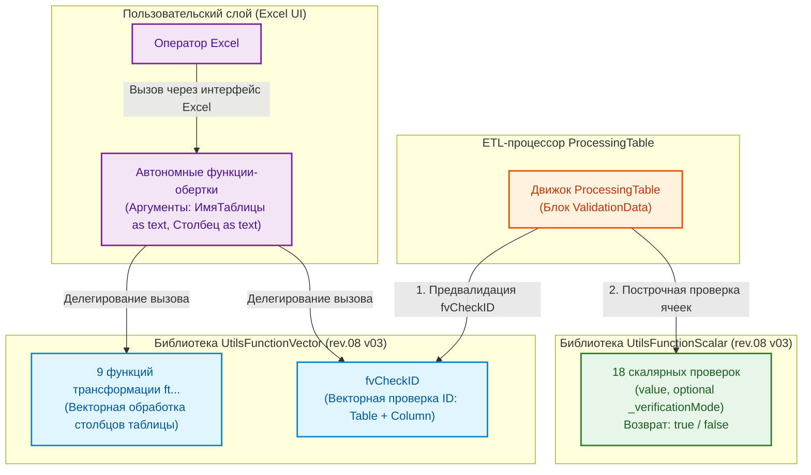
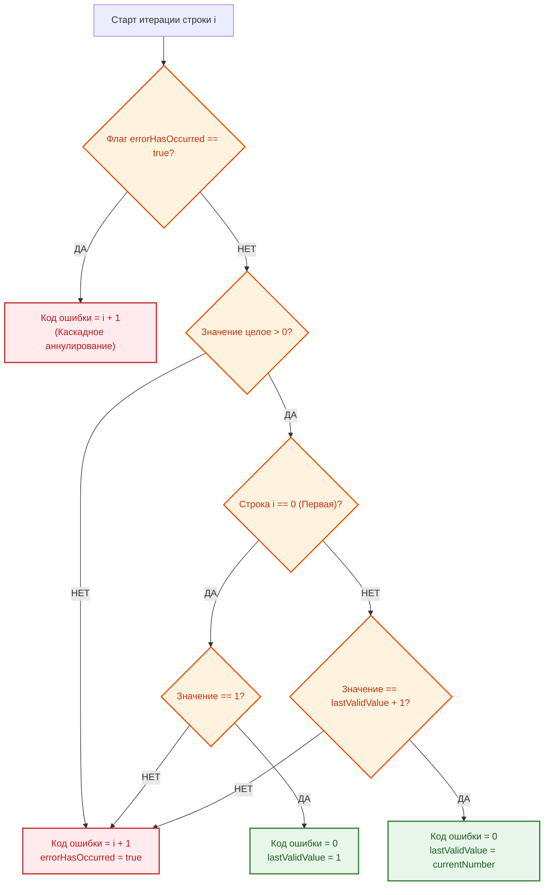

# РУКОВОДСТВО ПО БИБЛИОТЕКАМ СЛУЖЕБНЫХ ФУНКЦИЙ: «UTILS FUNCTION SCALAR» И «UTILS FUNCTION VECTOR»

---

## 1. ВВЕДЕНИЕ И АРХИТЕКТУРА БИБЛИОТЕК

### 1.1. Назначение и разделение ответственности

В экосистеме **HorizonBI** аналитическая обработка и контроль качества данных строго разделены на два функциональных контура:

1.  **Скалярный контур (`UtilsFunctionScalar`):** Набор чистых, детерминированных микро-функций. Каждая функция проверяет ровно одну ячейку (скалярное значение) и возвращает булев результат (`true` — валидно, `false` — ошибка). Этот контур оптимизирован для построчной проверки строк в ETL-процессоре `ProcessingTable`.
2.  **Векторный контур (`UtilsFunctionVector`):** Набор функций пакетной обработки, работающих с объектами `table`. Выполняет массовые структурные трансформации (регистр, нормализация дат, переупорядочивание) и сложные проверки с сохранением внутреннего состояния (каскадная проверка первичных ключей `fvCheckID`).

### 1.2. Паспорт компонентов

| Параметр                          | `UtilsFunctionScalar`                      | `UtilsFunctionVector`                          |
| :-------------------------------- | :----------------------------------------- | :--------------------------------------------- |
| **Имя запроса в Power Query**     | `UtilsFunctionScalar`                      | `UtilsFunctionVector`                          |
| **Текущая версия**                | `rev.08 v03`                               | `rev.08 v03`                                   |
| **Область применения**            | Построчная валидация в `ProcessingTable`   | Пакетные трансформации и векторный `fvCheckID` |
| **Тип возвращаемого значения**    | `logical` (`true` / `false`)               | `table` или `list`                             |
| **Формат поставки в Power Query** | Агрегатная запись `FunctionRecord = [...]` | Агрегатная запись `FunctionRecord = [...]`     |
| **Состав библиотеки**             | **18 скалярных функций**                   | **9 трансформаций + 1 проверка `fvCheckID`**   |

### 1.3. Архитектурная схема взаимодействия



---

## 2. БИБЛИОТЕКА «UTILSFUNCTIONSCALAR» (СПРАВОЧНИК СКАЛЯРНЫХ ФУНКЦИЙ)

### 2.1. Концепция режимов валидации (`_verificationMode`)

Большинство скалярных функций поддерживают опциональный параметр `optional _verificationMode as logical`:

- **Жесткий режим (Hard Mode — по умолчанию: `true` или `null`):** Пустые ячейки (`null` или пустая строка `""`) признаются **НЕВАЛИДНЫМИ** (`false`).
- **Мягкий режим (Soft Mode — передано `false`):** Пустые ячейки признаются **ВАЛИДНЫМИ** (`true`). Если же ячейка заполнена, она проверяется по всем строгим правилам типа.

_Исключение:_ Функция `fvCheckNonEmpty_scalar` не имеет мягкого режима, так как ее единственная задача — выявлять пустые ячейки.

---

### 2.2. Каталог скалярных функций

#### 1. `fvCheckNonEmpty_scalar`

- **Назначение:** Проверка ячейки на наличие данных (запрет `null` и пробельных строк).
- **Сигнатура M:**
  ```m
  (value as any) as logical
  ```
- **Логика:** Возвращает `false`, если значение равно `null` или является текстом, состоящим только из пробелов (`Text.Trim(Text.From(value)) = ""`).

#### 2. `fvCheckInteger_scalar`

- **Назначение:** Проверка значения на принадлежность к целым числам.
- **Сигнатура M:**
  ```m
  (value as any, optional _verificationMode as logical) as logical
  ```
- **Логика:** Преобразует значение в число через `try Number.From(value)`. Проверяет равенство `Number.Round(n) = n`.

#### 3. `fvCheckFloat_scalar`

- **Назначение:** Проверка значения на принадлежность к любым вещественным числам (целым или с дробной частью).
- **Сигнатура M:**
  ```m
  (value as any, optional _verificationMode as logical) as logical
  ```
- **Логика:** Проверяет успешность выполнения `(try Number.From(value) otherwise null) <> null`.

#### 4. `fvCheckDate_scalar`

- **Назначение:** Проверка корректности календарной даты.
- **Сигнатура M:**
  ```m
  (value as any, optional _verificationMode as logical) as logical
  ```
- **Логика:** Распознает нативные типы `date`/`datetime`, а также текстовые даты формата `ДД.ММ.ГГГГ` или `ДД.ММ.ГГ`. При двухзначном годе: $\ge 31 \rightarrow 19xx$, $< 31 \rightarrow 20xx$. Проверяет реальность календарного дня через конструктор `#date(year, month, day)`.

#### 5. `fvCheckINN_LLC_scalar`

- **Назначение:** Проверка 10-значного ИНН юридического лица РФ с расчетом контрольной суммы.
- **Сигнатура M:**
  ```m
  (value as any, optional _verificationMode as logical) as logical
  ```
- **Алгоритм:**
  1. Проверяет, что строка содержит ровно 10 цифр.
  2. Вычисляет контрольную сумму для 10-й цифры с весовыми коэффициентами: $\{2, 4, 10, 3, 5, 9, 4, 6, 8\}$.
  3. Контрольная цифра = $((\sum_{i=1}^{9} d_i \cdot w_i) \pmod{11}) \pmod{10}$.
  4. Сверяет вычисленный остаток с фактической 10-й цифрой.

#### 6. `fvCheckINN_Personal_scalar`

- **Назначение:** Проверка 12-значного ИНН физического лица / ИП РФ с расчетом двух контрольных сумм.
- **Сигнатура M:**
  ```m
  (value as any, optional _verificationMode as logical) as logical
  ```
- **Алгоритм:**
  1. Проверяет длину строго в 12 цифр.
  2. Контрольная цифра 11: веса $\{7, 2, 4, 10, 3, 5, 9, 4, 6, 8\}$, контрольный остаток $((\sum d_i \cdot w_i) \pmod{11}) \pmod{10}$.
  3. Контрольная цифра 12: веса $\{3, 7, 2, 4, 10, 3, 5, 9, 4, 6, 8\}$, контрольный остаток $((\sum d_i \cdot w_i) \pmod{11}) \pmod{10}$.
  4. Возвращает `true` только при совпадении обеих контрольных цифр.

#### 7. `fvCheckSNILS_scalar`

- **Назначение:** Валидация СНИЛС по формату `XXX-XXX-XXX YY` и официальному алгоритму ПФР.
- **Сигнатура M:**
  ```m
  (value as any, optional _verificationMode as logical) as logical
  ```
- **Алгоритм:**
  1. Проверяет строгую длину 14 символов и наличие разделителей: дефисы на позициях 4 и 8, **пробел на позиции 12**.
  2. Извлекает первые 9 цифр и вычисляет контрольную сумму: $S = \sum_{i=1}^{9} d_i \cdot (10 - i)$.
  3. Если $S < 100 \rightarrow K = S$; если $S \in \{100, 101\} \rightarrow K = 0$; если $S > 101 \rightarrow R = S \pmod{101}$, $K = (\text{если } R = 100 \text{ то } 0 \text{ иначе } R)$.
  4. Сверяет $K$ с 2-значным числом $YY$ в конце строки.

#### 8. `fvCheckKPP_scalar`

- **Назначение:** Проверка формата КПП юридического лица (9 цифр).
- **Сигнатура M:**
  ```m
  (value as any, optional _verificationMode as logical) as logical
  ```
- **Логика:** Строка должна содержать ровно 9 цифровых символов `0-9`.

#### 9. `fvCheckTextLength_scalar`

- **Назначение:** Проверка длины текста на вхождение в заданный диапазон.
- **Сигнатура M:**
  ```m
  (value as any, _minLength as number, _maxLength as number, optional _verificationMode as logical) as logical
  ```
- **Логика:** Длина очищенной строки (`Text.Length(Text.Trim(Text.From(value)))`) должна удовлетворять условию: $\text{minLength} \le L \le \text{maxLength}$.

#### 10. `fvCheckIntegerRange_scalar`

- **Назначение:** Проверка вхождения целого числа в диапазон $[min, max]$.
- **Сигнатура M:**
  ```m
  (value as any, _minValue as number, _maxValue as number, optional _verificationMode as logical) as logical
  ```
- **Логика:** Значение должно быть валидным целым числом и удовлетворять условию $\text{minValue} \le N \le \text{maxValue}$.

#### 11. `fvCheckFloatRange_scalar`

- **Назначение:** Проверка вхождения любого вещественного числа в диапазон $[min, max]$.
- **Сигнатура M:**
  ```m
  (value as any, _minValue as number, _maxValue as number, optional _verificationMode as logical) as logical
  ```
- **Логика:** Значение преобразуется в число и проверяется на $\text{minValue} \le N \le \text{maxValue}$.

#### 12. `fvCheckDateRange_scalar`

- **Назначение:** Проверка вхождения даты в календарный интервал $[minDate, maxDate]$.
- **Сигнатура M:**
  ```m
  (value as any, _minDate as date, _maxDate as date, optional _verificationMode as logical) as logical
  ```
- **Логика:** Значение парсится по правилам `fvCheckDate_scalar`, после чего проверяется условие $\text{minDate} \le D \le \text{maxDate}$.

#### 13. `fvCheckPhone_scalar`

- **Назначение:** Проверка мобильного номера РФ по строгому корпоративному стандарту.
- **Сигнатура M:**
  ```m
  (value as any, optional _verificationMode as logical) as logical
  ```
- **Формат:** Строго `+7 XXX XXX-XX-XX` (длина ровно 16 символов, плюс, семерка, пробелы на позициях 3 и 7, дефисы на 11 и 14).

#### 14. `fvCheckEmail_scalar`

- **Назначение:** Валидация синтаксиса корпоративного и личного email-адреса.
- **Сигнатура M:**
  ```m
  (value as any, optional _verificationMode as logical) as logical
  ```
- **Правила:** Ровно один символ `@` (не в начале и не в конце), отсутствие пробелов, запрет точек в начале/конце имени пользователя, длина имени $\le 64$, длина домена $\le 255$, обязательное наличие точки в домене.

#### 15. `fvCheckBoolean_scalar`

- **Назначение:** Проверка логических значений.
- **Сигнатура M:**
  ```m
  (value as any, optional _verificationMode as logical) as logical
  ```
- **Допустимые значения:** Тип `logical` (`true`/`false`), числа `0` и `1`, строки `"true"`, `"false"`, `"1"`, `"0"` (регистронезависимо).

#### 16. `fvCheckPassportSeries_scalar`

- **Назначение:** Проверка серии паспорта гражданина РФ.
- **Сигнатура M:**
  ```m
  (value as any, optional _verificationMode as logical) as logical
  ```
- **Правило:** Строго 4 цифры (тип `text`, сохраняющий ведущие нули).

#### 17. `fvCheckPassportNumber_scalar`

- **Назначение:** Проверка номера паспорта гражданина РФ.
- **Сигнатура M:**
  ```m
  (value as any, optional _verificationMode as logical) as logical
  ```
- **Правило:** Строго 6 цифр (тип `text`, сохраняющий ведущие нули).

#### 18. `fvCheckPassportUnitCode_scalar`

- **Назначение:** Проверка кода подразделения органа, выдавшего паспорт РФ.
- **Сигнатура M:**
  ```m
  (value as any, optional _verificationMode as logical) as logical
  ```
- **Правило:** Формат `XXX-XXX` (длина 7 символов, дефис на 4-й позиции, 6 цифр).

---

## 3. БИБЛИОТЕКА «UTILSFUNCTIONVECTOR» (СПРАВОЧНИК ВЕКТОРНЫХ ФУНКЦИЙ)

### 3.1. Трансформационные функции (`ft...`)

Все векторные функции принимают в качестве первого аргумента имя таблицы в виде строки `_selectTableName as text`, что позволяет вызывать их в автономном режиме без передачи сложных объектов M.

#### 1. `ftCreateFullNameColumn`

- **Назначение:** Формирует столбец `FULL_NAME` из трех столбцов ФИО в формате «Фамилия И.О.» и размещает его на указанной позиции.
- **Сигнатура:**
  ```m
  (_selectTableName as text, _lastNameCol as text, _firstNameCol as text, _patronymicCol as text, _position as number) as table
  ```

#### 2. `ftGetFullNameColumn`

- **Назначение:** Возвращает результирующий список строк (`list`) с ФИО формата «Фамилия И.О.».
- **Сигнатура:**
  ```m
  (_selectTableName as text, _lastNameCol as text, _firstNameCol as text, _patronymicCol as text) as list
  ```

#### 3. `ftCapitalizeWords`

- **Назначение:** Преобразует каждое слово в указанных столбцах к формату с заглавной буквы (аналог `Text.Proper`).
- **Сигнатура:**
  ```m
  (_selectTableName as text, _columnList as list) as table
  ```

#### 4. `ftToUpperCase` / `ftToLowerCase`

- **Назначение:** Приведение текстовых столбцов к верхнему или нижнему регистру.
- **Сигнатура:**
  ```m
  (_selectTableName as text, _columnList as list) as table
  ```

#### 5. `ftTrimTextColumns`

- **Назначение:** Массовое удаление ведущих и замыкающих пробелов в текстовых полях.
- **Сигнатура:**
  ```m
  (_selectTableName as text, _columnList as list) as table
  ```

#### 6. `ftNormalizeDates`

- **Назначение:** Пакетная нормализация дат в столбце к системному типу `date` с коррекцией двухзначных годов.
- **Сигнатура:**
  ```m
  (_selectTableName as text, _columnName as text) as table
  ```

#### 7. `ftReorderColumnsStrict` / `ftRemoveColumnsStrict`

- **Назначение:** Строгое упорядочивание или удаление столбцов с обязательной валидацией их наличия (при отсутствии столбца генерируется ошибка).
- **Сигнатура:**
  ```m
  (_selectTableName as text, _columnList as list) as table
  ```

---

### 3.2. Специальная векторная валидация `fvCheckID`

- **Назначение:** Проверка целостности автоинкрементного первичного ключа `ID`.
- **Контракт:**
  ```m
  (_sourceTable as table, _columnName as text) as list
  ```
- **Бизнес-правила:**
  1. Первое значение в первой строке таблицы обязано быть равно строго **`1`**.
  2. Каждое последующее значение обязано быть строго на **`+1`** больше предыдущего ($ID_i = ID_{i-1} + 1$).
  3. Значения обязаны быть положительными целыми числами без пропусков (`null` запрещен).
- **Каскадная инвалидация (Stateful Accumulator):**
  Функция реализована на базе `List.Accumulate`. Как только в строке $K$ обнаруживается первая ошибка (разрыв инкремента или неверный тип), внутренний флаг `errorHasOccurred` переключается в состояние `true`. После этого **все последующие строки автоматически помечаются невалидными** кодами ошибок ($K, K+1, K+2 \dots N$).



---

## 4. МЕХАНИЗМ АВТОНОМНЫХ ФУНКЦИЙ-ОБЕРТОК (UI WRAPPERS)

В Microsoft Excel встроенный графический интерфейс вызова функций Power Query имеет дефект: при указании типа параметра `table` интерфейс отображает неработающий выпадающий список.

Для решения этой проблемы все функции, предназначенные для конечных пользователей, оформляются как **тонкие автономные обертки**, принимающие имя таблицы строкой `_selectTableName as text`:

```m
// ---------------------------------------------------------------------------------------------
// Автономная функция 'ftNormalizeDates' (Пример обертки)
// ---------------------------------------------------------------------------------------------
(
    _selectTableName as text,
    _columnName as text
) as table =>
let
    UF = UtilsFunctionVector,
    result = UF[ftNormalizeDates](
        _selectTableName,
        _columnName
    )
in
    result
```

_Правило архитектуры:_ Вся логика валидации существования таблицы и колонок сосредоточена внутри `UtilsFunctionVector`. Автономная функция содержит только делегирование вызова.

---

## 5. ИНТЕГРАЦИЯ С ЯЗЫКОМ «HORIZONBI» И ETL-ПРОЦЕССОРОМ

Внутри процессора `ProcessingTable` в блоке `ValidationData` вызовы функций осуществляются динамически:

```m
// Фрагмент вызова скалярной функции в ProcessingTable
scalarFunctionName = currentFunctionName & "_scalar",
optionalArgs = Record.Field(rulesForColumn, currentFunctionName),
allArgs = {cellValue} & optionalArgs,
isValid = Function.Invoke(Record.Field(UtilsFunctionScalar, scalarFunctionName), allArgs)
```

### Маппинг конфигурации JSON на вызовы M-функций:

```json
"ValidationData": [
  {
    "NUM PROJECT": {
      "fvCheckNonEmpty": [],
      "fvCheckTextLength": [13, 30]
    }
  },
  {
    "PRICE VAT UNIT $TOTAL": {
      "fvCheckNonEmpty": [],
      "fvCheckFloat": [],
      "fvCheckFloatRange": [0.0, 50000000.0]
    }
  }
]
```

---

## 6. КАТАЛОГ СВЯЗЕЙ И ПЕРЕКРЁСТНЫЕ ССЫЛКИ

- [Головное руководство проекта (README.md)](../../../../../README.md)
- [Руководство по эксплуатации ETL-процессора ProcessingTable](../03__ETL-processing/README-etl-processor.md)
- [Руководство по системным сервисным функциям (GeneralFunction)](../01__general-function-processing/README-general-function.md)
- [Руководство по функциям нормализации справочников (HandbookFunction)](../04__handbook-function-processing/README-handbook-function.md)
- [Спецификация Master Data шаблона (README-work_spec)](../../../07__template-excel/20__work_spec/README-work_spec.md)

---

## 7. ДИАГНОСТИКА И ЧАСТЫЕ ОШИБКИ ВАЛИДАЦИИ

| Ошибка / Ситуация                                                  | Вероятная причина                                                                             | Способ устранения                                                           |
| :----------------------------------------------------------------- | :-------------------------------------------------------------------------------------------- | :-------------------------------------------------------------------------- |
| `fvCheckTextLength` вернула `false` для корректного текста         | В ячейке присутствуют невидимые неразрывные пробелы или переносы строк.                       | Применить операцию `ClearColumn` или предварительный `ftTrimTextColumns`.   |
| `fvCheckINN_LLC` сообщает об ошибке на реальном ИНН                | Опечатка в цифрах либо передан ИНН физлица (12 знаков вместо 10).                             | Проверить юрлицо по ЕГРЮЛ. Для ИП использовать `fvCheckINN_Personal`.       |
| `fvCheckSNILS` не проходит валидацию                               | Перед контрольным числом стоит тире вместо пробела (`XXX-XXX-XXX-YY`).                        | Исправить формат на нормативный: `XXX-XXX-XXX YY`.                          |
| `fvCheckID` пометила все строки таблицы ошибками начиная со второй | Нарушена непрерывная последовательность $1, 2, 3...$ (пропущена строка или сортировка сбита). | Восстановить правильную последовательность нумерации ID в исходной таблице. |

---

## 8. РЕГЛАМЕНТ РАСШИРЕНИЯ БИБЛИОТЕК

При добавлении новой функции валидации:

1. Создается скалярная версия `fvCheck<Имя>_scalar` в `UtilsFunctionScalar.m` с поддержкой `_verificationMode`.
2. Функция регистрируется в итоговой записи `FunctionRecord = [...]` библиотеки `UtilsFunctionScalar`.
3. При необходимости автономного использования в Excel создается векторная обертка в `UtilsFunctionVector.m` и файл автономной функции.
4. Обновляется настоящее Руководство и выполняется инкремент минорной версии библиотеки.
