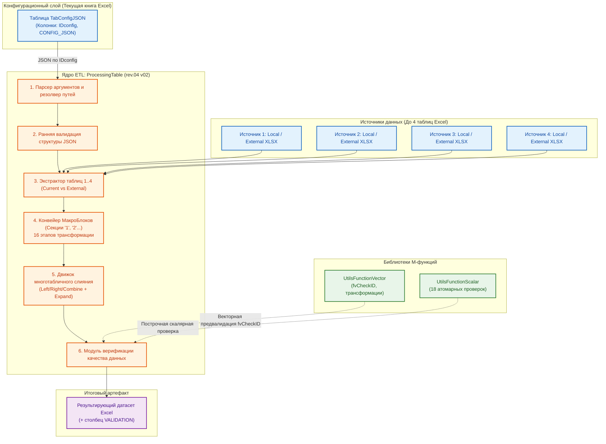
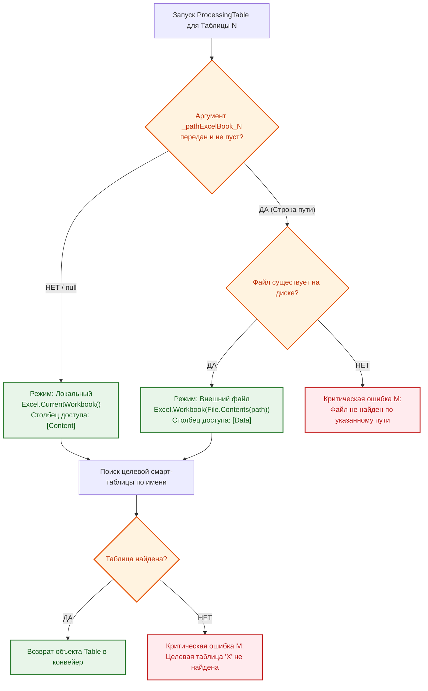
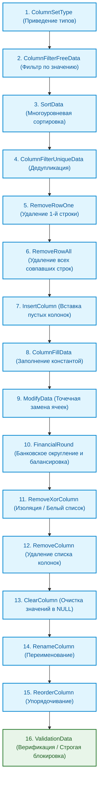
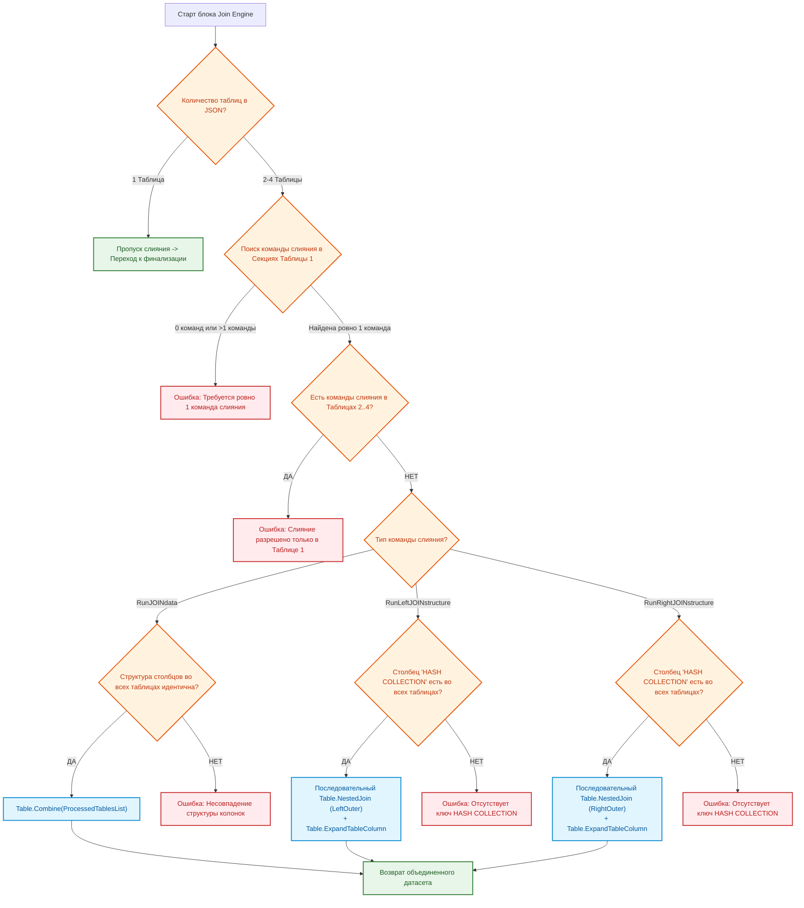

# РУКОВОДСТВО ПО ЭКСПЛУАТАЦИИ: ETL-ПРОЦЕССОР «PROCESSING TABLE»

---

## 1. ВВЕДЕНИЕ И ПАСПОРТ СИСТЕМЫ

### 1.1. Назначение и бизнес-роль в ГК «Передовые решения»

**ETL-процессор `ProcessingTable`** — это центральное программное ядро экосистемы **HorizonBI**, реализованное на функциональном языке Power Query (M). Процессор предназначен для автоматизации полного жизненного цикла обработки табличных массивов данных (Master Data) в среде Microsoft Excel: от извлечения сырых данных из разнородных файлов до сложных трансформаций, слияний и сквозной верификации качества данных.

В операционной модели ГК «Передовые решения» процессор выполняет роль **шлюза изоляции и трансформации данных**:

- Обеспечивает создание производных спецификаций (`to_customer_tech`, `to_customer_fin`, `to_supplier`, `purchase`, `shipment`) из единого источника правды — мастер-спецификации `work_spec` (`TabSpecificationWork_1` + `TabSpecificationWork_2`).
- Гарантирует абсолютную защиту коммерческой тайны (автоматическое и безошибочное удаление закупочных цен, внутренних наценок и данных о реальных поставщиках при формировании клиентских отгрузочных документов).
- Устраняет человеческий фактор при рутинных операциях нормализации номенклатуры, типизации, переименования столбцов и фильтрации.

### 1.2. Паспорт компонента

| Параметр                                          | Значение                                                                                                                                                          |
| :-------------------------------------------------------- | :------------------------------------------------------------------------------------------------------------------------------------------------------------------------ |
| **Идентификатор компонента** | `ProcessingTable`                                                                                                                                                       |
| **Текущая версия ядра**            | `rev.04 v02`                                                                                                                                                            |
| **Среда выполнения**                 | Power Query Engine (Excel 2016+, Excel M365, Power BI Desktop)                                                                                                            |
| **Язык разработки**                   | Power Query (M)                                                                                                                                                           |
| **Язык управления (DSL)**             | `HorizonBI` (на базе JSON-конфигураторов)                                                                                                           |
| **Тип вызова**                             | Параметризованная M-функция                                                                                                                       |
| **Входные контракты**               | `_configJSONIndex as text`, до 4-х необязательных путей к файлам `_pathExcelBook_1..4 as text`                                           |
| **Выходной контракт**               | Результирующий объект`table` с примененными трансформациями и опциональным столбцом `VALIDATION` |
| **Зависимости**                          | Внешние библиотеки`UtilsFunctionVector`, `UtilsFunctionScalar`, таблица `TabConfigJSON`                                                     |

### 1.3. Архитектурная схема взаимодействия компонентов



---

## 2. ИНСТРУКЦИЯ ДЛЯ ОПЕРАТОРА (БЫСТРЫЙ СТАРТ)

### 2.1. Подготовка конфигурации в таблице `TabConfigJSON`

Перед запуском обработки необходимо убедиться, что в текущей книге Excel присутствует смарт-таблица с именем **`TabConfigJSON`**. Таблица должна содержать обязательные столбцы:

1. **`IDconfig`** (Текстовый) — уникальный код конфигурации (например, `config_40_to_customer_fin_OSNO` или `join_work1_work2`).
2. **`CONFIG_JSON`** (Текстовый) — валидный JSON-документ на языке `HorizonBI`.
3. **`COMMENT`** (Текстовый, опционально) — служебное описание назначения сценария.

```
+----+------------------------------------+---------------------------------------------+------------------------------------+
| N  | IDconfig                           | CONFIG_JSON                                 | COMMENT                            |
+----+------------------------------------+---------------------------------------------+------------------------------------+
| 1  | 40_to_customer_fin_HORIZON         | {"TabSpecificationWork": {"1": {...}}}     | Генерация ТКП для ОСНО (с НДС 22%) |
+----+------------------------------------+---------------------------------------------+------------------------------------+
```

### 2.2. Запуск процессора

#### Вариант А: Вызов через пользовательский интерфейс Power Query

1. В редакторе Power Query выберите функцию **`ProcessingTable`**.
2. В появившейся форме ввода параметров заполните:
   - **`_configJSONIndex`**: введите точный идентификатор конфигурации (например, `40_to_customer_fin_HORIZON`).
   - **`_pathExcelBook_1`** (опционально): полный абсолютный путь к файлу-источнику для первой таблицы (например, `C:\OneDrive\Project_1\20__work_spec\spec.xlsx`). Оставьте пустым, если таблица находится в текущем файле.
   - **`_pathExcelBook_2..4`** (опционально): пути к файлам для остальных таблиц многотабличной конфигурации.
3. Нажмите кнопку **«Вызвать» (Invoke)**.

#### Вариант Б: Вызов через формулу языка M в новом запросе

Создайте пустой запрос и вставьте код вызова:

```m
let
    Source = ProcessingTable(
        "40_to_customer_fin_HORIZON",
        "C:\OneDrive\02__Спецификации\20__work_spec\22__Спецификация-Горизонт - work spec rev.22 v03 #1_2024.xlsx"
    )
in
    Source
```

### 2.3. Правила разрешения путей к файлам (Workbook Resolver)



---

## 3. АРХИТЕКТУРА МАКРОБЛОКОВ И ПРАВИЛА ВАЛИДАЦИИ JSON

### 3.1. Концепция нумерованных секций (Управление состоянием)

Язык `HorizonBI` организует обработку данных через **МакроБлоки (секции)**. МакроБлок — это атомарный контейнер операций, гарантирующий последовательное изменение состояния датасета.

```json
{
  "Таблица_1": {
    "1": {
      /* Шаг 1: Первичная очистка и фильтрация */
    },
    "2": {
      /* Шаг 2: Модификация значений */
    },
    "3": {
      /* Шаг 3: Финальное переименование и типизация */
    }
  }
}
```

**Принцип работы конвейера состояний:**

$$
\text{Table}_{\text{Initial}} \xrightarrow{\text{МакроБлок "1"}} \text{Table}_{\text{State 1}} \xrightarrow{\text{МакроБлок "2"}} \text{Table}_{\text{State 2}} \dots \xrightarrow{\text{МакроБлок "N"}} \text{Table}_{\text{Final}}
$$

### 3.2. Системные правила и ограничения структуры JSON

Нарушение любого из следующих правил приводит к аварийной остановке процессора на этапе **ранней валидации**:

1. **Числовые ключи секций:** Имена МакроБлоков обязаны быть строковыми представлениями положительных целых чисел (`"1"`, `"2"`, `"10"`, `"77"`). Произвольные текстовые имена (`"Step1"`, `"Clean"`) **запрещены**.
2. **Сортировка по числовому значению:** Порядок выполнения секций определяется строго числовым возрастанием: секция `"2"` всегда выполняется раньше секции `"10"` (в отличие от стандартной алфавитной сортировки строк, где `"10"` идет раньше `"2"`).
3. **Уникальность команд в секции:** Внутри одного МакроБлока каждая BI-команда может быть вызвана **строго один раз**. Если требуется применить команду повторно (например, выполнить еще одну фильтрацию после добавления столбца), оператор обязан создать следующую по номеру секцию.
4. **Ограничение многотабличности:** Корневой JSON-объект может содержать от **1 до 4 целевых таблиц**.

---

## 4. СПРАВОЧНИК КОМАНД DSL «HORIZONBI» (16 ЭТАПОВ ТРАНСФОРМАЦИИ)

Внутри каждого МакроБлока процессор выполняет команды строго по системному конвейеру приоритетов:



---

### Этап 1: `ColumnSetType` (Установка типов данных)

- **Назначение:** Принудительное назначение системных типов Power Query (`text`, `int`, `float`, `bool`) указанным столбцам.
- **JSON-сигнатура:**
  ```json
  "ColumnSetType": [
    { "ИмяСтолбца1": "int" },
    { "ИмяСтолбца2": "text" },
    { "ИмяСтолбца3": "float" },
    { "ИмяСтолбца4": "bool" }
  ]
  ```

---

### Этап 2: `ColumnFilterFreeData` (Фильтрация по значению)

- **Назначение:** Фильтрация строк таблицы по строгому равенству значения в указанном столбце (`WHERE column = 'value'`).
- **JSON-сигнатура:**
  ```json
  "ColumnFilterFreeData": [
    { "ИмяСтолбца": "ИскомоеЗначение" }
  ]
  ```

---

### Этап 3: `SortData` (Многоуровневая сортировка) — *добавлено в rev.04 v03*

- **Назначение:** Выстраивает строки таблицы по одному или нескольким столбцам в заданном направлении. Реализована на базе нативной `Table.Sort()`. Ключевое практическое применение — связка с `ColumnFilterUniqueData` (Этап 4) для реализации паттерна **«Latest Version»**: сортировка по номеру позиции (по возрастанию) и по версии (по убыванию) гарантирует, что при последующей дедупликации в каждой группе останется строка со старшей версией.
- **Допустимые направления:** `"Ascending"` (по возрастанию), `"Descending"` (по убыванию).
- **JSON-сигнатура:**
  ```json
  "SortData": [
    { "NUM FULL SET": "Ascending" },
    { "VER COLLECTION": "Descending" }
  ]
  ```
- **Типовой паттерн «Latest Version» (отбор старших версий позиций):**
  ```json
  "3": {
    "SortData": [
      { "NUM FULL SET": "Ascending" },
      { "VER COLLECTION": "Descending" }
    ],
    "ColumnFilterUniqueData": [
      "NUM FULL SET"
    ]
  }
  ```

---

### Этап 4: `ColumnFilterUniqueData` (Фильтрация по уникальности)

- **Назначение:** Дедупликация. Удаляет все повторяющиеся строки, оставляя только **первое вхождение**. Если этап предваряется `SortData` (Этап 3), «первым вхождением» становится строка, отсортированная в вершину группы (например, с максимальной версией).
- **JSON-сигнатура:**
  ```json
  "ColumnFilterUniqueData": [
    "ИмяСтолбца1",
    "ИмяСтолбца2"
  ]
  ```

---

### Этап 5: `RemoveRowOne` (Удаление первой найденной строки)

- **Назначение:** Поиск по ключевому полю и удаление **только одной (первой по порядку)** строки.
- **JSON-сигнатура:**
  ```json
  "RemoveRowOne": [
    {
      "rule_1": {
        "IndexSearchColumn": "HASH COLLECTION",
        "IndexSearchRow": "1/2024-N1-ГОРИЗОНТ-ver_1-set_1.1-true"
      }
    }
  ]
  ```

---

### Этап 6: `RemoveRowAll` (Удаление всех совпавших строк)

- **Назначение:** Удаление **всех** строк датасета, в которых значение в столбце совпадает с заданным.
- **JSON-сигнатура:**
  ```json
  "RemoveRowAll": [
    {
      "rule_1": {
        "IndexSearchColumn": "isSHIPPED",
        "IndexSearchRow": "false"
      }
    }
  ]
  ```

---

### Этап 7: `InsertColumn` (Вставка новых столбцов)

- **Назначение:** Добавление новых столбцов со значением по умолчанию `null`.
- **JSON-сигнатура:**
  ```json
  "InsertColumn": [
    "STATUS",
    "APPROVER_NAME"
  ]
  ```

---

### Этап 8: `ColumnFillData` (Массовое заполнение константой)

- **Назначение:** Замена всех значений в указанном столбце на фиксированное значение.
- **JSON-сигнатура:**
  ```json
  "ColumnFillData": [
    { "STATUS": "ВЫПОЛНЕНО" }
  ]
  ```

---

### Этап 9: `ModifyData` (Точечная модификация ячеек)

- **Назначение:** Адресное изменение значений в ячейках конкретной строки (поле `COMMENT` игнорируется).
- **JSON-сигнатура:**
  ```json
  "ModifyData": [
    {
      "data_1": {
        "IndexSearchColumn": "HASH COLLECTION",
        "IndexSearchRow": "1/2024-N1-ГОРИЗОНТ-ver_1-set_3.1-true",
        "NewData": {
          "QUANTITY TOTAL": 14,
          "COST $TOTAL": 15290.10,
          "COMMENT": "Служебный комментарий"
        }
      }
    }
  ]
  ```

---

### Этап 10: `FinancialRound` (Банковское округление и балансировка)

- **Назначение:** Решает проблему «расхождения копеек» при выгрузке производных финансовых спецификаций (`to_customer_fin`). В `work_spec` данные хранятся с максимальной, неокругленной точностью. Данный этап выполняет комплексный, взаимосвязанный пересчет блока финансовых полей одной строки, используя банковское округление (`RoundingMode.ToEven`, стандарт де-факто в 1С и большинстве бухгалтерских ERP-систем), и гарантирует строгий математический баланс: `Округленная Стоимость = Округленная Цена за ед. × Количество`.
- **Алгоритм расчета (построчно):**
  1. Точная стоимость без НДС = `SourceBasePrice × SourceQuantity`.
  2. Округление стоимости без НДС (банковское, до 2 знаков) → `TargetCostNoVat`.
  3. Точная сумма НДС = `TargetCostNoVat × SourceVatRate`.
  4. Округление суммы НДС → `TargetVatSum`.
  5. Стоимость с НДС = `TargetCostNoVat + TargetVatSum` → `TargetCostVat`.
  6. Обратный пересчет цены за единицу без НДС = `TargetCostNoVat / SourceQuantity` (округление) → `TargetPriceNoVat`.
  7. Обратный пересчет цены за единицу с НДС = `TargetCostVat / SourceQuantity` (округление) → `TargetPriceVat`.
- **Используемая функция-сателлит:** `UtilsFunctionVector[ftFinancialRound]`.
- **JSON-сигнатура:**
  ```json
  "FinancialRound": [
    {
      "rule_1": {
        "SourceQuantity": "QUANTITY TOTAL",
        "SourceBasePrice": "PRICE UNIT $TOTAL",
        "SourceVatRate": "VAT RATE CONTRACTOR $TOTAL",
        "TargetPriceNoVat": "PRICE UNIT $TOTAL",
        "TargetCostNoVat": "COST $TOTAL",
        "TargetVatSum": "COST ADD VAT $TOTAL",
        "TargetPriceVat": "PRICE VAT UNIT $TOTAL",
        "TargetCostVat": "COST VAT $TOTAL"
      }
    }
  ]
  ```
- **Важное примечание:** Столбцы-источники (`Source...`) и столбцы-цели (`Target...`) могут совпадать (перезапись «на месте», как в примере выше) — это стандартный режим для финализации данных перед отправкой клиенту. `SourceVatRate` для компаний на УСН должен содержать `0`.

---

### Этап 11: `RemoveXorColumn` (Исключающее/инверсное удаление списка столбцов` )

- **Назначение:** Удаляет абсолютно все столбцы, **кроме перечисленных в списке**.
- **JSON-сигнатура:**
  ```json
  "RemoveXorColumn": [
    "NUM FULL SET",
    "NAME PRODUCT",
    "QUANTITY TOTAL",
    "PRICE VAT UNIT $TOTAL",
    "COST VAT $TOTAL"
  ]
  ```

---

### Этап 12: `RemoveColumn` (Прямое удаление списка столбцов)

- **Назначение:** Удаление явно заданного перечня столбцов (черный список).
- **JSON-сигнатура:**
  ```json
  "RemoveColumn": [
    "SUPPLIER",
    "PRICE UNIT $PURCHASE",
    "COST PRICE $PURCHASE"
  ]
  ```

---

### Этап 13: `ClearColumn` (Очистка значений столбцов)

- **Назначение:** Сохраняет структуру столбца, но заменяет все ячейки на `null`.
- **JSON-сигнатура:**
  ```json
  "ClearColumn": [
    "COMMENT WORK",
    "TCP SOURCE"
  ]
  ```

---

### Этап 14: `RenameColumn` (Переименование столбцов)

- **Назначение:** Локализация и переименование заголовков.
- **JSON-сигнатура:**
  ```json
  "RenameColumn": [
    { "NAME PRODUCT": "НАИМЕНОВАНИЕ" },
    { "PRICE VAT UNIT $TOTAL": "ЦЕНА ЗА ЕД., С НДС" }
  ]
  ```

---

### Этап 15: `ReorderColumn` (Переупорядочивание столбцов)

- **Назначение:** Выстраивание последовательности столбцов слева направо.
- **JSON-сигнатура:**
  ```json
  "ReorderColumn": [
    "№ п/п",
    "НАИМЕНОВАНИЕ",
    "КОЛИЧЕСТВО",
    "ЦЕНА ЗА ЕД., С НДС",
    "СТОИМОСТЬ, С НДС"
  ]
  ```

---

### Этап 16: `ValidationData` (Универсальная валидация датасета) — *архитектура изменена в rev.04 v03*

- **Назначение:** Формирует сервисный столбец **`VALIDATION`** с кодами ошибок по каждой строке (`0` — валидно, `$N$` — номер столбца, где обнаружена ошибка, коды перечисляются через дефис: `0-0-2`).
- **Архитектурное изменение (rev.04 v03):** Начиная с этой версии `ValidationData` является **полноправным этапом конвейера внутри МакроБлока** (как и любая другая из 16 команд), а не отдельной, жестко зашитой финальной секцией ядра. Это означает, что команду можно вызывать:
  - **первым МакроБлоком** — для входного контроля качества данных сразу после загрузки таблицы (типовой сценарий для `to_customer_fin` и других производных спецификаций);
  - **последним МакроБлоком** — как раньше, для итоговой диагностики готового датасета;
  - **в нескольких МакроБлоках одновременно** — например, строгая пред-валидация в начале и мягкая финальная диагностика в конце.
- **JSON-сигнатура (базовая, без блокировки):**
  ```json
  "ValidationData": [
    {
      "IDnum": {
        "fvCheckID": []
      }
    },
    {
      "НАИМЕНОВАНИЕ": {
        "fvCheckNonEmpty": [],
        "fvCheckTextLength_scalar": [3, 200]
      }
    }
  ]
  ```

#### Служебный параметр `StrictBlock` (жесткая блокировка конвейера)

- **Назначение:** Управляет режимом реагирования на обнаруженные ошибки валидации. Задается отдельным объектом `{ "StrictBlock": true }` внутри массива `ValidationData` (порядок расположения в массиве не важен — движок валидации сначала извлекает этот флаг, а оставшиеся объекты обрабатывает как обычные правила проверки столбцов).
- **Режимы работы:**

  | Значение | Поведение при обнаружении ошибки |
  | :--- | :--- |
  | Флаг не указан (по умолчанию) | **Мягкий режим.** Конвейер не прерывается. Формируется столбец `VALIDATION` со строкой кодов ошибок, датасет продолжает движение по МакроБлокам без остановки. |
  | `"StrictBlock": true` | **Строгий режим.** Если хотя бы одна строка датасета не проходит валидацию, процессор немедленно выбрасывает критическую ошибку `error` с указанием количества невалидных строк. Формирование производной спецификации **полностью останавливается** — до тех пор, пока пользователь не устранит проблему в исходной таблице `work spec` и не повторит генерацию. |

- **Типовое назначение:** Гарантированная защита от генерации «бракованных» коммерческих документов (`to_customer_fin`, `to_customer_tech` и др.) на основе незаполненной или некорректной мастер-спецификации. Размещается **первым МакроБлоком** конфигурации, до любых фильтраций, слияний и трансформаций.
- **JSON-сигнатура (со строгой блокировкой):**
  ```json
  "1": {
    "ValidationData": [
      { "StrictBlock": true },
      { "NUM PROJECT": { "fvCheckNonEmpty": [] } },
      { "isSHIPPED": { "fvCheckNonEmpty": [], "fvCheckTextLength_scalar": [4, 5] } },
      { "QUANTITY TOTAL": { "fvCheckNonEmpty": [], "fvCheckIntegerRange_scalar": [1, 50] } }
    ]
  }
  ```
- **Текст критической ошибки при срабатывании:**
  ```
  ValidationData (StrictBlock): Обнаружены критические ошибки валидации в N строк(е/ах) исходного
  датасета. Генерация производной спецификации остановлена. Проверьте обязательные поля и
  корректность значений в спецификации 'work spec' и повторите валидацию.
  ```

---

## 5. МНОГОТАБЛИЧНЫЙ ДВИЖОК СЛИЯНИЯ (MULTI-TABLE JOIN ENGINE)

### 5.1. Архитектурные принципы

Процессор поддерживает работу с **1, 2, 3 или 4 таблицами** в рамках одной конфигурации. В многотабличном режиме процессор:

1. Загружает каждую таблицу по отдельности из локального или внешнего файла.
2. Прогоняет каждую таблицу через **ее собственный набор МакроБлоков** (Этапы 1..16, включая `ValidationData`).
3. Применяет **глобальную операцию слияния**, указанную в конфигурации первой таблицы.

> **Изменение в rev.04 v03:** ранее команда `ValidationData` была запрещена в конфигурациях со слиянием (`RunLeftJOINstructure`/`RunRightJOINstructure`/`RunJOINdata`), так как физически выполнялась только один раз, в самом конце обработки. Теперь, когда `ValidationData` выполняется **внутри** цикла обработки каждой таблицы (до момента слияния), это ограничение снято: валидацию можно свободно применять к каждой из 1–4 исходных таблиц индивидуально, независимо от команды слияния.



### 5.2. Спецификация команд слияния

1. **`RunLeftJOINstructure` (Левое структурное слияние):** Слияние структур по горизонтали. Таблица №1 — базовая («левая»), к ней последовательно присоединяются остальные по ключу `HASH COLLECTION` с автоматическим раскрытием колонок через `Table.ExpandTableColumn`._Синтаксис:_ `"RunLeftJOINstructure": []`
2. **`RunRightJOINstructure` (Правое структурное слияние):** Базовой («правой») становится последняя таблица в JSON, к ней присоединяются предыдущие по ключу `HASH COLLECTION`._Синтаксис:_ `"RunRightJOINstructure": []`
3. **`RunJOINdata` (Вертикальная склейка датасетов):** Добавление строк (`UNION ALL`) для таблиц идентичной структуры.
   _Синтаксис:_ `"RunJOINdata": []`

---

## 6. СВЯЗЬ С ВНЕШНИМИ БИБЛИОТЕКАМИ И КАТАЛОГ ССЫЛОК

- [Головное руководство проекта (README.md)](../../../../../README.md)
- [Руководство по функциям валидации и трансформации (UtilsFunction)](../02__utils-function-processing/README-utils-function.md)
- [Руководство по системным сервисным функциям (GeneralFunction)](../01__general-function-processing/README-general-function.md)
- [Руководство по функциям справочников (HandbookFunction)](../04__handbook-function-processing/README-handbook-function.md)
- [Спецификация Master Data шаблона (README-work_spec)](../../../07__template-excel/20__work_spec/README-work_spec.md)

---

## 7. ПРАКТИКУМ: РЕАЛЬНЫЕ BI-СЦЕНАРИИ ИЗ ПРАКТИКИ ГК

### Сценарий 1: Генерация финансовой спецификации `to_customer_fin` для ООО «ГОРИЗОНТ» (ОСНО, 22% НДС)

```json
{
  "TabSpecificationWork": {
    "1": {
      "ColumnSetType": [
        { "NUM PROJECT": "text" },
        { "QUANTITY TOTAL": "int" },
        { "PRICE VAT UNIT $TOTAL": "float" },
        { "COST VAT $TOTAL": "float" }
      ],
      "ColumnFilterFreeData": [{ "NUM PROJECT": "1/2024-N1-ГОРИЗОНТ" }]
    },
    "2": {
      "RemoveXorColumn": [
        "NUM FULL SET",
        "NAME PRODUCT",
        "DESCRIPTION PRODUCT",
        "QUANTITY TOTAL",
        "UNITS",
        "PRICE VAT UNIT $TOTAL",
        "COST VAT $TOTAL",
        "DURATION SALE $TOTAL",
        "COMMENT CUSTOMER"
      ]
    },
    "3": {
      "RenameColumn": [
        { "NUM FULL SET": "№ п/п" },
        { "NAME PRODUCT": "Наименование оборудования и услуг" },
        { "DESCRIPTION PRODUCT": "Технические характеристики" },
        { "QUANTITY TOTAL": "Кол-во" },
        { "UNITS": "Ед. изм." },
        { "PRICE VAT UNIT $TOTAL": "Цена за ед., руб. (с НДС 22%)" },
        { "COST VAT $TOTAL": "Стоимость, руб. (с НДС 22%)" },
        { "DURATION SALE $TOTAL": "Срок поставки (дней)" },
        { "COMMENT CUSTOMER": "Примечание" }
      ],
      "ReorderColumn": [
        "№ п/п",
        "Наименование оборудования и услуг",
        "Технические характеристики",
        "Кол-во",
        "Ед. изм.",
        "Цена за ед., руб. (с НДС 22%)",
        "Стоимость, руб. (с НДС 22%)",
        "Срок поставки (дней)",
        "Примечание"
      ]
    }
  }
}
```

---

## 8. ДИАГНОСТИКА, ОШИБКИ И ИХ УСТРАНЕНИЕ (TROUBLESHOOTING)

| Текст сообщения об ошибке                                                                                           | Причина возникновения                                                                                            | Регламент устранения                                                                                                                                |
| :---------------------------------------------------------------------------------------------------------------------------------------- | :----------------------------------------------------------------------------------------------------------------------------------- | :--------------------------------------------------------------------------------------------------------------------------------------------------------------------- |
| `Таблица с конфигурациями 'TabConfigJSON' не найдена в ТЕКУЩЕЙ книге.`                      | В активном файле Excel отсутствует смарт-таблица`TabConfigJSON`.                              | Создать лист`ConfigJSON`, создать смарт-таблицу с именем `TabConfigJSON` и столбцами `IDconfig`, `CONFIG_JSON`. |
| `В таблице 'TabConfigJSON' не найдена конфигурация с ID 'X'.`                                             | Опечатка в параметре`_configJSONIndex` или отсутствует строка в конфигураторе. | Проверить соответствие имени в вызове и столбце`IDconfig`. Проверить регистр букв.                      |
| `Целевая таблица с именем 'X', указанная в конфигураторе, не найдена.`             | В файле Excel нет листа/смарт-таблицы с именем, заданным в корне JSON.                | Проверить имя умной таблицы в исходном файле. Проверить правильность пути`_pathExcelBook`.            |
| `Ошибка конфигурации: Имена МакроБлоков в JSON должны быть только числами.`   | Секция названа текстом (напр.`"Step1"` вместо `"1"`).                                              | Переименовать ключи секций в строковые целые числа:`"1"`, `"2"`, `"3"`.                                              |
| `Ошибка конфигурации: В МакроБлоке "X" обнаружены повторяющиеся BI-команды.` | Внутри одной секции дважды вызвана одна команда (напр. две`ColumnFilterFreeData`). | Разнести повторяющиеся команды по разным секциям (МакроБлок`"1"` и МакроБлок `"2"`).                 |
| `RemoveColumn: В таблице отсутствуют столбцы для удаления: X, Y`                                   | Попытка удалить столбцы, которых нет в текущем состоянии таблицы.             | Проверить, не были ли эти столбцы переименованы или удалены на более ранних шагах/секциях.  |
| `ModifyData: Не удалось найти строку, где 'Col' = 'Val'`                                                         | Значение поиска не существует в указанном столбце.                                        | Проверить точность значения в`IndexSearchRow` (пробелы, регистр, опечатки в хэшах).                            |
| `ValidationData (StrictBlock): Обнаружены критические ошибки валидации в N строк(е/ах)...`                          | В режиме`StrictBlock: true` обнаружены пустые или некорректные значения в обязательных полях `work spec`. | Открыть файл `work spec`, найти строки с ошибками (подсказка: используйте встроенную валидацию Excel или повторный запуск без флага `StrictBlock` для получения столбца `VALIDATION` с кодами ошибок). Исправить проблемные ячейки. Запустить генерацию производной спецификации повторно. |
| `SortData: Указано неизвестное направление сортировки 'XXX'`                                                | Допустимые значения: только`"Ascending"` или `"Descending"`. Опечатка в JSON.         | Исправить значение направления сортировки в JSON-конфигурации на один из двух разрешенных вариантов.                 |

---

## 9. РЕГЛАМЕНТ ТЕХНИЧЕСКОГО ОБСЛУЖИВАНИЯ И ВЕРСИОНИРОВАНИЯ

1. Любое изменение функционала процессора сопровождается обязательным инкрементом версии в шапке кода и документации:
   - **Major (`rev.0X`):** Изменение архитектуры, сигнатуры параметров или структуры языка `HorizonBI`.
   - **Minor (`v0X`):** Исправление внутренних ошибок, оптимизация производительности M-кода.
2. Перед выпуском новой ревизии код процессора проходит обязательное тестирование на тестовом стенде `03__Проект/06__example-query/`.
