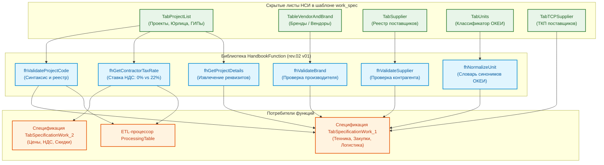

# РУКОВОДСТВО ПО ФУНКЦИЯМ НОРМАТИВНО-СПРАВОЧНОЙ ИНФОРМАЦИИ: «HANDBOOKFUNCTION»

---

## 1. ВВЕДЕНИЕ И ПАСПОРТ БИБЛИОТЕКИ

### 1.1. Назначение компонента

Библиотека **`HandbookFunction`** предназначена для централизованного управления нормативно-справочной информацией (НСИ) ГК «Передовые решения» в среде Power Query (M). Она предоставляет стандартизированный программный интерфейс для автоматической верификации ссылочной целостности, очистки пользовательского ввода, нормализации номенклатурных справочников и автоматического извлечения проектно-налоговых реквизитов.

**Ключевые бизнес-задачи библиотеки:**

- **Ссылочная целостность:** Проверка существования кодов проектов, поставщиков и производителей в корпоративных реестрах холдинга.
- **Нормализация единиц измерения:** Устранение синонимов и ненормативного написания единиц измерения (ОКЕИ).
- **Налоговая маршрутизация:** Автоматическое извлечение применимой ставки НДС по коду юридического лица-исполнителя проекта.
- **Обогащение данных:** Автоматическое извлечение метаданных проекта (ГИП, Генеральный подрядчик, статус проекта).

### 1.2. Паспорт компонента

| Параметр                       | Значение                                                                                                                                 |
| :----------------------------- | :--------------------------------------------------------------------------------------------------------------------------------------- |
| **Имя запроса в Power Query**  | `HandbookFunction`                                                                                                                       |
| **Текущая версия**             | `rev.02 v01`                                                                                                                             |
| **Область применения**         | Валидация номенклатуры`work_spec`, выпадающие списки, подготовка выгрузок                                                                |
| **Тип возвращаемого значения** | Агрегатная запись функций`FunctionRecord = [...]`                                                                                        |
| **Источники данных НСИ**       | Смарт-таблицы на скрытых листах книги`work_spec` (`HandbookProject`, `HandbookBrand`, `HandbookSupplier`, `HandbookUnit`, `HandbookTCP`) |
| **Связанные компоненты**       | `ProcessingTable`, `TabSpecificationWork_1`, `TabSpecificationWork_2`                                                                    |

### 1.3. Архитектурная схема взаимодействия



---

## 2. РЕЕСТР КОРПОРАТИВНЫХ СПРАВОЧНИКОВ НСИ

### 2.1. Таблица `TabProjectList` (Справочник проектов)

- **Лист размещения:** `HandbookProject` (Скрытый).
- **Назначение:** Реестр всех зарегистрированных договоров и заказов холдинга. Служит источником данных для выпадающего списка столбца `NUM PROJECT` в таблице `TabSpecificationWork_1`.
- **Структура полей:**

| Поле таблицы             | Тип  | Назначение / Пример                                                                                             |
| :----------------------- | :--- | :-------------------------------------------------------------------------------------------------------------- |
| `IDnum`                  | int  | Порядковый номер записи в справочнике                                                                           |
| `HASH COLLECTION`        | text | Уникальный хэш-код проектной группы                                                                             |
| `IDprojectfull`          | text | Полный официальный номер проекта (`1/2026-N2-МАС`, `1/2024-N1-ГОРИЗОНТ`, `10/2024-N2-КУКУШКИН ИВАН НИКОЛАЕВИЧ`) |
| `GENERAL CONTRACTOR`     | text | Юридическое лицо-исполнитель (`ООО "МАС"`, `ООО "ГОРИЗОНТ"`, `ИП Кукушкин И.Н.`)                                |
| `PROJECT CHIEF ENGINEER` | text | ФИО Главного инженера проекта (ГИП)                                                                             |

---

### 2.2. Таблица `TableVendorAndBrand` (Справочник брендов и вендоров)

- **Лист размещения:** `HandbookBrand` (Скрытый).
- **Назначение:** Нормализация наименований производителей оборудования и материалов. Исключает дублирование номенклатуры из-за разного написания (напр., `D-Link` vs `DLink`).
- **Структура полей:**

| Поле таблицы | Тип  | Назначение / Пример                                                     |
| :----------- | :--- | :---------------------------------------------------------------------- |
| `IDvendor`   | int  | Уникальный идентификатор производителя                                  |
| `BRAND`      | text | Нормализованное наименование бренда (`ORIGO`, `D-Link`, `SNR`, `Cisco`) |

---

### 2.3. Таблица `TabSupplier` (Справочник поставщиков)

- **Лист размещения:** `HandbookSupplier` (Скрытый).
- **Назначение:** Реестр аккредитованных дистрибьюторов и поставщиков. Относится к категории **коммерческой тайны**.
- **Структура полей:**

| Поле таблицы    | Тип  | Назначение / Пример                                                       |
| :-------------- | :--- | :------------------------------------------------------------------------ |
| `IDsupplier`    | int  | Идентификатор поставщика                                                  |
| `COMPANY_LABEL` | text | Краткое торговое наименование (`OCS`, `ДССЛ`, `НАГ`, `Марвел`, `Treolan`) |

---

### 2.4. Таблица `TabUnits` (Классификатор единиц измерения)

- **Лист размещения:** `HandbookUnit` (Скрытый).
- **Назначение:** Стандартизация единиц измерения согласно ОКЕИ для корректного формирования ТКП и закрывающих документов.
- **Структура полей:**

| Поле таблицы | Тип  | Назначение / Пример                                       |
| :----------- | :--- | :-------------------------------------------------------- |
| `IDnum`      | int  | Код ОКЕИ (`796`, `671`, `006`)                            |
| `UNITS`      | text | Нормативное обозначение (`шт`, `компл`, `м`, `усл`, `кг`) |

---

### 2.5. Таблица `TabTCPSupplier` (Реестр ТКП поставщиков)

- **Лист размещения:** `HandbookTCP` (Скрытый).
- **Назначение:** Хранение реквизитов коммерческих предложений поставщиков для подтверждения закупочных цен.
- **Структура полей:** `IDtcp` (int), `SUPPLIER` (text), `TCP_NUMBER` (text), `TCP_DATE` (date), `URL_FILE` (text).

---

## 3. КАТАЛОГ ФУНКЦИЙ БИБЛИОТЕКИ «HANDBOOKFUNCTION»

### 3.1. `fhGetContractorTaxRate` (Определение ставки НДС исполнителя)

- **Назначение:** Автоматический расчет ставки НДС (`0.22` или `0.00`) по номеру проекта.
- **Сигнатура M:**
  ```m
  (projectCode as text) as number
  ```
- **Бизнес-логика:**
  1. Очищает строку от пробелов и разделяет её на лексемы по дефису: `[Номер]/[Год]-N[Заказ]-[Компания]`.
  2. Извлекает 3-ю лексему (наименование исполнителя).
  3. Применяет налоговые правила холдинга:
     - `"ГОРИЗОНТ"` (ОСНО) $\rightarrow$ возвращает `0.22` (22% НДС).
     - `"МАС"` (УСН) $\rightarrow$ возвращает `0.00` (0% НДС).
     - `"КУКУШКИН ИВАН НИКОЛАЕВИЧ"` (УСН) $\rightarrow$ возвращает `0.00` (0% НДС).
  4. При обнаружении неизвестного наименования генерирует ошибку.

---

### 3.2. `fhNormalizeUnit` (Нормализация единиц измерения)

- **Назначение:** Преобразование пользовательского ввода единиц измерения к стандарту классификатора `TabUnits`.
- **Сигнатура M:**
  ```m
  (rawUnit as text) as text
  ```
- **Матрица синонимов:**
  - `"штука"`, `"штук"`, `"шт."`, `"ШТ"`, `"796"`, `"1"` $\rightarrow$ `"шт"`
  - `"комплект"`, `"компл."`, `"компл"`, `"к-т"`, `"671"` $\rightarrow$ `"компл"`
  - `"метр"`, `"м."`, `"пог. м"`, `"пог.м"`, `"006"` $\rightarrow$ `"м"`
  - `"услуга"`, `"усл."`, `"усл"`, `"раб."` $\rightarrow$ `"усл"`
  - Если совпадений нет, возвращает исходную очищенную строку.

---

### 3.3. `fhValidateProjectCode` (Валидация номера проекта)

- **Назначение:** Проверка синтаксиса номера проекта и факта его регистрации в реестре `TabProjectList`.
- **Сигнатура M:**
  ```m
  (projectCode as text, optional handbookTable as nullable table) as logical
  ```
- **Логика:**
  1. Проверяет структуру: 3 лексемы через дефис, первая содержит `/`, вторая начинается с `N`.
  2. Если передана таблица `handbookTable` (или доступна локально), проверяет вхождение `projectCode` в столбец `IDprojectfull`.

---

### 3.4. `fhValidateBrand` (Валидация бренда/производителя)

- **Назначение:** Проверка наличия указанного бренда в справочнике `TableVendorAndBrand`.
- **Сигнатура M:**
  ```m
  (brandName as text, optional handbookTable as nullable table) as logical
  ```

---

### 3.5. `fhValidateSupplier` (Валидация контрагента-поставщика)

- **Назначение:** Проверка наличия поставщика в реестре `TabSupplier`.
- **Сигнатура M:**
  ```m
  (supplierName as text, optional handbookTable as nullable table) as logical
  ```

---

### 3.6. `fhGetProjectDetails` (Извлечение атрибутов проекта)

- **Назначение:** Извлечение информации о ГИПе и Генеральном подрядчике в виде структуры `Record`.
- **Сигнатура M:**
  ```m
  (projectCode as text, handbookTable as table) as record
  ```
- **Возвращаемое значение:**
  ```m
  [
      GeneralContractor = "ООО ""ГОРИЗОНТ""",
      ChiefEngineer     = "Иванов И.И.",
      TaxRate           = 0.22,
      IsVAT             = true
  ]
  ```

---

## 4. ИСХОДНЫЙ КОД БИБЛИОТЕКИ «HANDBOOKFUNCTION» (M)

```m
// =============================================================================================
//
// БИБЛИОТЕКА СПРАВОЧНЫХ ФУНКЦИЙ 'HandbookFunction'
//
// версия rev.02 v01
// =============================================================================================

let
    // -----------------------------------------------------------------------------------------
    // 1. Определение ставки НДС по коду проекта
    // -----------------------------------------------------------------------------------------
    fhGetContractorTaxRate = (projectCode as text) as number =>
    let
        trimmedCode = Text.Trim(projectCode),
        parts = Text.Split(trimmedCode, "-"),
        contractor = if List.Count(parts) >= 3 then Text.Upper(Text.Trim(parts{2})) else "",
        rate = if contractor = "ГОРИЗОНТ" then 0.22
               else if contractor = "МАС" or contractor = "КУКУШКИН ИВАН НИКОЛАЕВИЧ" then 0.00
               else error "HandbookFunction: Неизвестное юридическое лицо в коде проекта '" & projectCode & "'. Допустимы: ГОРИЗОНТ, МАС, КУКУШКИН ИВАН НИКОЛАЕВИЧ."
    in
        rate,

    // -----------------------------------------------------------------------------------------
    // 2. Нормализация единиц измерения (ОКЕИ)
    // -----------------------------------------------------------------------------------------
    fhNormalizeUnit = (rawUnit as text) as text =>
    let
        clean = Text.Lower(Text.Trim(rawUnit)),
        result = if clean = "шт" or clean = "шт." or clean = "штука" or clean = "штук" or clean = "796" or clean = "1" then "шт"
                 else if clean = "компл" or clean = "компл." or clean = "комплект" or clean = "к-т" or clean = "671" then "компл"
                 else if clean = "м" or clean = "м." or clean = "метр" or clean = "пог. м" or clean = "006" then "м"
                 else if clean = "усл" or clean = "усл." or clean = "услуга" or clean = "раб." then "усл"
                 else rawUnit
    in
        result,

    // -----------------------------------------------------------------------------------------
    // 3. Валидация кода проекта (синтаксис + справочник)
    // -----------------------------------------------------------------------------------------
    fhValidateProjectCode = (projectCode as text, optional handbookTable as nullable table) as logical =>
    let
        trimmed = Text.Trim(projectCode),
        parts = Text.Split(trimmed, "-"),
        syntaxValid = (List.Count(parts) = 3) and Text.Contains(parts{0}, "/") and Text.StartsWith(Text.Upper(parts{1}), "N"),
        existsInTable = if handbookTable = null or not syntaxValid then syntaxValid
                        else List.Contains(Table.Column(handbookTable, "IDprojectfull"), trimmed)
    in
        existsInTable,

    // -----------------------------------------------------------------------------------------
    // 4. Валидация бренда по справочнику
    // -----------------------------------------------------------------------------------------
    fhValidateBrand = (brandName as text, optional handbookTable as nullable table) as logical =>
    let
        clean = Text.Trim(brandName),
        result = if clean = "" then false
                 else if handbookTable = null then true
                 else List.Contains(List.Transform(Table.Column(handbookTable, "BRAND"), each Text.Upper(Text.Trim(_))), Text.Upper(clean))
    in
        result,

    // -----------------------------------------------------------------------------------------
    // 5. Валидация поставщика по справочнику
    // -----------------------------------------------------------------------------------------
    fhValidateSupplier = (supplierName as text, optional handbookTable as nullable table) as logical =>
    let
        clean = Text.Trim(supplierName),
        result = if clean = "" then false
                 else if handbookTable = null then true
                 else List.Contains(List.Transform(Table.Column(handbookTable, "COMPANY_LABEL"), each Text.Upper(Text.Trim(_))), Text.Upper(clean))
    in
        result,

    // -----------------------------------------------------------------------------------------
    // 6. Получение реквизитов проекта (ГИП, Генподрядчик, НДС)
    // -----------------------------------------------------------------------------------------
    fhGetProjectDetails = (projectCode as text, handbookTable as table) as record =>
    let
        cleanCode = Text.Trim(projectCode),
        filtered = Table.SelectRows(handbookTable, each [IDprojectfull] = cleanCode),
        details = if Table.RowCount(filtered) = 1 then
            let
                row = filtered{0},
                tax = fhGetContractorTaxRate(cleanCode)
            in
                [
                    GeneralContractor = row[GENERAL CONTRACTOR],
                    ChiefEngineer     = row[PROJECT CHIEF ENGINEER],
                    TaxRate           = tax,
                    IsVAT             = (tax > 0)
                ]
        else
            error "HandbookFunction: Проект с кодом '" & projectCode & "' не найден в справочнике TabProjectList."
    in
        details,

    // =========================================================================================
    // РЕГИСТРАЦИЯ ФУНКЦИЙ В АГРЕГАТНОЙ ЗАПИСИ
    // =========================================================================================
    FunctionRecord = [
        fhGetContractorTaxRate = fhGetContractorTaxRate,
        fhNormalizeUnit        = fhNormalizeUnit,
        fhValidateProjectCode  = fhValidateProjectCode,
        fhValidateBrand        = fhValidateBrand,
        fhValidateSupplier     = fhValidateSupplier,
        fhGetProjectDetails    = fhGetProjectDetails
    ]
in
    FunctionRecord
```

---

## 5. ДИАГНОСТИКА И ЧАСТЫЕ ОШИБКИ НСИ

| Ошибка / Проблема                                           | Причина                                                                               | Способ устранения                                                                      |
| :---------------------------------------------------------- | :------------------------------------------------------------------------------------ | :------------------------------------------------------------------------------------- |
| `HandbookFunction: Неизвестное юридическое лицо...`         | В номере проекта указано юрлицо, отсутствующее в реестре (например,`1/2026-N1-РОГА`). | Исправить 3-ю лексему на нормативную:`ГОРИЗОНТ`, `МАС` или `КУКУШКИН ИВАН НИКОЛАЕВИЧ`. |
| `fhValidateBrand` возвращает `false` на существующем бренде | Разница в написании дефисов или скрытые пробелы (напр.`D-Link ` с пробелом на конце). | Добавить синоним в`TableVendorAndBrand` или применить `Text.Trim`.                     |
| `Таблица TabProjectList не найдена`                         | Скрытый лист`HandbookProject` удален или переименован.                                | Восстановить лист со смарт-таблицей`TabProjectList` из эталонного шаблона `work_spec`. |

---

## 6. КАТАЛОГ СВЯЗЕЙ И ПЕРЕКРЁСТНЫЕ ССЫЛКИ

- [Головное руководство проекта (README.md)](../../../../README.md)
- [Руководство по эксплуатации ETL-процессора ProcessingTable](../03__ETL-processing/README-etl-processor.md)
- [Руководство по библиотекам функций валидации и трансформации (UtilsFunction)](../02__utils-function-processing/README-utils-function.md)
- [Руководство по системным сервисным функциям (GeneralFunction)](../01__general-function-processing/README-general-function.md)
- [Спецификация Master Data шаблона (README-work_spec)](../../../07__template-excel/20__work_spec/README-work_spec.md)

---

**Конец документа**
