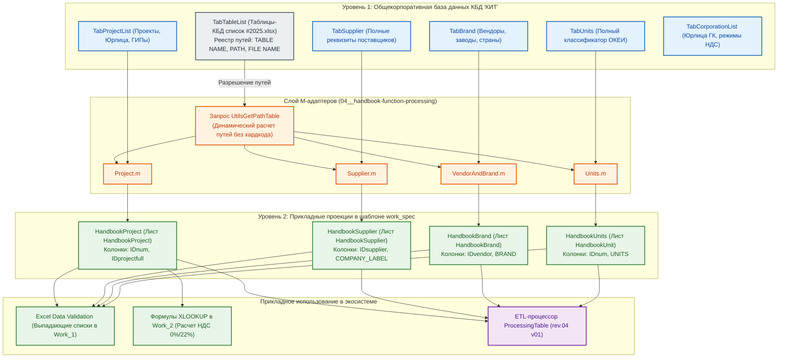

# РУКОВОДСТВО ПО ФУНКЦИЯМ НОРМАТИВНО-СПРАВОЧНОЙ ИНФОРМАЦИИ: «HANDBOOKFUNCTION»

---

## 1. ВВЕДЕНИЕ И АРХИТЕКТУРА ДВУХУРОВНЕВОЙ МОДЕЛИ НСИ

### 1.1. Назначение компонента и концепция НСИ

Библиотека **`HandbookFunction`** представляет собой аналитический и сервисный слой экосистемы **HorizonBI**, отвечающий за регламентное управление нормативно-справочной информацией (НСИ) ГК «Передовые решения» в среде Power Query (M).

В архитектуре компании реализована **двухуровневая модель справочников**, разделяющая тяжелые корпоративные базы данных и легкие прикладные проекции:



#### Характеристики уровней справочников:

1.  **Справочники 1-го типа (Master Handbooks):**
    - **Физическое размещение:** Общекорпоративное хранилище `c:\OneDrive\01__LLC_MAS_2025\КИТ\01__КБД\03__Excel\`.
    - **Состав данных:** Полные атрибуты сущностей (юридические реквизиты, телефоны, email, контактные лица, служебные метки аудита `WHO CREATED`, `WHO CHANGED`, расширенные статусы).
    - **Роль:** Непререкаемый первоисточник истины для всей группы компаний.
2.  **Справочники 2-го типа (Прикладные BI-проекции):**
    - **Физическое размещение:** Встроены непосредственно в скрытые листы мастер-спецификации `work_spec`.
    - **Формирование:** Специализированные M-запросы отсекают избыточные реквизиты и формируют компактные наборы из 2–4 ключевых полей (суррогатный ключ, код, отображаемое имя).
    - **Роль:** Обеспечение мгновенной работы выпадающих списков Excel (Data Validation), локальных формул `XLOOKUP` и дедупликации данных без задержек на сетевые вызовы.

### 1.2. Паспорт компонента

| Параметр                       | Значение                                                                                |
| :----------------------------- | :-------------------------------------------------------------------------------------- |
| **Идентификатор компонента**   | `HandbookFunction`                                                                      |
| **Текущая версия**             | `rev.02 v01`                                                                            |
| **Область применения**         | Валидация номенклатуры `work_spec`, автозаполнение реквизитов, очистка справочных полей |
| **Тип возвращаемого значения** | Агрегатная запись функций `FunctionRecord = [...]`                                      |
| **Источники метаданных**       | Таблица `TabTableList` (`Таблицы-КБД список #2025.xlsx`), скрытые листы `work_spec`     |
| **Связанные компоненты**       | `ProcessingTable`, `TabSpecificationWork_1`, `TabSpecificationWork_2`                   |

---

## 2. СВОДНЫЙ РЕЕСТР КОРПОРАТИВНЫХ СПРАВОЧНИКОВ 1-ГО ТИПА (ИСК «КИТ»)

Размещение мастер-базы: `c:\OneDrive\01__LLC_MAS_2025\КИТ\01__КБД\03__Excel\`

|   №    | Каталог КБД             | Имя файла Excel                       | Имя таблицы (1-й тип)     | M-адаптер (2-й тип)        | Бизнес-назначение в холдинге                                                 |
| :----: | :---------------------- | :------------------------------------ | :------------------------ | :------------------------- | :--------------------------------------------------------------------------- |
| **1**  | `TableList/`            | `Таблицы-КБД список #2025.xlsx`       | `TabTableList`            | Запрос `UtilsGetPathTable` | Мета-реестр физического размещения всех мастер-справочников                  |
| **2**  | `Project/`              | `Проекты-список #2025.xlsx`           | `TabProjectList`          | `Project.m`                | Полный реестр договоров, заказов, дат и привязок к рамочным соглашениям      |
| **3**  | `Supplier/`             | `Поставщики-список #2025.xlsx`        | `TabSupplier`             | `Supplier.m`               | Реестр аккредитованных поставщиков, дистрибьюторов и их платежных реквизитов |
| **4**  | `VendorAndBrand/`       | `Производители-список #2025.xlsx`     | `TabBrand`                | `VendorAndBrand.m`         | Каталог производителей, торговых марок и стран происхождения                 |
| **5**  | `Units/`                | `Единицы-список #2025.xlsx`           | `TabUnits`                | `Units.m`                  | Общероссийский классификатор единиц измерения (ОКЕИ)                         |
| **6**  | `Corporation/`          | `Корпорации-список #2025.xlsx`        | `TabCorporationList`      | `Corporation.m`            | Юридические лица холдинга («ГОРИЗОНТ», «МАС», ИП) и их налоговые ставки      |
| **7**  | `Counterparty/`         | `Контрагенты-список #2025.xlsx`       | `TabCounterpartyList`     | `Counterparty.m`           | Реестр внешних заказчиков и клиентов (ИНН, КПП, формы собственности)         |
| **8**  | `Employee/`             | `Сотрудники-список #2025.xlsx`        | `TabEmployeeList`         | `Employee.m` _(в проекте)_ | Штатные сотрудники, ГИПы, корпоративные адреса электронной почты             |
| **9**  | `Nomenclature/`         | `БД номеклатуры.xlsx`                 | `TabNomenclature`         | _(в разработке)_           | Эталонный каталог номенклатуры, артикулов и описаний ТМЦ                     |
| **10** | `Ownership/`            | `FormOwnershipList.xlsx`              | `TabFormOwnershipList`    | `Ownership.m`              | Классификатор организационно-правовых форм (ООО, АО, ИП, ПАО)                |
| **11** | `Departament/`          | `Departament.xlsx`                    | `TabDepartamentList`      | _(в плане)_                | Организационно-штатная структура предприятий холдинга                        |
| **12** | `Post/`                 | `Post.xlsx`                           | `TabPostList`             | _(в плане)_                | Общекорпоративный классификатор должностей                                   |
| **13** | `ProjectStatus/`        | `ProjectStatus.xlsx`                  | `TabProjectStatusList`    | _(в плане)_                | Реестр статусов жизненного цикла договоров и заказов                         |
| **14** | `TypeCounterparty/`     | `TypeCounterparty.xlsx`               | `TabTypeCounterpartyList` | `TypeCounterparty.m`       | Категории контрагентов (Заказчик, Поставщик, Подрядчик, Партнер)             |
| **15** | `TypeWorkCounterparty/` | `TypeWorkCounterparty.xlsx`           | `TabTypeWorkCounterparty` | `TypeWorkCounterparty.m`   | Профиль выполняемых контрагентами работ и услуг                              |
| **16** | `TypeProject/`          | `TypeProject.xlsx`                    | `TabTypeProjectList`      | _(в плане)_                | Классификатор видов договоров: Контракт / Тендер / Внутренний                |
| **17** | `TypeWork/`             | `TypeWork.xlsx`                       | `TabTypeWorkList`         | _(в плане)_                | Виды производственных и IT-работ (НИОКР, ПТК, ПНР, поставка)                 |
| **18** | `ProjectIDFull/`        | `IDProjectFull.xlsx`                  | `TabProjectIDFull`        | _(в плане)_                | Генератор сквозных идентификаторов проектов                                  |
| **19** | `DeviceIT/`             | `DB Devices IT rev.01 v01 #2025.xlsx` | `TabDevicesIT`            | _(в плане)_                | Инвентарный учет серверного, стендового и IT-оборудования                    |

---

## 3. СПРАВОЧНИКИ 2-ГО ТИПА В МАСТЕР-СПЕЦИФИКАЦИИ «WORK SPEC»

В активном шаблоне мастер-спецификации `Шаблон-спецификация work spec #2026.xlsx` развернуты 4 прикладные проекции:

| Справочник 2-го типа   | Лист книги         | Базовый мастер (1-й тип) | M-адаптер          | Состав полей (2-й тип)        | Прикладное назначение в спецификации                                                         |
| :--------------------- | :----------------- | :----------------------- | :----------------- | :---------------------------- | :------------------------------------------------------------------------------------------- |
| **`HandbookProject`**  | `HandbookProject`  | `TabProjectList`         | `Project.m`        | `IDnum`, `IDprojectfull`      | Задает список проектов в `Work_1[NUM PROJECT]`, обеспечивает авторасчет НДС в `Work_2`       |
| **`HandbookSupplier`** | `HandbookSupplier` | `TabSupplier`            | `Supplier.m`       | `IDsupplier`, `COMPANY_LABEL` | Формирует выпадающий список поставщиков в `Work_1[SUPPLIER]`, защищает от искажения названий |
| **`HandbookBrand`**    | `HandbookBrand`    | `TabBrand`               | `VendorAndBrand.m` | `IDvendor`, `BRAND`           | Стандартизирует производителей в `Work_1[BRAND]`, устраняет дубли номенклатуры               |
| **`HandbookUnits`**    | `HandbookUnit`     | `TabUnits`               | `Units.m`          | `IDnum`, `UNITS`              | Предоставляет нормативные единицы измерения ОКЕИ для `Work_1[UNITS]`                         |

---

## 4. КАТАЛОГ ФУНКЦИЙ БИБЛИОТЕКИ «HANDBOOKFUNCTION»

### 4.1. `fhGetContractorTaxRate` (Определение ставки НДС исполнителя)

- **Назначение:** Аналитический расчет ставки НДС (`0.22` или `0.00`) по коду проекта.
- **Сигнатура M:**
  ```m
  (projectCode as text) as number
  ```
- **Бизнес-правила налогообложения ГК:**
  - Если 3-я лексема шифра проекта равна `"ГОРИЗОНТ"` (ОСНО) $\rightarrow$ возвращает `0.22` (22% НДС).
  - Если 3-я лексема равна `"МАС"` (УСН) $\rightarrow$ возвращает `0.00` (0% НДС).
  - Если 3-я лексема равна `"КУКУШКИН ИВАН НИКОЛАЕВИЧ"` (УСН) $\rightarrow$ возвращает `0.00` (0% НДС).
  - При обнаружении неизвестного наименования генерирует ошибку.

### 4.2. `fhNormalizeUnit` (Нормализация единиц измерения)

- **Назначение:** Преобразование пользовательского ввода единиц измерения к стандарту классификатора `TabUnits`.
- **Сигнатура M:**
  ```m
  (rawUnit as text) as text
  ```
- **Матрица автозамен:**
  - `"штука"`, `"штук"`, `"шт."`, `"ШТ"`, `"796"`, `"1"` $\rightarrow$ `"шт"`
  - `"комплект"`, `"компл."`, `"компл"`, `"к-т"`, `"671"` $\rightarrow$ `"компл"`
  - `"метр"`, `"м."`, `"пог. м"`, `"пог.м"`, `"006"` $\rightarrow$ `"м"`
  - `"услуга"`, `"усл."`, `"усл"`, `"раб."` $\rightarrow$ `"усл"`

### 4.3. `fhValidateProjectCode` (Валидация номера проекта)

- **Назначение:** Проверка синтаксиса номера проекта и факта его регистрации в реестре `TabProjectList`.
- **Сигнатура M:**
  ```m
  (projectCode as text, optional handbookTable as nullable table) as logical
  ```
- **Логика:**
  1. Проверяет структуру: 3 лексемы через дефис, первая содержит `/`, вторая начинается с `N`.
  2. При передаче `handbookTable` (или наличии в книге) проверяет вхождение `projectCode` в столбец `IDprojectfull`.

### 4.4. `fhValidateBrand` (Валидация бренда/производителя)

- **Назначение:** Проверка наличия указанного бренда в справочнике `TableVendorAndBrand`.
- **Сигнатура M:**
  ```m
  (brandName as text, optional handbookTable as nullable table) as logical
  ```

### 4.5. `fhValidateSupplier` (Валидация контрагента-поставщика)

- **Назначение:** Проверка наличия поставщика в реестре `TabSupplier`.
- **Сигнатура M:**
  ```m
  (supplierName as text, optional handbookTable as nullable table) as logical
  ```

### 4.6. `fhGetProjectDetails` (Извлечение атрибутов проекта)

- **Назначение:** Извлечение информации о ГИПе и Генеральном подрядчике в виде структуры `Record`.
- **Сигнатура M:**
  ```m
  (projectCode as text, handbookTable as table) as record
  ```
- **Возвращаемое значение:**
  ```m
  [
      GeneralContractor = "ООО ""ГОРИЗОНТ""",
      ChiefEngineer     = "Иванов И.И.",
      TaxRate           = 0.22,
      IsVAT             = true
  ]
  ```

---

## 5. ИСХОДНЫЙ КОД БИБЛИОТЕКИ «HANDBOOKFUNCTION» (M)

```m
// =============================================================================================
//
// БИБЛИОТЕКА СПРАВОЧНЫХ ФУНКЦИЙ 'HandbookFunction'
//
// версия rev.02 v01
// =============================================================================================

let
    // -----------------------------------------------------------------------------------------
    // 1. Определение ставки НДС по коду проекта
    // -----------------------------------------------------------------------------------------
    fhGetContractorTaxRate = (projectCode as text) as number =>
    let
        trimmedCode = Text.Trim(projectCode),
        parts = Text.Split(trimmedCode, "-"),
        contractor = if List.Count(parts) >= 3 then Text.Upper(Text.Trim(parts{2})) else "",
        rate = if contractor = "ГОРИЗОНТ" then 0.22
               else if contractor = "МАС" or contractor = "КУКУШКИН ИВАН НИКОЛАЕВИЧ" then 0.00
               else error "HandbookFunction: Неизвестное юридическое лицо в коде проекта '" & projectCode & "'. Допустимы: ГОРИЗОНТ, МАС, КУКУШКИН ИВАН НИКОЛАЕВИЧ."
    in
        rate,

    // -----------------------------------------------------------------------------------------
    // 2. Нормализация единиц измерения (ОКЕИ)
    // -----------------------------------------------------------------------------------------
    fhNormalizeUnit = (rawUnit as text) as text =>
    let
        clean = Text.Lower(Text.Trim(rawUnit)),
        result = if clean = "шт" or clean = "шт." or clean = "штука" or clean = "штук" or clean = "796" or clean = "1" then "шт"
                 else if clean = "компл" or clean = "компл." or clean = "комплект" or clean = "к-т" or clean = "671" then "компл"
                 else if clean = "м" or clean = "м." or clean = "метр" or clean = "пог. м" or clean = "006" then "м"
                 else if clean = "усл" or clean = "усл." or clean = "услуга" or clean = "раб." then "усл"
                 else rawUnit
    in
        result,

    // -----------------------------------------------------------------------------------------
    // 3. Валидация кода проекта (синтаксис + справочник)
    // -----------------------------------------------------------------------------------------
    fhValidateProjectCode = (projectCode as text, optional handbookTable as nullable table) as logical =>
    let
        trimmed = Text.Trim(projectCode),
        parts = Text.Split(trimmed, "-"),
        syntaxValid = (List.Count(parts) = 3) and Text.Contains(parts{0}, "/") and Text.StartsWith(Text.Upper(parts{1}), "N"),
        existsInTable = if handbookTable = null or not syntaxValid then syntaxValid
                        else List.Contains(Table.Column(handbookTable, "IDprojectfull"), trimmed)
    in
        existsInTable,

    // -----------------------------------------------------------------------------------------
    // 4. Валидация бренда по справочнику
    // -----------------------------------------------------------------------------------------
    fhValidateBrand = (brandName as text, optional handbookTable as nullable table) as logical =>
    let
        clean = Text.Trim(brandName),
        result = if clean = "" then false
                 else if handbookTable = null then true
                 else List.Contains(List.Transform(Table.Column(handbookTable, "BRAND"), each Text.Upper(Text.Trim(_))), Text.Upper(clean))
    in
        result,

    // -----------------------------------------------------------------------------------------
    // 5. Валидация поставщика по справочнику
    // -----------------------------------------------------------------------------------------
    fhValidateSupplier = (supplierName as text, optional handbookTable as nullable table) as logical =>
    let
        clean = Text.Trim(supplierName),
        result = if clean = "" then false
                 else if handbookTable = null then true
                 else List.Contains(List.Transform(Table.Column(handbookTable, "COMPANY_LABEL"), each Text.Upper(Text.Trim(_))), Text.Upper(clean))
    in
        result,

    // -----------------------------------------------------------------------------------------
    // 6. Получение реквизитов проекта (ГИП, Генподрядчик, НДС)
    // -----------------------------------------------------------------------------------------
    fhGetProjectDetails = (projectCode as text, handbookTable as table) as record =>
    let
        cleanCode = Text.Trim(projectCode),
        filtered = Table.SelectRows(handbookTable, each [IDprojectfull] = cleanCode),
        details = if Table.RowCount(filtered) = 1 then
            let
                row = filtered{0},
                tax = fhGetContractorTaxRate(cleanCode)
            in
                [
                    GeneralContractor = row[GENERAL CONTRACTOR],
                    ChiefEngineer     = row[PROJECT CHIEF ENGINEER],
                    TaxRate           = tax,
                    IsVAT             = (tax > 0)
                ]
        else
            error "HandbookFunction: Проект с кодом '" & projectCode & "' не найден в справочнике TabProjectList."
    in
        details,

    // =========================================================================================
    // РЕГИСТРАЦИЯ ФУНКЦИЙ В АГРЕГАТНОЙ ЗАПИСИ
    // =========================================================================================
    FunctionRecord = [
        fhGetContractorTaxRate = fhGetContractorTaxRate,
        fhNormalizeUnit        = fhNormalizeUnit,
        fhValidateProjectCode  = fhValidateProjectCode,
        fhValidateBrand        = fhValidateBrand,
        fhValidateSupplier     = fhValidateSupplier,
        fhGetProjectDetails    = fhGetProjectDetails
    ]
in
    FunctionRecord
```

---

## 6. ДИАГНОСТИКА И ЧАСТЫЕ ОШИБКИ НСИ

| Ошибка / Проблема                                           | Причина                                                                                | Способ устранения                                                                            |
| :---------------------------------------------------------- | :------------------------------------------------------------------------------------- | :------------------------------------------------------------------------------------------- |
| `HandbookFunction: Неизвестное юридическое лицо...`         | В номере проекта указано юрлицо, отсутствующее в реестре (например, `1/2026-N1-РОГА`). | Исправить 3-ю лексему на нормативную: `ГОРИЗОНТ`, `МАС` или `КУКУШКИН ИВАН НИКОЛАЕВИЧ`.      |
| `fhValidateBrand` возвращает `false` на существующем бренде | Разница в написании дефисов или скрытые пробелы (напр. `D-Link ` с пробелом на конце). | Добавить синоним в `TableVendorAndBrand` или применить `Text.Trim`.                          |
| `Таблица TabProjectList не найдена`                         | Скрытый лист `HandbookProject` удален или поврежден M-запрос `Project.m`.              | Проверить наличие таблицы 2-го типа в книге или обновить ее через вызов `UtilsGetPathTable`. |

---

## 7. КАТАЛОГ СВЯЗЕЙ И ПЕРЕКРЁСТНЫЕ ССЫЛКИ

- [Головное руководство проекта (README.md)](../../../../../README.md)
- [Руководство по эксплуатации ETL-процессора ProcessingTable](../03__ETL-processing/README-etl-processor.md)
- [Руководство по библиотекам функций валидации и трансформации (UtilsFunction)](../02__utils-function-processing/README-utils-function.md)
- [Руководство по системным сервисным функциям (GeneralFunction)](../01__general-function-processing/README-general-function.md)
- [Спецификация Master Data шаблона (README-work_spec)](../../../07__template-excel/20__work_spec/README-work_spec.md)
