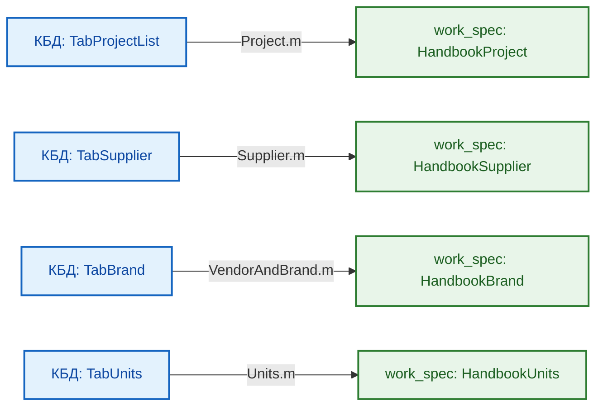

# ДОКУМЕНТАЦИЯ: СПЕЦИФИКАЦИЯ ТИПА `work spec`

## НАЗНАЧЕНИЕ ДОКУМЕНТА

Данный документ содержит полное техническое описание архитектуры, структуры данных, нормативно-справочной модели (НСИ) и правил валидации спецификаций типа `work spec` — ключевого элемента системы управления проектами и заказами Группы компаний «ПЕРЕДОВЫЕ РЕШЕНИЯ».

---

## ОГЛАВЛЕНИЕ

1. [Введение](#1-введение)
2. [Архитектура спецификации work spec](#2-архитектура-спецификации-work-spec)
3. [Таблица TabTableSchema — метаданные и схема валидации](#3-таблица-tabtableschema)
4. [Структура столбцов TabTableSchema](#4-структура-столбцов-tabtableschema)
5. [Спецификация TabSpecificationWork_1](#5-спецификация-tabspecificationwork_1)
6. [Спецификация TabSpecificationWork_2](#6-спецификация-tabspecificationwork_2)
7. [Справочники и источники данных (Двухуровневая модель НСИ)](#7-справочники-и-источники-данных)
8. [Правила модификации и автоматизации](#8-правила-модификации-и-автоматизации)
9. [Генерация JSON-конфигураций для валидации](#9-генерация-json-конфигураций-для-валидации)
10. [Примеры использования и сценарии HorizonBI](#10-примеры-использования)
11. [Каталог связей и перекрёстные ссылки](#11-каталог-связей-и-перекрёстные-ссылки)

---

## 1. ВВЕДЕНИЕ

### 1.1. Что такое спецификация `work spec`

**Спецификация `work spec`** — это Master Data документ в формате Microsoft Excel, содержащий:

- **Технические данные**: описание товаров/услуг, номенклатура, комплектация, единицы измерения.
- **Логистические данные**: количества, сроки поставки, статусы отгрузки.
- **Финансовые данные**: цены закупки/продажи, расчетный контур НДС (0% и 22%), скидки, коэффициенты наценки.
- **Справочные данные (2-й тип)**: легкие прикладные проекции корпоративной базы данных КБД «КИТ» (проекты, поставщики, бренды).

### 1.2. Роль в экосистеме HorizonBI

Спецификации `work spec`:

1. Являются **источником первичных данных** для ETL-процессора `ProcessingTable`.
2. Служат основой для регламентной генерации **производных спецификаций** (типы `30..90`).
3. Обеспечивают **единую точку истины** (Single Source of Truth) для всех проектов холдинга.
4. Интегрируются с системой валидации через язык конфигураций `HorizonBI`.

### 1.3. Версионность

- **Текущая версия шаблона**: `rev.04 v03`
- **Дата последнего обновления**: 21 сентября 2026 г.
- **Файл эталонного шаблона**: `Шаблон-спецификация work spec #2026.xlsx`

---

## 2. АРХИТЕКТУРА СПЕЦИФИКАЦИИ WORK SPEC

### 2.1. Структура книги Excel

Файл спецификации состоит из следующих взаимосвязанных листов:

| Лист                  | Тип                  | Назначение                                                                  |
| :-------------------- | :------------------- | :-------------------------------------------------------------------------- |
| `SpecificationWork_1` | Рабочий              | Основная таблица Master Data (техника, закупки, логистика: 30 колонок)      |
| `SpecificationWork_2` | Рабочий              | Финансовая таблица (наценки, цены реализации, блок НДС, скидки: 18 колонок) |
| `SpecificationWork`   | Технологический      | Объединенный плоский датасет (результат слияния Work_1 + Work_2)            |
| `Pivot`               | Аналитический        | Сводная таблица для экспресс-анализа проекта                                |
| `TableSchema`         | Служебный            | Таблица `TabTableSchema` (схема данных и правила валидации 48 колонок)      |
| `ConfigJSON`          | Служебный            | Таблица `TabConfigJSON` (JSON-конфигурации для ETL-процессора)              |
| `HandbookProject`     | Справочник (2-й тип) | Проекты и заказы холдинга (проекция `TabProjectList` через `Project.m`)     |
| `HandbookBrand`       | Справочник (2-й тип) | Бренды и вендоры (проекция `TabBrand` через `VendorAndBrand.m`)             |
| `HandbookSupplier`    | Справочник (2-й тип) | Реестр поставщиков (проекция `TabSupplier` через `Supplier.m`)              |
| `HandbookUnit`        | Справочник (2-й тип) | Единицы измерения ОКЕИ (проекция `TabUnits` через `Units.m`)                |

### 2.2. Связь между таблицами

```
TabSpecificationWork_1 (30 колонок)
         │
         │ [HASH COLLECTION] — ключ связи 1:1
         │
         ↓
TabSpecificationWork_2 (18 колонок)
         │
         │ LEFT JOIN (ProcessingTable / RunLeftJOINstructure)
         │
         ↓
TabSpecificationWork (47 колонок без дубля ключа) → Pivot → Аналитика
```

### 2.3. Ключевое поле связи: `HASH COLLECTION`

Глобальный первичный ключ строки спецификации:

- **Тип данных:** `text`
- **Формат генерации:** `{NUM PROJECT}-ver_{VER COLLECTION}-set_{IDset}-{isSHIPPED}`
- **Пример:** `1/2026-N2-МАС-ver_1-set_4.2-true`
- **Назначение:** Обеспечение строгой реляционной целостности 1:1 между строками инженерной (`Work_1`) и финансовой (`Work_2`) частей.

---

## 3. ТАБЛИЦА TabTableSchema

### 3.1. Назначение и функции

Таблица **`TabTableSchema`** расположена на листе `TableSchema` и содержит полную машиночитаемую спецификацию метаданных для всех **48 столбцов** спецификации.

Функции схемы:

1. Автоматическая генерация секций `ValidationData` для DSL-конфигураторов `HorizonBI`.
2. Документирование физических типов данных (`TYPE DATASET`), диапазонов (`RANGE VALUES`) и обязательности (`NULL VALUE`).
3. Контроль форматирования ячеек Excel (`EXCEL TYPE`, `HORIZONTAL ALIGNMENT`).

### 3.2. Статистика схемы

- **Всего описанных столбцов:** 48 (30 для `Work_1` + 18 для `Work_2`)
- **Атрибутов описания (колонок схемы):** 17
- **Используемых типов данных:** 3 (`int`, `float`, `text`)
- **Подключенных справочников 2-го типа:** 4

---

## 4. СТРУКТУРА СТОЛБЦОВ TabTableSchema

Таблица схемы состоит из 17 нормативных атрибутов:

1. `TABLE NAME` — имя целевой таблицы (`TabSpecificationWork_1` или `TabSpecificationWork_2`).
2. `NUM COLUMN` — порядковый номер столбца (1..30 и 1..18).
3. `СOLUMNS NAME` — системное английское имя столбца в смарт-таблице.
4. `COLUMN NAME RUS` — официальное русскоязычное наименование для UI и отчетов.
5. `TYPE DATASET` — тип данных валидации (`int`, `float`, `text`).
6. `RANGE VALUES` — допустимый диапазон значений `[min, max]`.
7. `UNIQUE FLAG` — флаг уникальности значений (`true`/`false`).
8. `NULL VALUE` — допустимость пустых значений (`true`/`false`).
9. `isAUTOMATIC` — флаг автоматического вычисления формулой Excel.
10. `MODIFY FLAG` — признак возможности ручного переопределения формулы.
11. `HANDBOOK SOURCE` — имя подключенного справочника 2-го типа (`TabProjectList`, `TabSupplier` и др.).
12. `DROPDOWN LIST` — признак наличия выпадающего списка Data Validation в Excel.
13. `EXCEL TYPE` — формат ячейки Excel (Числовой, Текстовый, Процентный, Общий).
14. `VERTICAL ALIGNMENT` — вертикальное выравнивание (`up`, `center`, `down`).
15. `HORIZONTAL ALIGNMENT` — горизонтальное выравнивание (`left`, `center`, `right`).
16. `TRANSFER TEXT` — признак переноса текста по словам (Wrap Text).
17. `COMMENT` — подробное инженерное описание бизнес-логики столбца.

---

## 5. СПЕЦИФИКАЦИЯ TabSpecificationWork_1 (30 колонок)

Таблица размещена на листе `SpecificationWork_1` и содержит технические, логистические и закупочные данные.

### Полный реестр столбцов TabSpecificationWork_1:

|  №  | Имя столбца                | Тип   | Диапазон      | Авто | Конфиденциально | Описание                                                  |
| :-: | :------------------------- | :---- | :------------ | :--: | :-------------: | :-------------------------------------------------------- |
|  1  | `IDnum`                    | int   | [1, 300]      |  ❌  |       ❌        | Порядковый номер строки в спецификации                    |
|  2  | `IDsource`                 | int   | [1, 300]      |  ❌  |       ❌        | Внешний идентификатор позиции в ИД                        |
|  3  | `NUM PROJECT`              | text  | [13, 25]      |  ❌  |       ❌        | Шифр проекта (выпадающий список из `HandbookProject`)     |
|  4  | `NUM ORDER`                | int   | [1, 100]      |  ✅  |       ❌        | Номер заказа (автовычисление из `NUM PROJECT`)            |
|  5  | `VER COLLECTION`           | int   | [1, 50]       |  ❌  |       ❌        | Версия ревизии комплектации                               |
|  6  | `DESCRIPTION SET`          | text  | [5, 300]      |  ❌  |       ❌        | Наименование комплекта поставки                           |
|  7  | `IDset`                    | text  | [1, 50]       |  ❌  |       ❌        | Идентификатор комплекта оборудования                      |
|  8  | `NUM SEQUENCE SET`         | int   | [1, 50]       |  ❌  |       ❌        | Порядковый номер позиции внутри комплекта                 |
|  9  | `NUM FULL SET`             | text  | [3, 5]        |  ✅  |       ❌        | Полный иерархический номер (`1.1`, `1.2`)                 |
| 10  | `isSHIPPED`                | text  | [4, 5]        |  ❌  |       ❌        | Признак завершения отгрузки (`true`/`false`)              |
| 11  | `HASH COLLECTION`          | text  | [6, 50]       |  ✅  |       ❌        | **Глобальный ключ связи спецификаций**                    |
| 12  | `NAME PRODUCT`             | text  | [3, 300]      |  ❌  |       ❌        | Наименование товара, оборудования или услуги              |
| 13  | `DESCRIPTION PRODUCT`      | text  | [10, 1000]    |  ❌  |       ❌        | Подробное техническое описание и характеристики           |
| 14  | `BRAND`                    | text  | [3, 50]       |  ❌  |       ❌        | Производитель/бренд (выпадающий список `HandbookBrand`)   |
| 15  | `SUPPLIER`                 | text  | [3, 50]       |  ❌  |    🔒 **ДА**    | Поставщик (выпадающий список `HandbookSupplier`)          |
| 16  | `ARTICLE SUPPLIER`         | text  | [3, 50]       |  ❌  |    🔒 **ДА**    | Артикул номенклатуры в прайсе поставщика                  |
| 17  | `ARTICLE INTERNAL`         | text  | [3, 15]       |  ❌  |    🔒 **ДА**    | Уникальный внутренний артикул номенклатуры ГК             |
| 18  | `UNITS`                    | text  | [1, 10]       |  ❌  |       ❌        | Единица измерения (выпадающий список `HandbookUnit`)      |
| 19  | `QUANTITY SET`             | int   | [1, 50]       |  ❌  |       ❌        | Количество единиц в одном комплекте                       |
| 20  | `QUANTITY SHIPPED SET`     | int   | [1, 50]       |  ❌  |       ❌        | Число комплектов в партии отгрузки                        |
| 21  | `QUANTITY TOTAL`           | int   | [1, 50]       |  ✅  |       ❌        | Общее количество к поставке (`QUANTITY SET * SHIPPED`)    |
| 22  | `QUANTITY SUPPLIER`        | int   | [0, 999]      |  ❌  |    🔒 **ДА**    | Количество в партии закупки у поставщика                  |
| 23  | `PRICE UNIT $PURCHASE`     | float | [1, 1000000]  |  ❌  |    🔒 **ДА**    | **Цена закупки за ед. БЕЗ НДС** (чистая база закупки)     |
| 24  | `VAT ADD PRICE $PURCHASE`  | float | [0, 3000000]  |  ❌  |    🔒 **ДА**    | **Входящий НДС на ед. закупки** (ручной ввод / 0 при УСН) |
| 25  | `COST PRICE $PURCHASE`     | float | [1, 5000000]  |  ✅  |    🔒 **ДА**    | Себестоимость партии закупки БЕЗ НДС (`21 * 23`)          |
| 26  | `COST PRICE VAT $PURCHASE` | float | [1, 10000000] |  ✅  |    🔒 **ДА**    | **Себестоимость закупки С НДС** (`25 + 21 * 24`)          |
| 27  | `TCP SOURCE`               | text  | [7, 1000]     |  ❌  |    🔒 **ДА**    | Ссылка на ТКП поставщика (`HandbookTCP`)                  |
| 28  | `COMMENT WORK`             | text  | [7, 3000]     |  ❌  |    🔒 **ДА**    | Служебный комментарий инженера                            |
| 29  | `URL PRODUCT`              | text  | [7, 1000]     |  ❌  |       ❌        | Ссылка на официальную карточку товара                     |
| 30  | `IMAGE PRODUCT`            | text  | [7, 1000]     |  ❌  |       ❌        | Имя или путь к файлу изображения ТМЦ                      |

---

## 6. СПЕЦИФИКАЦИЯ TabSpecificationWork_2 (18 колонок)

Таблица размещена на листе `SpecificationWork_2` (диапазон F1:W4). Содержит финансовые параметры реализации, скидки и блок расчета НДС.  
_(Колонки A–E листа содержат формулы `=ВЫБОРСТОЛБЦ(TabSpecificationWork_1;...)` для отображения контекста и не входят в смарт-таблицу)._

### Полный реестр столбцов TabSpecificationWork_2:

|  №  | Имя столбца                  | Тип   | Диапазон      | Авто | Конфиденциально | Описание                                                            |
| :-: | :--------------------------- | :---- | :------------ | :--: | :-------------: | :------------------------------------------------------------------ |
|  1  | `HASH COLLECTION`            | text  | [6, 50]       |  ✅  |       ❌        | **Ключ связи с таблицей Work_1**                                    |
|  2  | `COEFFICIENT MARKUP`         | float | [1, 10]       |  ❌  |    🔒 **ДА**    | Коэффициент торговой наценки холдинга                               |
|  3  | `PRICE UNIT $SALE`           | float | [1, 1000000]  |  ✅  |    🔒 **ДА**    | Базовая цена продажи за ед. БЕЗ НДС (`PURCHASE * MARKUP`)           |
|  4  | `COST DEAL $SALE`            | float | [1, 5000000]  |  ✅  |    🔒 **ДА**    | Базовая стоимость продажи БЕЗ НДС (`QUANTITY TOTAL * SALE`)         |
|  5  | `DISCOUNT PERCENT`           | float | [0, 70]       |  ❌  |    🔒 **ДА**    | Согласованный процент коммерческой скидки                           |
|  6  | `DISCOUNT MONEY`             | float | [1, 1000000]  |  ✅  |    🔒 **ДА**    | Сумма скидки в деньгах                                              |
|  7  | `FORMULA SPECIFIC COST`      | text  | [0, 300]      |  ❌  |    🔒 **ДА**    | Формула специфического расчета бандлов                              |
|  8  | `VAT RATE CONTRACTOR $TOTAL` | float | [0, 0.22]     |  ✅  |       ❌        | **Ставка НДС исполнителя** (`0.22` для ГОРИЗОНТ; `0.00` для МАС/ИП) |
|  9  | `PRICE UNIT $TOTAL`          | float | [1, 5000000]  |  ✅  |       ❌        | **Итоговая цена за ед. БЕЗ НДС** (для договоров без НДС)            |
| 10  | `VAT ADD PRICE UNIT $TOTAL`  | float | [0, 5000000]  |  ✅  |       ❌        | Исходящий НДС на ед. продукции (`Col_9 * Col_8`)                    |
| 11  | `PRICE VAT UNIT $TOTAL`      | float | [0, 15000000] |  ✅  |       ❌        | **Итоговая цена за ед. С НДС** (для договоров ОСНО)                 |
| 12  | `COST $TOTAL`                | float | [1, 10000000] |  ✅  |       ❌        | **Итоговая стоимость БЕЗ НДС** (`QUANTITY TOTAL * Col_9`)           |
| 13  | `COST ADD VAT $TOTAL`        | float | [0, 5000000]  |  ✅  |       ❌        | Исходящий НДС на стоимость партии (`Col_12 * Col_8`)                |
| 14  | `COST VAT $TOTAL`            | float | [1, 25000000] |  ✅  |       ❌        | **Итоговая стоимость партии С НДС** (`Col_12 + Col_13`)             |
| 15  | `DURATION SALE $TOTAL`       | int   | [1, 540]      |  ❌  |       ❌        | Срок поставки клиенту в рабочих днях                                |
| 16  | `isSUPPLIED`                 | text  | [4, 5]        |  ❌  |       ❌        | Признак наличия складского остатка (`true`/`false`)                 |
| 17  | `isPROCESSING`               | text  | [4, 5]        |  ❌  |       ❌        | Признак необходимости доработки/постобработки                       |
| 18  | `COMMENT CUSTOMER`           | text  | [0, 3000]     |  ❌  |       ❌        | Публичное примечание для заказчика в ТКП                            |

---

## 7. СПРАВОЧНИКИ И ИСТОЧНИКИ ДАННЫХ (ДВУХУРОВНЕВАЯ МОДЕЛЬ НСИ)

Спецификация `work_spec` не хранит мастер-справочники, а использует **прикладные проекции 2-го типа**, формируемые из корпоративной базы данных «КИТ» (`c:\OneDrive\01__LLC_MAS_2025\КИТ\01__КБД\03__Excel\`):



_Подробное описание 19 фондов КБД 1-го типа и логики работы M-адаптеров содержится в:_  
**[README-handbook-function.md](../../05__pq-script/01__general/04__handbook-function-processing/README-handbook-function.md)**

---

## 8. ПРАВИЛА МОДИФИКАЦИИ И АВТОМАТИЗАЦИИ

1.  **Категория 1 (Строгий ручной ввод):** Колонки описаний, артикулов, брендов, количеств и чистой цены закупки `PRICE UNIT $PURCHASE`.
2.  **Категория 2 (Строго автоматические):** Колонки `NUM ORDER`, `NUM FULL SET`, `HASH COLLECTION`, `COST PRICE $PURCHASE`, `COST PRICE VAT $PURCHASE`, расчетные налоговые столбцы НДС (`Col_8`, `Col_10`, `Col_11`, `Col_13`, `Col_14` в `Work_2`). Изменение формул запрещено.
3.  **Категория 3 (Автовычисление с возможностью переопределения):** Столбцы `QUANTITY TOTAL`, `PRICE UNIT $SALE`, `COST DEAL $SALE`, `DISCOUNT MONEY`, `PRICE UNIT $TOTAL`, `COST $TOTAL`. Допускают точечную ручную корректировку в особых коммерческих сценариях.

---

## 9. ГЕНЕРАЦИЯ JSON-КОНФИГУРАЦИЙ ДЛЯ ВАЛИДАЦИИ

Таблица `TabTableSchema` позволяет генерировать блоки правил `ValidationData` для языка `HorizonBI`:

- `TYPE DATASET = int` $\rightarrow$ функция `fvCheckIntegerRange_scalar` с параметрами `RANGE VALUES`.
- `TYPE DATASET = float` $\rightarrow$ функция `fvCheckFloatRange_scalar` с параметрами `RANGE VALUES`.
- `TYPE DATASET = text` $\rightarrow$ функция `fvCheckTextLength_scalar` с параметрами `RANGE VALUES`.
- `NULL VALUE = false` $\rightarrow$ обязательное добавление правила `fvCheckNonEmpty: []`.

---

## 10. ПРИМЕРЫ ИСПОЛЬЗОВАНИЯ И СЦЕНАРИИ HORIZONBI

### 10.1. Генерация ТКП для ОСНО: `40__to_customer_fin` (ООО «ГОРИЗОНТ», с НДС 22%)

```json
{
  "TabSpecificationWork": {
    "1": {
      "ColumnSetType": [
        { "NUM PROJECT": "text" },
        { "QUANTITY TOTAL": "int" },
        { "PRICE VAT UNIT $TOTAL": "float" },
        { "COST VAT $TOTAL": "float" }
      ],
      "ColumnFilterFreeData": [{ "NUM PROJECT": "1/2026-N2-ГОРИЗОНТ" }]
    },
    "2": {
      "RemoveXorColumn": [
        "NUM FULL SET",
        "NAME PRODUCT",
        "DESCRIPTION PRODUCT",
        "QUANTITY TOTAL",
        "UNITS",
        "PRICE VAT UNIT $TOTAL",
        "COST VAT $TOTAL",
        "DURATION SALE $TOTAL",
        "COMMENT CUSTOMER"
      ]
    },
    "3": {
      "RenameColumn": [
        { "NUM FULL SET": "№ п/п" },
        { "NAME PRODUCT": "Наименование оборудования" },
        { "DESCRIPTION PRODUCT": "Технические характеристики" },
        { "QUANTITY TOTAL": "Кол-во" },
        { "UNITS": "Ед. изм." },
        { "PRICE VAT UNIT $TOTAL": "Цена с НДС 22%, руб." },
        { "COST VAT $TOTAL": "Стоимость с НДС 22%, руб." },
        { "DURATION SALE $TOTAL": "Срок поставки (дней)" },
        { "COMMENT CUSTOMER": "Примечание" }
      ],
      "ReorderColumn": [
        "№ п/п",
        "Наименование оборудования",
        "Технические характеристики",
        "Кол-во",
        "Ед. изм.",
        "Цена с НДС 22%, руб.",
        "Стоимость с НДС 22%, руб.",
        "Срок поставки (дней)",
        "Примечание"
      ]
    }
  }
}
```

---

## 11. КАТАЛОГ СВЯЗЕЙ И ПЕРЕКРЁСТНЫЕ ССЫЛКИ

- [Головной навигатор проекта (README.md)](../../../README.md)
- [Руководство по эксплуатации ETL-процессора ProcessingTable](../../05__pq-script/01__general/03__ETL-processing/README-etl-processor.md)
- [Справочник функций НСИ (README-handbook-function.md)](../../05__pq-script/01__general/04__handbook-function-processing/README-handbook-function.md)
- [Библиотеки валидации и трансформаций (README-utils-function.md)](../../05__pq-script/01__general/02__utils-function-processing/README-utils-function.md)
- [Системные функции M (README-general-function.md)](../../05__pq-script/01__general/01__general-function-processing/README-general-function.md)
- **Производные спецификации ИРП:**
  - [Техническая спецификация: to_customer_tech (тип 30)](../30__to_customer_tech/README-to_customer_tech.md)
  - [Финансовая спецификация ТКП: to_customer_fin (тип 40)](../40__to_customer_fin/README-to_customer_fin.md)
  - [Правки заказчика: from_customer (тип 50)](../50__from_customer/README-from_customer.md)
  - [Запросы поставщикам: to_supplier (тип 60)](../60__to_supplier/README-to_supplier.md)
  - [Коммерческие предложения: from_supplier (тип 70)](../70__from_supplier/README-from_supplier.md)
  - [План-факт закупки: purchase (тип 80)](../80__purchase/README-purchase.md)
  - [План-факт отгрузки: shipment (тип 90)](../90__shipment/README-shipment.md)
