# ИСТОЧНИК: README-etl-processor.md

# РУКОВОДСТВО ПО ЭКСПЛУАТАЦИИ: ETL-ПРОЦЕССОР «PROCESSING TABLE»

---

## 1. ВВЕДЕНИЕ И ПАСПОРТ СИСТЕМЫ

### 1.1. Назначение и бизнес-роль в ГК «Передовые решения»

**ETL-процессор `ProcessingTable`** — это центральное программное ядро экосистемы **HorizonBI**, реализованное на функциональном языке Power Query (M). Процессор предназначен для автоматизации полного жизненного цикла обработки табличных массивов данных (Master Data) в среде Microsoft Excel: от извлечения сырых данных из разнородных файлов до сложных трансформаций, слияний и сквозной верификации качества данных.

В операционной модели ГК «Передовые решения» процессор выполняет роль **шлюза изоляции и трансформации данных**:

- Обеспечивает создание производных спецификаций (`to_customer_tech`, `to_customer_fin`, `to_supplier`, `purchase`, `shipment`) из единого источника правды — мастер-спецификации `work_spec` (`TabSpecificationWork_1` + `TabSpecificationWork_2`).
- Гарантирует абсолютную защиту коммерческой тайны (автоматическое и безошибочное удаление закупочных цен, внутренних наценок и данных о реальных поставщиках при формировании клиентских отгрузочных документов).
- Устраняет человеческий фактор при рутинных операциях нормализации номенклатуры, типизации, переименования столбцов и фильтрации.

### 1.2. Паспорт компонента

| Параметр                                          | Значение                                                                                                                                                          |
| :-------------------------------------------------------- | :------------------------------------------------------------------------------------------------------------------------------------------------------------------------ |
| **Идентификатор компонента** | `ProcessingTable`                                                                                                                                                       |
| **Текущая версия ядра**            | `rev.04 v02`                                                                                                                                                            |
| **Среда выполнения**                 | Power Query Engine (Excel 2016+, Excel M365, Power BI Desktop)                                                                                                            |
| **Язык разработки**                   | Power Query (M)                                                                                                                                                           |
| **Язык управления (DSL)**             | `HorizonBI` (на базе JSON-конфигураторов)                                                                                                           |
| **Тип вызова**                             | Параметризованная M-функция                                                                                                                       |
| **Входные контракты**               | `_configJSONIndex as text`, до 4-х необязательных путей к файлам `_pathExcelBook_1..4 as text`                                           |
| **Выходной контракт**               | Результирующий объект`table` с примененными трансформациями и опциональным столбцом `VALIDATION` |
| **Зависимости**                          | Внешние библиотеки`UtilsFunctionVector`, `UtilsFunctionScalar`, таблица `TabConfigJSON`                                                     |

### 1.3. Архитектурная схема взаимодействия компонентов

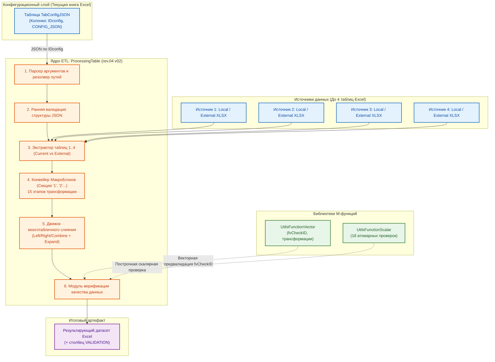

---

## 2. ИНСТРУКЦИЯ ДЛЯ ОПЕРАТОРА (БЫСТРЫЙ СТАРТ)

### 2.1. Подготовка конфигурации в таблице `TabConfigJSON`

Перед запуском обработки необходимо убедиться, что в текущей книге Excel присутствует смарт-таблица с именем **`TabConfigJSON`**. Таблица должна содержать обязательные столбцы:

1. **`IDconfig`** (Текстовый) — уникальный код конфигурации (например, `config_40_to_customer_fin_OSNO` или `join_work1_work2`).
2. **`CONFIG_JSON`** (Текстовый) — валидный JSON-документ на языке `HorizonBI`.
3. **`COMMENT`** (Текстовый, опционально) — служебное описание назначения сценария.

```
+----+------------------------------------+---------------------------------------------+------------------------------------+
| N  | IDconfig                           | CONFIG_JSON                                 | COMMENT                            |
+----+------------------------------------+---------------------------------------------+------------------------------------+
| 1  | 40_to_customer_fin_HORIZON         | {"TabSpecificationWork": {"1": {...}}}     | Генерация ТКП для ОСНО (с НДС 22%) |
+----+------------------------------------+---------------------------------------------+------------------------------------+
```

### 2.2. Запуск процессора

#### Вариант А: Вызов через пользовательский интерфейс Power Query

1. В редакторе Power Query выберите функцию **`ProcessingTable`**.
2. В появившейся форме ввода параметров заполните:
   - **`_configJSONIndex`**: введите точный идентификатор конфигурации (например, `40_to_customer_fin_HORIZON`).
   - **`_pathExcelBook_1`** (опционально): полный абсолютный путь к файлу-источнику для первой таблицы (например, `C:\OneDrive\Project_1\20__work_spec\spec.xlsx`). Оставьте пустым, если таблица находится в текущем файле.
   - **`_pathExcelBook_2..4`** (опционально): пути к файлам для остальных таблиц многотабличной конфигурации.
3. Нажмите кнопку **«Вызвать» (Invoke)**.

#### Вариант Б: Вызов через формулу языка M в новом запросе

Создайте пустой запрос и вставьте код вызова:

```m
let
    Source = ProcessingTable(
        "40_to_customer_fin_HORIZON",
        "C:\OneDrive\02__Спецификации\20__work_spec\22__Спецификация-Горизонт - work spec rev.22 v03 #1_2024.xlsx"
    )
in
    Source
```

### 2.3. Правила разрешения путей к файлам (Workbook Resolver)

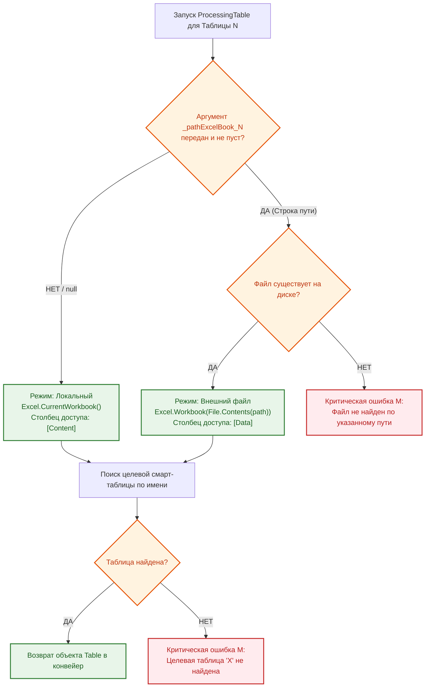

---

## 3. АРХИТЕКТУРА МАКРОБЛОКОВ И ПРАВИЛА ВАЛИДАЦИИ JSON

### 3.1. Концепция нумерованных секций (Управление состоянием)

Язык `HorizonBI` организует обработку данных через **МакроБлоки (секции)**. МакроБлок — это атомарный контейнер операций, гарантирующий последовательное изменение состояния датасета.

```json
{
  "Таблица_1": {
    "1": {
      /* Шаг 1: Первичная очистка и фильтрация */
    },
    "2": {
      /* Шаг 2: Модификация значений */
    },
    "3": {
      /* Шаг 3: Финальное переименование и типизация */
    }
  }
}
```

**Принцип работы конвейера состояний:**

$$
\text{Table}_{\text{Initial}} \xrightarrow{\text{МакроБлок "1"}} \text{Table}_{\text{State 1}} \xrightarrow{\text{МакроБлок "2"}} \text{Table}_{\text{State 2}} \dots \xrightarrow{\text{МакроБлок "N"}} \text{Table}_{\text{Final}}
$$

### 3.2. Системные правила и ограничения структуры JSON

Нарушение любого из следующих правил приводит к аварийной остановке процессора на этапе **ранней валидации**:

1. **Числовые ключи секций:** Имена МакроБлоков обязаны быть строковыми представлениями положительных целых чисел (`"1"`, `"2"`, `"10"`, `"77"`). Произвольные текстовые имена (`"Step1"`, `"Clean"`) **запрещены**.
2. **Сортировка по числовому значению:** Порядок выполнения секций определяется строго числовым возрастанием: секция `"2"` всегда выполняется раньше секции `"10"` (в отличие от стандартной алфавитной сортировки строк, где `"10"` идет раньше `"2"`).
3. **Уникальность команд в секции:** Внутри одного МакроБлока каждая BI-команда может быть вызвана **строго один раз**. Если требуется применить команду повторно (например, выполнить еще одну фильтрацию после добавления столбца), оператор обязан создать следующую по номеру секцию.
4. **Ограничение многотабличности:** Корневой JSON-объект может содержать от **1 до 4 целевых таблиц**.

---

## 4. СПРАВОЧНИК КОМАНД DSL «HORIZONBI» (15 ЭТАПОВ ТРАНСФОРМАЦИИ)

Внутри каждого МакроБлока процессор выполняет команды строго по системному конвейеру приоритетов:

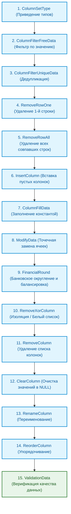

---

### Этап 1: `ColumnSetType` (Установка типов данных)

- **Назначение:** Принудительное назначение системных типов Power Query (`text`, `int`, `float`, `bool`) указанным столбцам.
- **JSON-сигнатура:**
  ```json
  "ColumnSetType": [
    { "ИмяСтолбца1": "int" },
    { "ИмяСтолбца2": "text" },
    { "ИмяСтолбца3": "float" },
    { "ИмяСтолбца4": "bool" }
  ]
  ```

---

### Этап 2: `ColumnFilterFreeData` (Фильтрация по значению)

- **Назначение:** Фильтрация строк таблицы по строгому равенству значения в указанном столбце (`WHERE column = 'value'`).
- **JSON-сигнатура:**
  ```json
  "ColumnFilterFreeData": [
    { "ИмяСтолбца": "ИскомоеЗначение" }
  ]
  ```

---

### Этап 3: `ColumnFilterUniqueData` (Фильтрация по уникальности)

- **Назначение:** Дедупликация. Удаляет все повторяющиеся строки, оставляя только **первое вхождение**.
- **JSON-сигнатура:**
  ```json
  "ColumnFilterUniqueData": [
    "ИмяСтолбца1",
    "ИмяСтолбца2"
  ]
  ```

---

### Этап 4: `RemoveRowOne` (Удаление первой найденной строки)

- **Назначение:** Поиск по ключевому полю и удаление **только одной (первой по порядку)** строки.
- **JSON-сигнатура:**
  ```json
  "RemoveRowOne": [
    {
      "rule_1": {
        "IndexSearchColumn": "HASH COLLECTION",
        "IndexSearchRow": "1/2024-N1-ГОРИЗОНТ-ver_1-set_1.1-true"
      }
    }
  ]
  ```

---

### Этап 5: `RemoveRowAll` (Удаление всех совпавших строк)

- **Назначение:** Удаление **всех** строк датасета, в которых значение в столбце совпадает с заданным.
- **JSON-сигнатура:**
  ```json
  "RemoveRowAll": [
    {
      "rule_1": {
        "IndexSearchColumn": "isSHIPPED",
        "IndexSearchRow": "false"
      }
    }
  ]
  ```

---

### Этап 6: `InsertColumn` (Вставка новых столбцов)

- **Назначение:** Добавление новых столбцов со значением по умолчанию `null`.
- **JSON-сигнатура:**
  ```json
  "InsertColumn": [
    "STATUS",
    "APPROVER_NAME"
  ]
  ```

---

### Этап 7: `ColumnFillData` (Массовое заполнение константой)

- **Назначение:** Замена всех значений в указанном столбце на фиксированное значение.
- **JSON-сигнатура:**
  ```json
  "ColumnFillData": [
    { "STATUS": "ВЫПОЛНЕНО" }
  ]
  ```

---

### Этап 8: `ModifyData` (Точечная модификация ячеек)

- **Назначение:** Адресное изменение значений в ячейках конкретной строки (поле `COMMENT` игнорируется).
- **JSON-сигнатура:**
  ```json
  "ModifyData": [
    {
      "data_1": {
        "IndexSearchColumn": "HASH COLLECTION",
        "IndexSearchRow": "1/2024-N1-ГОРИЗОНТ-ver_1-set_3.1-true",
        "NewData": {
          "QUANTITY TOTAL": 14,
          "COST $TOTAL": 15290.10,
          "COMMENT": "Служебный комментарий"
        }
      }
    }
  ]
  ```

---

### Этап 9: `FinancialRound` (Банковское округление и балансировка)

- **Назначение:** Решает проблему «расхождения копеек» при выгрузке производных финансовых спецификаций (`to_customer_fin`). В `work_spec` данные хранятся с максимальной, неокругленной точностью. Данный этап выполняет комплексный, взаимосвязанный пересчет блока финансовых полей одной строки, используя банковское округление (`RoundingMode.ToEven`, стандарт де-факто в 1С и большинстве бухгалтерских ERP-систем), и гарантирует строгий математический баланс: `Округленная Стоимость = Округленная Цена за ед. × Количество`.
- **Алгоритм расчета (построчно):**
  1. Точная стоимость без НДС = `SourceBasePrice × SourceQuantity`.
  2. Округление стоимости без НДС (банковское, до 2 знаков) → `TargetCostNoVat`.
  3. Точная сумма НДС = `TargetCostNoVat × SourceVatRate`.
  4. Округление суммы НДС → `TargetVatSum`.
  5. Стоимость с НДС = `TargetCostNoVat + TargetVatSum` → `TargetCostVat`.
  6. Обратный пересчет цены за единицу без НДС = `TargetCostNoVat / SourceQuantity` (округление) → `TargetPriceNoVat`.
  7. Обратный пересчет цены за единицу с НДС = `TargetCostVat / SourceQuantity` (округление) → `TargetPriceVat`.
- **Используемая функция-сателлит:** `UtilsFunctionVector[ftFinancialRound]`.
- **JSON-сигнатура:**
  ```json
  "FinancialRound": [
    {
      "rule_1": {
        "SourceQuantity": "QUANTITY TOTAL",
        "SourceBasePrice": "PRICE UNIT $TOTAL",
        "SourceVatRate": "VAT RATE CONTRACTOR $TOTAL",
        "TargetPriceNoVat": "PRICE UNIT $TOTAL",
        "TargetCostNoVat": "COST $TOTAL",
        "TargetVatSum": "COST ADD VAT $TOTAL",
        "TargetPriceVat": "PRICE VAT UNIT $TOTAL",
        "TargetCostVat": "COST VAT $TOTAL"
      }
    }
  ]
  ```
- **Важное примечание:** Столбцы-источники (`Source...`) и столбцы-цели (`Target...`) могут совпадать (перезапись «на месте», как в примере выше) — это стандартный режим для финализации данных перед отправкой клиенту. `SourceVatRate` для компаний на УСН должен содержать `0`.

---

### Этап 10: `RemoveXorColumn` (Исключающее/инверсное удаление списка столбцов` )

- **Назначение:** Удаляет абсолютно все столбцы, **кроме перечисленных в списке**.
- **JSON-сигнатура:**
  ```json
  "RemoveXorColumn": [
    "NUM FULL SET",
    "NAME PRODUCT",
    "QUANTITY TOTAL",
    "PRICE VAT UNIT $TOTAL",
    "COST VAT $TOTAL"
  ]
  ```

---

### Этап 11: `RemoveColumn` (Прямое удаление списка столбцов)

- **Назначение:** Удаление явно заданного перечня столбцов (черный список).
- **JSON-сигнатура:**
  ```json
  "RemoveColumn": [
    "SUPPLIER",
    "PRICE UNIT $PURCHASE",
    "COST PRICE $PURCHASE"
  ]
  ```

---

### Этап 12: `ClearColumn` (Очистка значений столбцов)

- **Назначение:** Сохраняет структуру столбца, но заменяет все ячейки на `null`.
- **JSON-сигнатура:**
  ```json
  "ClearColumn": [
    "COMMENT WORK",
    "TCP SOURCE"
  ]
  ```

---

### Этап 13: `RenameColumn` (Переименование столбцов)

- **Назначение:** Локализация и переименование заголовков.
- **JSON-сигнатура:**
  ```json
  "RenameColumn": [
    { "NAME PRODUCT": "НАИМЕНОВАНИЕ" },
    { "PRICE VAT UNIT $TOTAL": "ЦЕНА ЗА ЕД., С НДС" }
  ]
  ```

---

### Этап 14: `ReorderColumn` (Переупорядочивание столбцов)

- **Назначение:** Выстраивание последовательности столбцов слева направо.
- **JSON-сигнатура:**
  ```json
  "ReorderColumn": [
    "№ п/п",
    "НАИМЕНОВАНИЕ",
    "КОЛИЧЕСТВО",
    "ЦЕНА ЗА ЕД., С НДС",
    "СТОИМОСТЬ, С НДС"
  ]
  ```

---

### Этап 15: `ValidationData` (Комплексная валидация датасета)

- **Назначение:** Формирует сервисный столбец **`VALIDATION`** с кодами ошибок по каждой строке (`0` — валидно, `$N$` — номер столбца с ошибкой).
- **JSON-сигнатура:**
  ```json
  "ValidationData": [
    {
      "IDnum": {
        "fvCheckID": []
      }
    },
    {
      "НАИМЕНОВАНИЕ": {
        "fvCheckNonEmpty": [],
        "fvCheckTextLength_scalar": [3, 200]
      }
    }
  ]
  ```

---

## 5. МНОГОТАБЛИЧНЫЙ ДВИЖОК СЛИЯНИЯ (MULTI-TABLE JOIN ENGINE)

### 5.1. Архитектурные принципы

Процессор поддерживает работу с **1, 2, 3 или 4 таблицами** в рамках одной конфигурации. В многотабличном режиме процессор:

1. Загружает каждую таблицу по отдельности из локального или внешнего файла.
2. Прогоняет каждую таблицу через **ее собственный набор МакроБлоков** (Этапы 1..14).
3. Применяет **глобальную операцию слияния**, указанную в конфигурации первой таблицы.

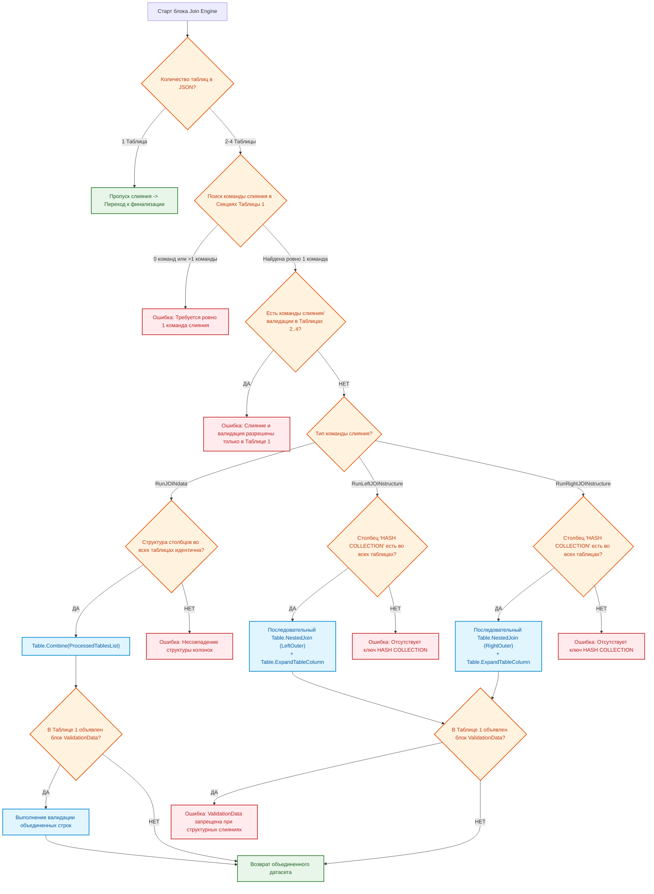

### 5.2. Спецификация команд слияния

1. **`RunLeftJOINstructure` (Левое структурное слияние):** Слияние структур по горизонтали. Таблица №1 — базовая («левая»), к ней последовательно присоединяются остальные по ключу `HASH COLLECTION` с автоматическим раскрытием колонок через `Table.ExpandTableColumn`._Синтаксис:_ `"RunLeftJOINstructure": []`
2. **`RunRightJOINstructure` (Правое структурное слияние):** Базовой («правой») становится последняя таблица в JSON, к ней присоединяются предыдущие по ключу `HASH COLLECTION`._Синтаксис:_ `"RunRightJOINstructure": []`
3. **`RunJOINdata` (Вертикальная склейка датасетов):** Добавление строк (`UNION ALL`) для таблиц идентичной структуры.
   _Синтаксис:_ `"RunJOINdata": []`

---

## 6. СВЯЗЬ С ВНЕШНИМИ БИБЛИОТЕКАМИ И КАТАЛОГ ССЫЛОК

- [Головное руководство проекта (README.md)](../../../../../README.md)
- [Руководство по функциям валидации и трансформации (UtilsFunction)](../02__utils-function-processing/README-utils-function.md)
- [Руководство по системным сервисным функциям (GeneralFunction)](../01__general-function-processing/README-general-function.md)
- [Руководство по функциям справочников (HandbookFunction)](../04__handbook-function-processing/README-handbook-function.md)
- [Спецификация Master Data шаблона (README-work_spec)](../../../07__template-excel/20__work_spec/README-work_spec.md)

---

## 7. ПРАКТИКУМ: РЕАЛЬНЫЕ BI-СЦЕНАРИИ ИЗ ПРАКТИКИ ГК

### Сценарий 1: Генерация финансовой спецификации `to_customer_fin` для ООО «ГОРИЗОНТ» (ОСНО, 22% НДС)

```json
{
  "TabSpecificationWork": {
    "1": {
      "ColumnSetType": [
        { "NUM PROJECT": "text" },
        { "QUANTITY TOTAL": "int" },
        { "PRICE VAT UNIT $TOTAL": "float" },
        { "COST VAT $TOTAL": "float" }
      ],
      "ColumnFilterFreeData": [{ "NUM PROJECT": "1/2024-N1-ГОРИЗОНТ" }]
    },
    "2": {
      "RemoveXorColumn": [
        "NUM FULL SET",
        "NAME PRODUCT",
        "DESCRIPTION PRODUCT",
        "QUANTITY TOTAL",
        "UNITS",
        "PRICE VAT UNIT $TOTAL",
        "COST VAT $TOTAL",
        "DURATION SALE $TOTAL",
        "COMMENT CUSTOMER"
      ]
    },
    "3": {
      "RenameColumn": [
        { "NUM FULL SET": "№ п/п" },
        { "NAME PRODUCT": "Наименование оборудования и услуг" },
        { "DESCRIPTION PRODUCT": "Технические характеристики" },
        { "QUANTITY TOTAL": "Кол-во" },
        { "UNITS": "Ед. изм." },
        { "PRICE VAT UNIT $TOTAL": "Цена за ед., руб. (с НДС 22%)" },
        { "COST VAT $TOTAL": "Стоимость, руб. (с НДС 22%)" },
        { "DURATION SALE $TOTAL": "Срок поставки (дней)" },
        { "COMMENT CUSTOMER": "Примечание" }
      ],
      "ReorderColumn": [
        "№ п/п",
        "Наименование оборудования и услуг",
        "Технические характеристики",
        "Кол-во",
        "Ед. изм.",
        "Цена за ед., руб. (с НДС 22%)",
        "Стоимость, руб. (с НДС 22%)",
        "Срок поставки (дней)",
        "Примечание"
      ]
    }
  }
}
```

---

## 8. ДИАГНОСТИКА, ОШИБКИ И ИХ УСТРАНЕНИЕ (TROUBLESHOOTING)

| Текст сообщения об ошибке                                                                                           | Причина возникновения                                                                                            | Регламент устранения                                                                                                                                |
| :---------------------------------------------------------------------------------------------------------------------------------------- | :----------------------------------------------------------------------------------------------------------------------------------- | :--------------------------------------------------------------------------------------------------------------------------------------------------------------------- |
| `Таблица с конфигурациями 'TabConfigJSON' не найдена в ТЕКУЩЕЙ книге.`                      | В активном файле Excel отсутствует смарт-таблица`TabConfigJSON`.                              | Создать лист`ConfigJSON`, создать смарт-таблицу с именем `TabConfigJSON` и столбцами `IDconfig`, `CONFIG_JSON`. |
| `В таблице 'TabConfigJSON' не найдена конфигурация с ID 'X'.`                                             | Опечатка в параметре`_configJSONIndex` или отсутствует строка в конфигураторе. | Проверить соответствие имени в вызове и столбце`IDconfig`. Проверить регистр букв.                      |
| `Целевая таблица с именем 'X', указанная в конфигураторе, не найдена.`             | В файле Excel нет листа/смарт-таблицы с именем, заданным в корне JSON.                | Проверить имя умной таблицы в исходном файле. Проверить правильность пути`_pathExcelBook`.            |
| `Ошибка конфигурации: Имена МакроБлоков в JSON должны быть только числами.`   | Секция названа текстом (напр.`"Step1"` вместо `"1"`).                                              | Переименовать ключи секций в строковые целые числа:`"1"`, `"2"`, `"3"`.                                              |
| `Ошибка конфигурации: В МакроБлоке "X" обнаружены повторяющиеся BI-команды.` | Внутри одной секции дважды вызвана одна команда (напр. две`ColumnFilterFreeData`). | Разнести повторяющиеся команды по разным секциям (МакроБлок`"1"` и МакроБлок `"2"`).                 |
| `RemoveColumn: В таблице отсутствуют столбцы для удаления: X, Y`                                   | Попытка удалить столбцы, которых нет в текущем состоянии таблицы.             | Проверить, не были ли эти столбцы переименованы или удалены на более ранних шагах/секциях.  |
| `ModifyData: Не удалось найти строку, где 'Col' = 'Val'`                                                         | Значение поиска не существует в указанном столбце.                                        | Проверить точность значения в`IndexSearchRow` (пробелы, регистр, опечатки в хэшах).                            |
| `Команда 'ValidationData' не может использоваться совместно с 'RunLeftJOINstructure'`             | Нарушение правил совместимости многотабличного слияния.                            | Удалить блок`ValidationData` из многотабличной конфигурации структурного слияния.                          |

---

## 9. РЕГЛАМЕНТ ТЕХНИЧЕСКОГО ОБСЛУЖИВАНИЯ И ВЕРСИОНИРОВАНИЯ

1. Любое изменение функционала процессора сопровождается обязательным инкрементом версии в шапке кода и документации:
   - **Major (`rev.0X`):** Изменение архитектуры, сигнатуры параметров или структуры языка `HorizonBI`.
   - **Minor (`v0X`):** Исправление внутренних ошибок, оптимизация производительности M-кода.
2. Перед выпуском новой ревизии код процессора проходит обязательное тестирование на тестовом стенде `03__Проект/06__example-query/`.

---

# ИСТОЧНИК: README-general-function.md

# РУКОВОДСТВО ПО СИСТЕМНЫМ СЕРВИСНЫМ ФУНКЦИЯМ: «GENERALFUNCTION»

---

## 1. ВВЕДЕНИЕ И ПАСПОРТ БИБЛИОТЕКИ

### 1.1. Назначение компонента

Библиотека **`GeneralFunction`** представляет собой низкоуровневый системный слой экосистемы **HorizonBI**, реализованный на языке Power Query (M). Библиотека инкапсулирует базовые платформенные операции, необходимые для бесперебойного функционирования ETL-процессора `ProcessingTable`:

- Универсальный доступ к книгам и таблицам Microsoft Excel с автоматическим разрешением контекста исполнения (текущий открытый файл vs внешний закрытый файл на диске или в OneDrive).
- Проверка целостности файловых путей, нормализация абсолютных и относительных ссылок.
- Низкоуровневая валидация и безопасный парсинг служебных JSON-структур.
- Унифицированное логирование, перехват критических исключений M и форматирование диагностических сообщений об ошибках.

### 1.2. Паспорт компонента

| Параметр                       | Значение                                                                    |
| :----------------------------- | :-------------------------------------------------------------------------- |
| **Имя запроса в Power Query**  | `GeneralFunction`                                                           |
| **Текущая версия**             | `rev.02 v01`                                                                |
| **Область применения**         | Системная поддержка процессора `ProcessingTable` и вспомогательных скриптов |
| **Тип возвращаемого значения** | Агрегатная запись функций `FunctionRecord = [...]`                          |
| **Зависимости**                | Отсутствуют (базовые функции Power Query Engine)                            |

### 1.3. Архитектурная схема взаимодействия

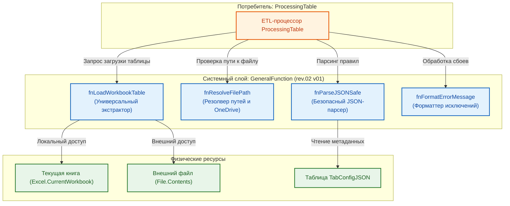

---

## 2. КАТАЛОГ СИСТЕМНЫХ ФУНКЦИЙ

### 2.1. `fnLoadWorkbookTable` (Универсальный загрузчик таблиц)

- **Назначение:** Извлечение объекта смарт-таблицы Excel по имени с автоматическим выбором между текущей активной книгой и внешним файлом.
- **Сигнатура M:**
  ```m
  (tableName as text, optional filePath as nullable text) as table
  ```
- **Параметры:**
  - `tableName`: точное имя целевой смарт-таблицы (например, `"TabSpecificationWork_1"`).
  - `filePath`: абсолютный путь к файлу `.xlsx` (если параметр `null` или пустая строка `""`, поиск выполняется в текущей активной книге через `Excel.CurrentWorkbook()`).
- **Алгоритм работы:**
  1. Если `filePath` не указан: обращается к `Excel.CurrentWorkbook()`, выполняет фильтрацию по полю `[Name] = tableName` и извлекает содержимое из столбца `[Content]`.
  2. Если `filePath` передан: открывает файл через `Excel.Workbook(File.Contents(filePath))`, выполняет фильтрацию по `[Item] = tableName` или `[Name] = tableName` и извлекает данные из столбца `[Data]`.
  3. Если таблица не найдена, генерирует детерминированную ошибку M: `"Целевая таблица с именем '<tableName>' не найдена."`.

---

### 2.2. `fnResolveFilePath` (Валидатор и резолвер файловых путей)

- **Назначение:** Проверка доступности файла на диске, нормализация разделителей путей (`\` vs `/`), защита от битых ссылок в синхронизируемых каталогах OneDrive.
- **Сигнатура M:**
  ```m
  (filePath as nullable text) as record
  ```
- **Возвращаемое значение:** Запись вида:
  ```m
  [
      IsValid = true,          // logical: признак корректности пути
      IsLocal = false,         // logical: true если это текущая книга (путь null)
      CleanPath = "C:\...",    // text: нормализованный путь без лишних пробелов
      ErrorMessage = null      // text / null: текст ошибки при сбое
  ]
  ```
- **Обработка краевых условий:**
  - Пустые строки и пробельные символы приводятся к состоянию `IsLocal = true`.
  - Проверяется наличие двоеточия для абсолютных путей Windows (`C:\...`) или сетевых UNC-путей (`\\server\...`).

---

### 2.3. `fnParseJSONSafe` (Отказоустойчивый парсер JSON)

- **Назначение:** Безопасное преобразование строкового JSON-конфигуратора в нативные структуры Power Query (`Record` / `List`) с детальной диагностикой синтаксических ошибок.
- **Сигнатура M:**
  ```m
  (jsonText as text, optional contextTag as nullable text) as any
  ```
- **Параметры:**
  - `jsonText`: текстовая строка в формате JSON.
  - `contextTag`: служебный тег для логирования (например, `"TabSpecificationWork_1/MacroBlock_1"`).
- **Алгоритм работы:**
  Выполняет вызов `try Json.Document(jsonText)`. В случае сбоя перехватывает исключение и генерирует структурированное сообщение об ошибке с указанием проблемного контекста и фрагмента некорректного JSON.

---

### 2.4. `fnFormatErrorMessage` (Стандартизатор диагностических сообщений)

- **Назначение:** Формирование единообразных, понятных бизнес-пользователю сообщений об ошибках ETL-процессора с указанием источника проблемы, этапа конвейера и корректирующего действия.
- **Сигнатура M:**
  ```m
  (stageName as text, entityName as text, details as text) as text
  ```
- **Формат выходного сообщения:**
  $$\text{"[HorizonBI Engine] Ошибка на этапе '\{stageName\}' при обработке '\{entityName\}': \{details\}"}$$

---

## 3. РЕАЛИЗАЦИЯ И ИСХОДНЫЙ КОД БИБЛИОТЕКИ

```m
// =============================================================================================
//
// СИСТЕМНАЯ БИБЛИОТЕКА 'GeneralFunction'
//
// версия rev.02 v01
// =============================================================================================

let
    // -----------------------------------------------------------------------------------------
    // Функция: fnLoadWorkbookTable
    // -----------------------------------------------------------------------------------------
    fnLoadWorkbookTable = (tableName as text, optional filePath as nullable text) as table =>
    let
        isLocal = (filePath = null or Text.Trim(filePath) = ""),
        sourceData = if isLocal then
            let
                currentWb = Excel.CurrentWorkbook(),
                filtered = Table.SelectRows(currentWb, each [Name] = tableName),
                resultTable = if Table.RowCount(filtered) = 1 then filtered{0}[Content]
                              else error "Целевая таблица с именем '" & tableName & "' не найдена в ТЕКУЩЕЙ книге."
            in
                resultTable
        else
            let
                fileBinary = try File.Contents(filePath)
                             otherwise error "Не удалось прочитать файл по указанному пути: '" & filePath & "'.",
                externalWb = Excel.Workbook(fileBinary),
                filtered = Table.SelectRows(externalWb, each [Item] = tableName or [Name] = tableName),
                resultTable = if Table.RowCount(filtered) >= 1 then filtered{0}[Data]
                              else error "Целевая таблица с именем '" & tableName & "' не найдена во внешнем файле '" & filePath & "'."
            in
                resultTable
    in
        sourceData,

    // -----------------------------------------------------------------------------------------
    // Функция: fnResolveFilePath
    // -----------------------------------------------------------------------------------------
    fnResolveFilePath = (filePath as nullable text) as record =>
    let
        isLocal = (filePath = null or Text.Trim(filePath) = ""),
        cleanPath = if isLocal then null else Text.Trim(filePath),
        isValid = isLocal or (Text.Length(cleanPath) >= 3 and (Text.Middle(cleanPath, 1, 2) = ":\" or Text.StartsWith(cleanPath, "\\"))),
        errorMsg = if isValid then null else "Указан некорректный формат пути к файлу: '" & Text.From(filePath) & "'."
    in
        [
            IsValid = isValid,
            IsLocal = isLocal,
            CleanPath = cleanPath,
            ErrorMessage = errorMsg
        ],

    // -----------------------------------------------------------------------------------------
    // Функция: fnParseJSONSafe
    // -----------------------------------------------------------------------------------------
    fnParseJSONSafe = (jsonText as text, optional contextTag as nullable text) as any =>
    let
        tag = if contextTag = null then "" else " [" & contextTag & "]",
        parseResult = try Json.Document(jsonText),
        output = if parseResult[HasError] then
            error "Ошибка парсинга JSON конфигурации" & tag & ". Проверьте корректность синтаксиса JSON (кавычки, скобки, запятые)."
        else
            parseResult[Value]
    in
        output,

    // -----------------------------------------------------------------------------------------
    // Функция: fnFormatErrorMessage
    // -----------------------------------------------------------------------------------------
    fnFormatErrorMessage = (stageName as text, entityName as text, details as text) as text =>
        "[HorizonBI Engine] Ошибка на этапе '" & stageName & "' при обработке '" & entityName & "': " & details,

    // =========================================================================================
    // РЕГИСТРАЦИЯ ФУНКЦИЙ В СИСТЕМНОЙ ЗАПИСИ
    // =========================================================================================
    FunctionRecord = [
        fnLoadWorkbookTable  = fnLoadWorkbookTable,
        fnResolveFilePath    = fnResolveFilePath,
        fnParseJSONSafe      = fnParseJSONSafe,
        fnFormatErrorMessage = fnFormatErrorMessage
    ]
in
    FunctionRecord
```

---

## 4. КАТАЛОГ СВЯЗЕЙ И ПЕРЕКРЁСТНЫЕ ССЫЛКИ

- [Головное руководство проекта (README.md)](../../../../../README.md)
- [Руководство по эксплуатации ETL-процессора ProcessingTable](../03__ETL-processing/README-etl-processor.md)
- [Руководство по библиотекам функций валидации и трансформации (UtilsFunction)](../02__utils-function-processing/README-utils-function.md)
- [Руководство по функциям нормализации справочников (HandbookFunction)](../04__handbook-function-processing/README-handbook-function.md)
- [Спецификация Master Data шаблона (README-work_spec)](../../../07__template-excel/20__work_spec/README-work_spec.md)

---

# ИСТОЧНИК: README-handbook-function.md

# РУКОВОДСТВО ПО ФУНКЦИЯМ НОРМАТИВНО-СПРАВОЧНОЙ ИНФОРМАЦИИ: «HANDBOOKFUNCTION»

---

## 1. ВВЕДЕНИЕ И АРХИТЕКТУРА ДВУХУРОВНЕВОЙ МОДЕЛИ НСИ

### 1.1. Назначение компонента и концепция НСИ

Библиотека **`HandbookFunction`** представляет собой аналитический и сервисный слой экосистемы **HorizonBI**, отвечающий за регламентное управление нормативно-справочной информацией (НСИ) ГК «Передовые решения» в среде Power Query (M).

В архитектуре компании реализована **двухуровневая модель справочников**, разделяющая тяжелые корпоративные базы данных и легкие прикладные проекции:

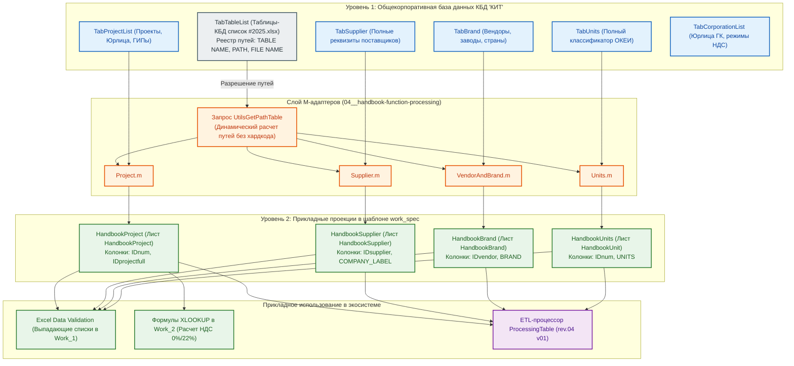

#### Характеристики уровней справочников:

1.  **Справочники 1-го типа (Master Handbooks):**
    - **Физическое размещение:** Общекорпоративное хранилище `c:\OneDrive\01__LLC_MAS_2025\КИТ\01__КБД\03__Excel\`.
    - **Состав данных:** Полные атрибуты сущностей (юридические реквизиты, телефоны, email, контактные лица, служебные метки аудита `WHO CREATED`, `WHO CHANGED`, расширенные статусы).
    - **Роль:** Непререкаемый первоисточник истины для всей группы компаний.
2.  **Справочники 2-го типа (Прикладные BI-проекции):**
    - **Физическое размещение:** Встроены непосредственно в скрытые листы мастер-спецификации `work_spec`.
    - **Формирование:** Специализированные M-запросы отсекают избыточные реквизиты и формируют компактные наборы из 2–4 ключевых полей (суррогатный ключ, код, отображаемое имя).
    - **Роль:** Обеспечение мгновенной работы выпадающих списков Excel (Data Validation), локальных формул `XLOOKUP` и дедупликации данных без задержек на сетевые вызовы.

### 1.2. Паспорт компонента

| Параметр                       | Значение                                                                                |
| :----------------------------- | :-------------------------------------------------------------------------------------- |
| **Идентификатор компонента**   | `HandbookFunction`                                                                      |
| **Текущая версия**             | `rev.02 v01`                                                                            |
| **Область применения**         | Валидация номенклатуры `work_spec`, автозаполнение реквизитов, очистка справочных полей |
| **Тип возвращаемого значения** | Агрегатная запись функций `FunctionRecord = [...]`                                      |
| **Источники метаданных**       | Таблица `TabTableList` (`Таблицы-КБД список #2025.xlsx`), скрытые листы `work_spec`     |
| **Связанные компоненты**       | `ProcessingTable`, `TabSpecificationWork_1`, `TabSpecificationWork_2`                   |

---

## 2. СВОДНЫЙ РЕЕСТР КОРПОРАТИВНЫХ СПРАВОЧНИКОВ 1-ГО ТИПА (ИСК «КИТ»)

Размещение мастер-базы: `c:\OneDrive\01__LLC_MAS_2025\КИТ\01__КБД\03__Excel\`

|   №    | Каталог КБД             | Имя файла Excel                       | Имя таблицы (1-й тип)     | M-адаптер (2-й тип)        | Бизнес-назначение в холдинге                                                 |
| :----: | :---------------------- | :------------------------------------ | :------------------------ | :------------------------- | :--------------------------------------------------------------------------- |
| **1**  | `TableList/`            | `Таблицы-КБД список #2025.xlsx`       | `TabTableList`            | Запрос `UtilsGetPathTable` | Мета-реестр физического размещения всех мастер-справочников                  |
| **2**  | `Project/`              | `Проекты-список #2025.xlsx`           | `TabProjectList`          | `Project.m`                | Полный реестр договоров, заказов, дат и привязок к рамочным соглашениям      |
| **3**  | `Supplier/`             | `Поставщики-список #2025.xlsx`        | `TabSupplier`             | `Supplier.m`               | Реестр аккредитованных поставщиков, дистрибьюторов и их платежных реквизитов |
| **4**  | `VendorAndBrand/`       | `Производители-список #2025.xlsx`     | `TabBrand`                | `VendorAndBrand.m`         | Каталог производителей, торговых марок и стран происхождения                 |
| **5**  | `Units/`                | `Единицы-список #2025.xlsx`           | `TabUnits`                | `Units.m`                  | Общероссийский классификатор единиц измерения (ОКЕИ)                         |
| **6**  | `Corporation/`          | `Корпорации-список #2025.xlsx`        | `TabCorporationList`      | `Corporation.m`            | Юридические лица холдинга («ГОРИЗОНТ», «МАС», ИП) и их налоговые ставки      |
| **7**  | `Counterparty/`         | `Контрагенты-список #2025.xlsx`       | `TabCounterpartyList`     | `Counterparty.m`           | Реестр внешних заказчиков и клиентов (ИНН, КПП, формы собственности)         |
| **8**  | `Employee/`             | `Сотрудники-список #2025.xlsx`        | `TabEmployeeList`         | `Employee.m` _(в проекте)_ | Штатные сотрудники, ГИПы, корпоративные адреса электронной почты             |
| **9**  | `Nomenclature/`         | `БД номеклатуры.xlsx`                 | `TabNomenclature`         | _(в разработке)_           | Эталонный каталог номенклатуры, артикулов и описаний ТМЦ                     |
| **10** | `Ownership/`            | `FormOwnershipList.xlsx`              | `TabFormOwnershipList`    | `Ownership.m`              | Классификатор организационно-правовых форм (ООО, АО, ИП, ПАО)                |
| **11** | `Departament/`          | `Departament.xlsx`                    | `TabDepartamentList`      | _(в плане)_                | Организационно-штатная структура предприятий холдинга                        |
| **12** | `Post/`                 | `Post.xlsx`                           | `TabPostList`             | _(в плане)_                | Общекорпоративный классификатор должностей                                   |
| **13** | `ProjectStatus/`        | `ProjectStatus.xlsx`                  | `TabProjectStatusList`    | _(в плане)_                | Реестр статусов жизненного цикла договоров и заказов                         |
| **14** | `TypeCounterparty/`     | `TypeCounterparty.xlsx`               | `TabTypeCounterpartyList` | `TypeCounterparty.m`       | Категории контрагентов (Заказчик, Поставщик, Подрядчик, Партнер)             |
| **15** | `TypeWorkCounterparty/` | `TypeWorkCounterparty.xlsx`           | `TabTypeWorkCounterparty` | `TypeWorkCounterparty.m`   | Профиль выполняемых контрагентами работ и услуг                              |
| **16** | `TypeProject/`          | `TypeProject.xlsx`                    | `TabTypeProjectList`      | _(в плане)_                | Классификатор видов договоров: Контракт / Тендер / Внутренний                |
| **17** | `TypeWork/`             | `TypeWork.xlsx`                       | `TabTypeWorkList`         | _(в плане)_                | Виды производственных и IT-работ (НИОКР, ПТК, ПНР, поставка)                 |
| **18** | `ProjectIDFull/`        | `IDProjectFull.xlsx`                  | `TabProjectIDFull`        | _(в плане)_                | Генератор сквозных идентификаторов проектов                                  |
| **19** | `DeviceIT/`             | `DB Devices IT rev.01 v01 #2025.xlsx` | `TabDevicesIT`            | _(в плане)_                | Инвентарный учет серверного, стендового и IT-оборудования                    |

---

## 3. СПРАВОЧНИКИ 2-ГО ТИПА В МАСТЕР-СПЕЦИФИКАЦИИ «WORK SPEC»

В активном шаблоне мастер-спецификации `Шаблон-спецификация work spec #2026.xlsx` развернуты 4 прикладные проекции:

| Справочник 2-го типа   | Лист книги         | Базовый мастер (1-й тип) | M-адаптер          | Состав полей (2-й тип)        | Прикладное назначение в спецификации                                                         |
| :--------------------- | :----------------- | :----------------------- | :----------------- | :---------------------------- | :------------------------------------------------------------------------------------------- |
| **`HandbookProject`**  | `HandbookProject`  | `TabProjectList`         | `Project.m`        | `IDnum`, `IDprojectfull`      | Задает список проектов в `Work_1[NUM PROJECT]`, обеспечивает авторасчет НДС в `Work_2`       |
| **`HandbookSupplier`** | `HandbookSupplier` | `TabSupplier`            | `Supplier.m`       | `IDsupplier`, `COMPANY_LABEL` | Формирует выпадающий список поставщиков в `Work_1[SUPPLIER]`, защищает от искажения названий |
| **`HandbookBrand`**    | `HandbookBrand`    | `TabBrand`               | `VendorAndBrand.m` | `IDvendor`, `BRAND`           | Стандартизирует производителей в `Work_1[BRAND]`, устраняет дубли номенклатуры               |
| **`HandbookUnits`**    | `HandbookUnit`     | `TabUnits`               | `Units.m`          | `IDnum`, `UNITS`              | Предоставляет нормативные единицы измерения ОКЕИ для `Work_1[UNITS]`                         |

---

## 4. КАТАЛОГ ФУНКЦИЙ БИБЛИОТЕКИ «HANDBOOKFUNCTION»

### 4.1. `fhGetContractorTaxRate` (Определение ставки НДС исполнителя)

- **Назначение:** Аналитический расчет ставки НДС (`0.22` или `0.00`) по коду проекта.
- **Сигнатура M:**
  ```m
  (projectCode as text) as number
  ```
- **Бизнес-правила налогообложения ГК:**
  - Если 3-я лексема шифра проекта равна `"ГОРИЗОНТ"` (ОСНО) $\rightarrow$ возвращает `0.22` (22% НДС).
  - Если 3-я лексема равна `"МАС"` (УСН) $\rightarrow$ возвращает `0.00` (0% НДС).
  - Если 3-я лексема равна `"КУКУШКИН ИВАН НИКОЛАЕВИЧ"` (УСН) $\rightarrow$ возвращает `0.00` (0% НДС).
  - При обнаружении неизвестного наименования генерирует ошибку.

### 4.2. `fhNormalizeUnit` (Нормализация единиц измерения)

- **Назначение:** Преобразование пользовательского ввода единиц измерения к стандарту классификатора `TabUnits`.
- **Сигнатура M:**
  ```m
  (rawUnit as text) as text
  ```
- **Матрица автозамен:**
  - `"штука"`, `"штук"`, `"шт."`, `"ШТ"`, `"796"`, `"1"` $\rightarrow$ `"шт"`
  - `"комплект"`, `"компл."`, `"компл"`, `"к-т"`, `"671"` $\rightarrow$ `"компл"`
  - `"метр"`, `"м."`, `"пог. м"`, `"пог.м"`, `"006"` $\rightarrow$ `"м"`
  - `"услуга"`, `"усл."`, `"усл"`, `"раб."` $\rightarrow$ `"усл"`

### 4.3. `fhValidateProjectCode` (Валидация номера проекта)

- **Назначение:** Проверка синтаксиса номера проекта и факта его регистрации в реестре `TabProjectList`.
- **Сигнатура M:**
  ```m
  (projectCode as text, optional handbookTable as nullable table) as logical
  ```
- **Логика:**
  1. Проверяет структуру: 3 лексемы через дефис, первая содержит `/`, вторая начинается с `N`.
  2. При передаче `handbookTable` (или наличии в книге) проверяет вхождение `projectCode` в столбец `IDprojectfull`.

### 4.4. `fhValidateBrand` (Валидация бренда/производителя)

- **Назначение:** Проверка наличия указанного бренда в справочнике `TableVendorAndBrand`.
- **Сигнатура M:**
  ```m
  (brandName as text, optional handbookTable as nullable table) as logical
  ```

### 4.5. `fhValidateSupplier` (Валидация контрагента-поставщика)

- **Назначение:** Проверка наличия поставщика в реестре `TabSupplier`.
- **Сигнатура M:**
  ```m
  (supplierName as text, optional handbookTable as nullable table) as logical
  ```

### 4.6. `fhGetProjectDetails` (Извлечение атрибутов проекта)

- **Назначение:** Извлечение информации о ГИПе и Генеральном подрядчике в виде структуры `Record`.
- **Сигнатура M:**
  ```m
  (projectCode as text, handbookTable as table) as record
  ```
- **Возвращаемое значение:**
  ```m
  [
      GeneralContractor = "ООО ""ГОРИЗОНТ""",
      ChiefEngineer     = "Иванов И.И.",
      TaxRate           = 0.22,
      IsVAT             = true
  ]
  ```

---

## 5. ИСХОДНЫЙ КОД БИБЛИОТЕКИ «HANDBOOKFUNCTION» (M)

```m
// =============================================================================================
//
// БИБЛИОТЕКА СПРАВОЧНЫХ ФУНКЦИЙ 'HandbookFunction'
//
// версия rev.02 v01
// =============================================================================================

let
    // -----------------------------------------------------------------------------------------
    // 1. Определение ставки НДС по коду проекта
    // -----------------------------------------------------------------------------------------
    fhGetContractorTaxRate = (projectCode as text) as number =>
    let
        trimmedCode = Text.Trim(projectCode),
        parts = Text.Split(trimmedCode, "-"),
        contractor = if List.Count(parts) >= 3 then Text.Upper(Text.Trim(parts{2})) else "",
        rate = if contractor = "ГОРИЗОНТ" then 0.22
               else if contractor = "МАС" or contractor = "КУКУШКИН ИВАН НИКОЛАЕВИЧ" then 0.00
               else error "HandbookFunction: Неизвестное юридическое лицо в коде проекта '" & projectCode & "'. Допустимы: ГОРИЗОНТ, МАС, КУКУШКИН ИВАН НИКОЛАЕВИЧ."
    in
        rate,

    // -----------------------------------------------------------------------------------------
    // 2. Нормализация единиц измерения (ОКЕИ)
    // -----------------------------------------------------------------------------------------
    fhNormalizeUnit = (rawUnit as text) as text =>
    let
        clean = Text.Lower(Text.Trim(rawUnit)),
        result = if clean = "шт" or clean = "шт." or clean = "штука" or clean = "штук" or clean = "796" or clean = "1" then "шт"
                 else if clean = "компл" or clean = "компл." or clean = "комплект" or clean = "к-т" or clean = "671" then "компл"
                 else if clean = "м" or clean = "м." or clean = "метр" or clean = "пог. м" or clean = "006" then "м"
                 else if clean = "усл" or clean = "усл." or clean = "услуга" or clean = "раб." then "усл"
                 else rawUnit
    in
        result,

    // -----------------------------------------------------------------------------------------
    // 3. Валидация кода проекта (синтаксис + справочник)
    // -----------------------------------------------------------------------------------------
    fhValidateProjectCode = (projectCode as text, optional handbookTable as nullable table) as logical =>
    let
        trimmed = Text.Trim(projectCode),
        parts = Text.Split(trimmed, "-"),
        syntaxValid = (List.Count(parts) = 3) and Text.Contains(parts{0}, "/") and Text.StartsWith(Text.Upper(parts{1}), "N"),
        existsInTable = if handbookTable = null or not syntaxValid then syntaxValid
                        else List.Contains(Table.Column(handbookTable, "IDprojectfull"), trimmed)
    in
        existsInTable,

    // -----------------------------------------------------------------------------------------
    // 4. Валидация бренда по справочнику
    // -----------------------------------------------------------------------------------------
    fhValidateBrand = (brandName as text, optional handbookTable as nullable table) as logical =>
    let
        clean = Text.Trim(brandName),
        result = if clean = "" then false
                 else if handbookTable = null then true
                 else List.Contains(List.Transform(Table.Column(handbookTable, "BRAND"), each Text.Upper(Text.Trim(_))), Text.Upper(clean))
    in
        result,

    // -----------------------------------------------------------------------------------------
    // 5. Валидация поставщика по справочнику
    // -----------------------------------------------------------------------------------------
    fhValidateSupplier = (supplierName as text, optional handbookTable as nullable table) as logical =>
    let
        clean = Text.Trim(supplierName),
        result = if clean = "" then false
                 else if handbookTable = null then true
                 else List.Contains(List.Transform(Table.Column(handbookTable, "COMPANY_LABEL"), each Text.Upper(Text.Trim(_))), Text.Upper(clean))
    in
        result,

    // -----------------------------------------------------------------------------------------
    // 6. Получение реквизитов проекта (ГИП, Генподрядчик, НДС)
    // -----------------------------------------------------------------------------------------
    fhGetProjectDetails = (projectCode as text, handbookTable as table) as record =>
    let
        cleanCode = Text.Trim(projectCode),
        filtered = Table.SelectRows(handbookTable, each [IDprojectfull] = cleanCode),
        details = if Table.RowCount(filtered) = 1 then
            let
                row = filtered{0},
                tax = fhGetContractorTaxRate(cleanCode)
            in
                [
                    GeneralContractor = row[GENERAL CONTRACTOR],
                    ChiefEngineer     = row[PROJECT CHIEF ENGINEER],
                    TaxRate           = tax,
                    IsVAT             = (tax > 0)
                ]
        else
            error "HandbookFunction: Проект с кодом '" & projectCode & "' не найден в справочнике TabProjectList."
    in
        details,

    // =========================================================================================
    // РЕГИСТРАЦИЯ ФУНКЦИЙ В АГРЕГАТНОЙ ЗАПИСИ
    // =========================================================================================
    FunctionRecord = [
        fhGetContractorTaxRate = fhGetContractorTaxRate,
        fhNormalizeUnit        = fhNormalizeUnit,
        fhValidateProjectCode  = fhValidateProjectCode,
        fhValidateBrand        = fhValidateBrand,
        fhValidateSupplier     = fhValidateSupplier,
        fhGetProjectDetails    = fhGetProjectDetails
    ]
in
    FunctionRecord
```

---

## 6. ДИАГНОСТИКА И ЧАСТЫЕ ОШИБКИ НСИ

| Ошибка / Проблема                                           | Причина                                                                                | Способ устранения                                                                            |
| :---------------------------------------------------------- | :------------------------------------------------------------------------------------- | :------------------------------------------------------------------------------------------- |
| `HandbookFunction: Неизвестное юридическое лицо...`         | В номере проекта указано юрлицо, отсутствующее в реестре (например, `1/2026-N1-РОГА`). | Исправить 3-ю лексему на нормативную: `ГОРИЗОНТ`, `МАС` или `КУКУШКИН ИВАН НИКОЛАЕВИЧ`.      |
| `fhValidateBrand` возвращает `false` на существующем бренде | Разница в написании дефисов или скрытые пробелы (напр. `D-Link ` с пробелом на конце). | Добавить синоним в `TableVendorAndBrand` или применить `Text.Trim`.                          |
| `Таблица TabProjectList не найдена`                         | Скрытый лист `HandbookProject` удален или поврежден M-запрос `Project.m`.              | Проверить наличие таблицы 2-го типа в книге или обновить ее через вызов `UtilsGetPathTable`. |

---

## 7. КАТАЛОГ СВЯЗЕЙ И ПЕРЕКРЁСТНЫЕ ССЫЛКИ

- [Головное руководство проекта (README.md)](../../../../../README.md)
- [Руководство по эксплуатации ETL-процессора ProcessingTable](../03__ETL-processing/README-etl-processor.md)
- [Руководство по библиотекам функций валидации и трансформации (UtilsFunction)](../02__utils-function-processing/README-utils-function.md)
- [Руководство по системным сервисным функциям (GeneralFunction)](../01__general-function-processing/README-general-function.md)
- [Спецификация Master Data шаблона (README-work_spec)](../../../07__template-excel/20__work_spec/README-work_spec.md)

---

# ИСТОЧНИК: README-to_customer_fin.md

# ДОКУМЕНТАЦИЯ: ФИНАНСОВАЯ СПЕЦИФИКАЦИЯ TO_CUSTOMER_FIN (тип 40)

---

## 1. НАЗНАЧЕНИЕ И БИЗНЕС-РОЛЬ

Спецификация типа `to_customer_fin` является ключевым коммерческим документом в проектном цикле ГК «Передовые решения». 

Несмотря на то, что инструментально (в среде разработки) она формируется в MS Excel и классифицируется как «техническая», по своей бизнес-роли это **внешний коммерческий документ**. Именно эта спецификация, после согласования, конвертируется в формат PDF/DOCX и становится юридически значимым приложением к Договору с заказчиком или финальным Технико-Коммерческим Предложением (ТКП).

### 1.1. Главные принципы
1. **Изоляция коммерческой тайны:** Из датасета жестко удаляются все внутренние финансовые показатели (закупочные цены, плановая себестоимость, коэффициенты торговой наценки), а также данные о реальных поставщиках и внутренние служебные комментарии.
2. **Точность и баланс:** В документе применяются строгие правила банковского округления, гарантирующие идеальный баланс строки: `Цена × Количество = Стоимость` вплоть до копейки, что критично для загрузки в 1С и бухгалтерского учета заказчика.

---

## 2. КЛАССИФИКАЦИЯ КОНФИГУРАЦИЙ (JSON DSL)

В связи с наличием в холдинге компаний с разными режимами налогообложения (ОСНО 22% НДС и УСН 0%), а также разными типами контрактов (только услуги / поставка оборудования), разработано **4 типа конфигураций**.

> Все конфигурации генерируются ETL-процессором `ProcessingTable` на базе единого источника данных — консолидированной смарт-таблицы `TabSpecificationWork`.

### Тип 1. УСН (0% НДС) / Поставка + Услуги
Предназначен для ООО «МАС» и ИП. Не содержит НДС-колонок.

### Тип 2. УСН (0% НДС) / Только Услуги
Аналогичен Типу 1, но набор столбцов оптимизирован под оказание услуг (например, отсутствует вес/габариты).

### Тип 3. ОСНО (22% НДС) / Поставка + Услуги
Предназначен для ООО «ГОРИЗОНТ». Явно выделяет ставку НДС, сумму НДС и итоговые значения с налогом.

### Тип 4. ОСНО (22% НДС) / Только Услуги
Конфигурация для контрактов ООО «ГОРИЗОНТ» без отгрузки материальных ТМЦ. 

---

## 3. ЭТАЛОННАЯ СТРУКТУРА: ТИП 4 (Услуги, ОСНО)

Для генерации спецификации Типа 4 используется конвейер из 5 макроблоков ETL-процессора.

### 3.1. Этапы конвейера
1. **Первичная изоляция (`RemoveXorColumn`):** Оставляем только базовый набор полей (включая служебные поля ставок и полных сумм с НДС, необходимых для корректного округления).
2. **Финансовая балансировка (`FinancialRound`):** Применяется банковское округление `UtilsFunctionVector[ftFinancialRound]`, гарантирующее математически верное соответствие цен, количеств и итогов.
3. **Финальная очистка (`RemoveXorColumn`):** Удаление служебных полей, отработавших на этапе округления (например, `VAT RATE CONTRACTOR $TOTAL`), чтобы они не попали к клиенту.
4. **Локализация (`RenameColumn`):** Перевод англоязычных системных ключей в клиентские русскоязычные заголовки.
5. **Типизация (`ColumnSetType`):** Жесткая фиксация типов (`text`, `float`, `int`) для корректного отображения в Excel.

### 3.2. Состав итоговых столбцов (Тип 4)
| Исходный столбец (work_spec) | Целевой столбец (to_customer_fin) | Тип данных | Описание / Источник |
| :--- | :--- | :--- | :--- |
| `NUM FULL SET` | **№** | `text` | Полный иерархический номер позиции |
| `NAME PRODUCT` | **НАИМЕНОВАНИЕ** | `text` | Наименование услуги |
| `UNITS` | **ЕД ИЗМ.** | `text` | Единица измерения |
| `QUANTITY TOTAL` | **КОЛ-ВО** | `int` | Итоговое количество |
| `PRICE UNIT $TOTAL` | **ЦЕНА БЕЗ НДС, руб** | `float` | Округленная цена за единицу |
| `COST $TOTAL` | **СТОИМОСТЬ БЕЗ НДС, руб** | `float` | Округленная стоимость |
| `COST ADD VAT $TOTAL`| **НДС, руб** | `float` | Округленная сумма налога |
| `DURATION SALE $TOTAL`| **ДЛИТЕЛЬНОСТЬ, КАЛ. ДНЕЙ** | `int` | Срок оказания услуги |

---

## 4. СВЯЗИ И ССЫЛКИ

* [Описание архитектуры ETL-процессора `ProcessingTable`](../../05__pq-script/01__general/03__ETL-processing/README-etl-processor.md)
* [Документация мастер-спецификации `work_spec`](../20__work_spec/README-work_spec.md)
* [Библиотека функций валидации и трансформации](../../05__pq-script/01__general/02__utils-function-processing/README-utils-function.md)

---

# ИСТОЧНИК: README-utils-function.md

# РУКОВОДСТВО ПО БИБЛИОТЕКАМ СЛУЖЕБНЫХ ФУНКЦИЙ: «UTILS FUNCTION SCALAR» И «UTILS FUNCTION VECTOR»

---

## 1. ВВЕДЕНИЕ И АРХИТЕКТУРА БИБЛИОТЕК

### 1.1. Назначение и разделение ответственности

В экосистеме **HorizonBI** аналитическая обработка и контроль качества данных строго разделены на два функциональных контура:

1.  **Скалярный контур (`UtilsFunctionScalar`):** Набор чистых, детерминированных микро-функций. Каждая функция проверяет ровно одну ячейку (скалярное значение) и возвращает булев результат (`true` — валидно, `false` — ошибка). Этот контур оптимизирован для построчной проверки строк в ETL-процессоре `ProcessingTable`.
2.  **Векторный контур (`UtilsFunctionVector`):** Набор функций пакетной обработки, работающих с объектами `table`. Выполняет массовые структурные трансформации (регистр, нормализация дат, переупорядочивание) и сложные проверки с сохранением внутреннего состояния (каскадная проверка первичных ключей `fvCheckID`).

### 1.2. Паспорт компонентов

| Параметр                          | `UtilsFunctionScalar`                      | `UtilsFunctionVector`                          |
| :-------------------------------- | :----------------------------------------- | :--------------------------------------------- |
| **Имя запроса в Power Query**     | `UtilsFunctionScalar`                      | `UtilsFunctionVector`                          |
| **Текущая версия**                | `rev.08 v03`                               | `rev.08 v03`                                   |
| **Область применения**            | Построчная валидация в `ProcessingTable`   | Пакетные трансформации и векторный `fvCheckID` |
| **Тип возвращаемого значения**    | `logical` (`true` / `false`)               | `table` или `list`                             |
| **Формат поставки в Power Query** | Агрегатная запись `FunctionRecord = [...]` | Агрегатная запись `FunctionRecord = [...]`     |
| **Состав библиотеки**             | **18 скалярных функций**                   | **9 трансформаций + 1 проверка `fvCheckID`**   |

### 1.3. Архитектурная схема взаимодействия

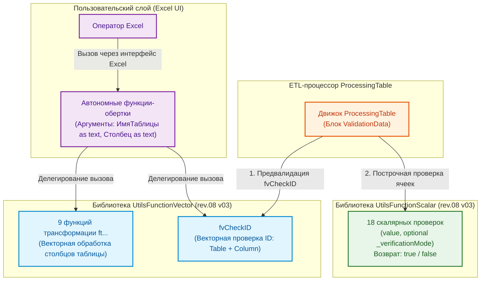

---

## 2. БИБЛИОТЕКА «UTILSFUNCTIONSCALAR» (СПРАВОЧНИК СКАЛЯРНЫХ ФУНКЦИЙ)

### 2.1. Концепция режимов валидации (`_verificationMode`)

Большинство скалярных функций поддерживают опциональный параметр `optional _verificationMode as logical`:

- **Жесткий режим (Hard Mode — по умолчанию: `true` или `null`):** Пустые ячейки (`null` или пустая строка `""`) признаются **НЕВАЛИДНЫМИ** (`false`).
- **Мягкий режим (Soft Mode — передано `false`):** Пустые ячейки признаются **ВАЛИДНЫМИ** (`true`). Если же ячейка заполнена, она проверяется по всем строгим правилам типа.

_Исключение:_ Функция `fvCheckNonEmpty_scalar` не имеет мягкого режима, так как ее единственная задача — выявлять пустые ячейки.

---

### 2.2. Каталог скалярных функций

#### 1. `fvCheckNonEmpty_scalar`

- **Назначение:** Проверка ячейки на наличие данных (запрет `null` и пробельных строк).
- **Сигнатура M:**
  ```m
  (value as any) as logical
  ```
- **Логика:** Возвращает `false`, если значение равно `null` или является текстом, состоящим только из пробелов (`Text.Trim(Text.From(value)) = ""`).

#### 2. `fvCheckInteger_scalar`

- **Назначение:** Проверка значения на принадлежность к целым числам.
- **Сигнатура M:**
  ```m
  (value as any, optional _verificationMode as logical) as logical
  ```
- **Логика:** Преобразует значение в число через `try Number.From(value)`. Проверяет равенство `Number.Round(n) = n`.

#### 3. `fvCheckFloat_scalar`

- **Назначение:** Проверка значения на принадлежность к любым вещественным числам (целым или с дробной частью).
- **Сигнатура M:**
  ```m
  (value as any, optional _verificationMode as logical) as logical
  ```
- **Логика:** Проверяет успешность выполнения `(try Number.From(value) otherwise null) <> null`.

#### 4. `fvCheckDate_scalar`

- **Назначение:** Проверка корректности календарной даты.
- **Сигнатура M:**
  ```m
  (value as any, optional _verificationMode as logical) as logical
  ```
- **Логика:** Распознает нативные типы `date`/`datetime`, а также текстовые даты формата `ДД.ММ.ГГГГ` или `ДД.ММ.ГГ`. При двухзначном годе: $\ge 31 \rightarrow 19xx$, $< 31 \rightarrow 20xx$. Проверяет реальность календарного дня через конструктор `#date(year, month, day)`.

#### 5. `fvCheckINN_LLC_scalar`

- **Назначение:** Проверка 10-значного ИНН юридического лица РФ с расчетом контрольной суммы.
- **Сигнатура M:**
  ```m
  (value as any, optional _verificationMode as logical) as logical
  ```
- **Алгоритм:**
  1. Проверяет, что строка содержит ровно 10 цифр.
  2. Вычисляет контрольную сумму для 10-й цифры с весовыми коэффициентами: $\{2, 4, 10, 3, 5, 9, 4, 6, 8\}$.
  3. Контрольная цифра = $((\sum_{i=1}^{9} d_i \cdot w_i) \pmod{11}) \pmod{10}$.
  4. Сверяет вычисленный остаток с фактической 10-й цифрой.

#### 6. `fvCheckINN_Personal_scalar`

- **Назначение:** Проверка 12-значного ИНН физического лица / ИП РФ с расчетом двух контрольных сумм.
- **Сигнатура M:**
  ```m
  (value as any, optional _verificationMode as logical) as logical
  ```
- **Алгоритм:**
  1. Проверяет длину строго в 12 цифр.
  2. Контрольная цифра 11: веса $\{7, 2, 4, 10, 3, 5, 9, 4, 6, 8\}$, контрольный остаток $((\sum d_i \cdot w_i) \pmod{11}) \pmod{10}$.
  3. Контрольная цифра 12: веса $\{3, 7, 2, 4, 10, 3, 5, 9, 4, 6, 8\}$, контрольный остаток $((\sum d_i \cdot w_i) \pmod{11}) \pmod{10}$.
  4. Возвращает `true` только при совпадении обеих контрольных цифр.

#### 7. `fvCheckSNILS_scalar`

- **Назначение:** Валидация СНИЛС по формату `XXX-XXX-XXX YY` и официальному алгоритму ПФР.
- **Сигнатура M:**
  ```m
  (value as any, optional _verificationMode as logical) as logical
  ```
- **Алгоритм:**
  1. Проверяет строгую длину 14 символов и наличие разделителей: дефисы на позициях 4 и 8, **пробел на позиции 12**.
  2. Извлекает первые 9 цифр и вычисляет контрольную сумму: $S = \sum_{i=1}^{9} d_i \cdot (10 - i)$.
  3. Если $S < 100 \rightarrow K = S$; если $S \in \{100, 101\} \rightarrow K = 0$; если $S > 101 \rightarrow R = S \pmod{101}$, $K = (\text{если } R = 100 \text{ то } 0 \text{ иначе } R)$.
  4. Сверяет $K$ с 2-значным числом $YY$ в конце строки.

#### 8. `fvCheckKPP_scalar`

- **Назначение:** Проверка формата КПП юридического лица (9 цифр).
- **Сигнатура M:**
  ```m
  (value as any, optional _verificationMode as logical) as logical
  ```
- **Логика:** Строка должна содержать ровно 9 цифровых символов `0-9`.

#### 9. `fvCheckTextLength_scalar`

- **Назначение:** Проверка длины текста на вхождение в заданный диапазон.
- **Сигнатура M:**
  ```m
  (value as any, _minLength as number, _maxLength as number, optional _verificationMode as logical) as logical
  ```
- **Логика:** Длина очищенной строки (`Text.Length(Text.Trim(Text.From(value)))`) должна удовлетворять условию: $\text{minLength} \le L \le \text{maxLength}$.

#### 10. `fvCheckIntegerRange_scalar`

- **Назначение:** Проверка вхождения целого числа в диапазон $[min, max]$.
- **Сигнатура M:**
  ```m
  (value as any, _minValue as number, _maxValue as number, optional _verificationMode as logical) as logical
  ```
- **Логика:** Значение должно быть валидным целым числом и удовлетворять условию $\text{minValue} \le N \le \text{maxValue}$.

#### 11. `fvCheckFloatRange_scalar`

- **Назначение:** Проверка вхождения любого вещественного числа в диапазон $[min, max]$.
- **Сигнатура M:**
  ```m
  (value as any, _minValue as number, _maxValue as number, optional _verificationMode as logical) as logical
  ```
- **Логика:** Значение преобразуется в число и проверяется на $\text{minValue} \le N \le \text{maxValue}$.

#### 12. `fvCheckDateRange_scalar`

- **Назначение:** Проверка вхождения даты в календарный интервал $[minDate, maxDate]$.
- **Сигнатура M:**
  ```m
  (value as any, _minDate as date, _maxDate as date, optional _verificationMode as logical) as logical
  ```
- **Логика:** Значение парсится по правилам `fvCheckDate_scalar`, после чего проверяется условие $\text{minDate} \le D \le \text{maxDate}$.

#### 13. `fvCheckPhone_scalar`

- **Назначение:** Проверка мобильного номера РФ по строгому корпоративному стандарту.
- **Сигнатура M:**
  ```m
  (value as any, optional _verificationMode as logical) as logical
  ```
- **Формат:** Строго `+7 XXX XXX-XX-XX` (длина ровно 16 символов, плюс, семерка, пробелы на позициях 3 и 7, дефисы на 11 и 14).

#### 14. `fvCheckEmail_scalar`

- **Назначение:** Валидация синтаксиса корпоративного и личного email-адреса.
- **Сигнатура M:**
  ```m
  (value as any, optional _verificationMode as logical) as logical
  ```
- **Правила:** Ровно один символ `@` (не в начале и не в конце), отсутствие пробелов, запрет точек в начале/конце имени пользователя, длина имени $\le 64$, длина домена $\le 255$, обязательное наличие точки в домене.

#### 15. `fvCheckBoolean_scalar`

- **Назначение:** Проверка логических значений.
- **Сигнатура M:**
  ```m
  (value as any, optional _verificationMode as logical) as logical
  ```
- **Допустимые значения:** Тип `logical` (`true`/`false`), числа `0` и `1`, строки `"true"`, `"false"`, `"1"`, `"0"` (регистронезависимо).

#### 16. `fvCheckPassportSeries_scalar`

- **Назначение:** Проверка серии паспорта гражданина РФ.
- **Сигнатура M:**
  ```m
  (value as any, optional _verificationMode as logical) as logical
  ```
- **Правило:** Строго 4 цифры (тип `text`, сохраняющий ведущие нули).

#### 17. `fvCheckPassportNumber_scalar`

- **Назначение:** Проверка номера паспорта гражданина РФ.
- **Сигнатура M:**
  ```m
  (value as any, optional _verificationMode as logical) as logical
  ```
- **Правило:** Строго 6 цифр (тип `text`, сохраняющий ведущие нули).

#### 18. `fvCheckPassportUnitCode_scalar`

- **Назначение:** Проверка кода подразделения органа, выдавшего паспорт РФ.
- **Сигнатура M:**
  ```m
  (value as any, optional _verificationMode as logical) as logical
  ```
- **Правило:** Формат `XXX-XXX` (длина 7 символов, дефис на 4-й позиции, 6 цифр).

---

## 3. БИБЛИОТЕКА «UTILSFUNCTIONVECTOR» (СПРАВОЧНИК ВЕКТОРНЫХ ФУНКЦИЙ)

### 3.1. Трансформационные функции (`ft...`)

Все векторные функции принимают в качестве первого аргумента имя таблицы в виде строки `_selectTableName as text`, что позволяет вызывать их в автономном режиме без передачи сложных объектов M.

#### 1. `ftCreateFullNameColumn`

- **Назначение:** Формирует столбец `FULL_NAME` из трех столбцов ФИО в формате «Фамилия И.О.» и размещает его на указанной позиции.
- **Сигнатура:**
  ```m
  (_selectTableName as text, _lastNameCol as text, _firstNameCol as text, _patronymicCol as text, _position as number) as table
  ```

#### 2. `ftGetFullNameColumn`

- **Назначение:** Возвращает результирующий список строк (`list`) с ФИО формата «Фамилия И.О.».
- **Сигнатура:**
  ```m
  (_selectTableName as text, _lastNameCol as text, _firstNameCol as text, _patronymicCol as text) as list
  ```

#### 3. `ftCapitalizeWords`

- **Назначение:** Преобразует каждое слово в указанных столбцах к формату с заглавной буквы (аналог `Text.Proper`).
- **Сигнатура:**
  ```m
  (_selectTableName as text, _columnList as list) as table
  ```

#### 4. `ftToUpperCase` / `ftToLowerCase`

- **Назначение:** Приведение текстовых столбцов к верхнему или нижнему регистру.
- **Сигнатура:**
  ```m
  (_selectTableName as text, _columnList as list) as table
  ```

#### 5. `ftTrimTextColumns`

- **Назначение:** Массовое удаление ведущих и замыкающих пробелов в текстовых полях.
- **Сигнатура:**
  ```m
  (_selectTableName as text, _columnList as list) as table
  ```

#### 6. `ftNormalizeDates`

- **Назначение:** Пакетная нормализация дат в столбце к системному типу `date` с коррекцией двухзначных годов.
- **Сигнатура:**
  ```m
  (_selectTableName as text, _columnName as text) as table
  ```

#### 7. `ftReorderColumnsStrict` / `ftRemoveColumnsStrict`

- **Назначение:** Строгое упорядочивание или удаление столбцов с обязательной валидацией их наличия (при отсутствии столбца генерируется ошибка).
- **Сигнатура:**
  ```m
  (_selectTableName as text, _columnList as list) as table
  ```

#### 8. `ftFinancialRound`

- **Назначение:** Выполняет банковское (бухгалтерское) округление комплекса связанных финансовых полей, гарантируя строгий математический баланс: `Округленная_Стоимость = Округленная_Цена × Количество`. Опционально рассчитывает и округляет сумму НДС.
- **Сигнатура:**
  ```m
  (_sourceTable as table, _configList as list) as table
  ```
- **Конфигурация списка (`_configList`):**
  1. `SourceQuantity` — столбец источника Количество
  2. `SourceBasePrice` — столбец источника Базовой Цены
  3. `SourceVatRate` — столбец источника Ставки НДС
  4. `TargetPriceNoVat` — целевой столбец: Цена без НДС
  5. `TargetCostNoVat` — целевой столбец: Стоимость без НДС
  6. `TargetVatSum` — целевой столбец: Сумма НДС
  7. `TargetPriceVat` — целевой столбец: Цена с НДС
  8. `TargetCostVat` — целевой столбец: Стоимость с НДС

---

### 3.2. Специальная векторная валидация `fvCheckID`

- **Назначение:** Проверка целостности автоинкрементного первичного ключа `ID`.
- **Контракт:**
  ```m
  (_sourceTable as table, _columnName as text) as list
  ```
- **Бизнес-правила:**
  1. Первое значение в первой строке таблицы обязано быть равно строго **`1`**.
  2. Каждое последующее значение обязано быть строго на **`+1`** больше предыдущего ($ID_i = ID_{i-1} + 1$).
  3. Значения обязаны быть положительными целыми числами без пропусков (`null` запрещен).
- **Каскадная инвалидация (Stateful Accumulator):**
  Функция реализована на базе `List.Accumulate`. Как только в строке $K$ обнаруживается первая ошибка (разрыв инкремента или неверный тип), внутренний флаг `errorHasOccurred` переключается в состояние `true`. После этого **все последующие строки автоматически помечаются невалидными** кодами ошибок ($K, K+1, K+2 \dots N$).

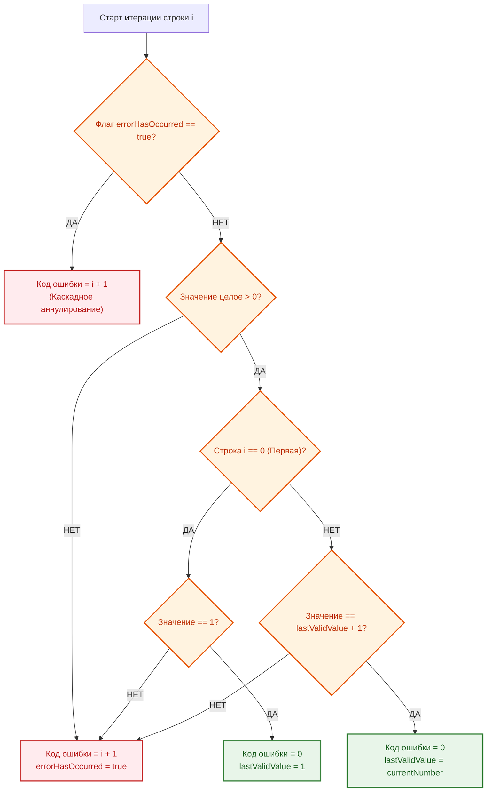

---

## 4. МЕХАНИЗМ АВТОНОМНЫХ ФУНКЦИЙ-ОБЕРТОК (UI WRAPPERS)

В Microsoft Excel встроенный графический интерфейс вызова функций Power Query имеет дефект: при указании типа параметра `table` интерфейс отображает неработающий выпадающий список.

Для решения этой проблемы все функции, предназначенные для конечных пользователей, оформляются как **тонкие автономные обертки**, принимающие имя таблицы строкой `_selectTableName as text`:

```m
// ---------------------------------------------------------------------------------------------
// Автономная функция 'ftNormalizeDates' (Пример обертки)
// ---------------------------------------------------------------------------------------------
(
    _selectTableName as text,
    _columnName as text
) as table =>
let
    UF = UtilsFunctionVector,
    result = UF[ftNormalizeDates](
        _selectTableName,
        _columnName
    )
in
    result
```

_Правило архитектуры:_ Вся логика валидации существования таблицы и колонок сосредоточена внутри `UtilsFunctionVector`. Автономная функция содержит только делегирование вызова.

---

## 5. ИНТЕГРАЦИЯ С ЯЗЫКОМ «HORIZONBI» И ETL-ПРОЦЕССОРОМ

Внутри процессора `ProcessingTable` в блоке `ValidationData` вызовы функций осуществляются динамически:

```m
// Фрагмент вызова скалярной функции в ProcessingTable
scalarFunctionName = currentFunctionName & "_scalar",
optionalArgs = Record.Field(rulesForColumn, currentFunctionName),
allArgs = {cellValue} & optionalArgs,
isValid = Function.Invoke(Record.Field(UtilsFunctionScalar, scalarFunctionName), allArgs)
```

### Маппинг конфигурации JSON на вызовы M-функций:

```json
"ValidationData": [
  {
    "NUM PROJECT": {
      "fvCheckNonEmpty": [],
      "fvCheckTextLength": [13, 30]
    }
  },
  {
    "PRICE VAT UNIT $TOTAL": {
      "fvCheckNonEmpty": [],
      "fvCheckFloat": [],
      "fvCheckFloatRange": [0.0, 50000000.0]
    }
  }
]
```

---

## 6. КАТАЛОГ СВЯЗЕЙ И ПЕРЕКРЁСТНЫЕ ССЫЛКИ

- [Головное руководство проекта (README.md)](../../../../../README.md)
- [Руководство по эксплуатации ETL-процессора ProcessingTable](../03__ETL-processing/README-etl-processor.md)
- [Руководство по системным сервисным функциям (GeneralFunction)](../01__general-function-processing/README-general-function.md)
- [Руководство по функциям нормализации справочников (HandbookFunction)](../04__handbook-function-processing/README-handbook-function.md)
- [Спецификация Master Data шаблона (README-work_spec)](../../../07__template-excel/20__work_spec/README-work_spec.md)

---

## 7. ДИАГНОСТИКА И ЧАСТЫЕ ОШИБКИ ВАЛИДАЦИИ

| Ошибка / Ситуация                                                  | Вероятная причина                                                                             | Способ устранения                                                           |
| :----------------------------------------------------------------- | :-------------------------------------------------------------------------------------------- | :-------------------------------------------------------------------------- |
| `fvCheckTextLength` вернула `false` для корректного текста         | В ячейке присутствуют невидимые неразрывные пробелы или переносы строк.                       | Применить операцию `ClearColumn` или предварительный `ftTrimTextColumns`.   |
| `fvCheckINN_LLC` сообщает об ошибке на реальном ИНН                | Опечатка в цифрах либо передан ИНН физлица (12 знаков вместо 10).                             | Проверить юрлицо по ЕГРЮЛ. Для ИП использовать `fvCheckINN_Personal`.       |
| `fvCheckSNILS` не проходит валидацию                               | Перед контрольным числом стоит тире вместо пробела (`XXX-XXX-XXX-YY`).                        | Исправить формат на нормативный: `XXX-XXX-XXX YY`.                          |
| `fvCheckID` пометила все строки таблицы ошибками начиная со второй | Нарушена непрерывная последовательность $1, 2, 3...$ (пропущена строка или сортировка сбита). | Восстановить правильную последовательность нумерации ID в исходной таблице. |

---

## 8. РЕГЛАМЕНТ РАСШИРЕНИЯ БИБЛИОТЕК

При добавлении новой функции валидации:

1. Создается скалярная версия `fvCheck<Имя>_scalar` в `UtilsFunctionScalar.m` с поддержкой `_verificationMode`.
2. Функция регистрируется в итоговой записи `FunctionRecord = [...]` библиотеки `UtilsFunctionScalar`.
3. При необходимости автономного использования в Excel создается векторная обертка в `UtilsFunctionVector.m` и файл автономной функции.
4. Обновляется настоящее Руководство и выполняется инкремент минорной версии библиотеки.

---

# ИСТОЧНИК: README-work_spec.md

# ДОКУМЕНТАЦИЯ: СПЕЦИФИКАЦИЯ ТИПА `work spec`

## НАЗНАЧЕНИЕ ДОКУМЕНТА

Данный документ содержит полное техническое описание архитектуры, структуры данных, нормативно-справочной модели (НСИ) и правил валидации спецификаций типа `work spec` — ключевого элемента системы управления проектами и заказами Группы компаний «ПЕРЕДОВЫЕ РЕШЕНИЯ».

---

## ОГЛАВЛЕНИЕ

1. [Введение](#1-введение)
2. [Архитектура спецификации work spec](#2-архитектура-спецификации-work-spec)
3. [Таблица TabTableSchema — метаданные и схема валидации](#3-таблица-tabtableschema)
4. [Структура столбцов TabTableSchema](#4-структура-столбцов-tabtableschema)
5. [Спецификация TabSpecificationWork_1](#5-спецификация-tabspecificationwork_1)
6. [Спецификация TabSpecificationWork_2](#6-спецификация-tabspecificationwork_2)
7. [Справочники и источники данных (Двухуровневая модель НСИ)](#7-справочники-и-источники-данных)
8. [Правила модификации и автоматизации](#8-правила-модификации-и-автоматизации)
9. [Генерация JSON-конфигураций для валидации](#9-генерация-json-конфигураций-для-валидации)
10. [Примеры использования и сценарии HorizonBI](#10-примеры-использования)
11. [Каталог связей и перекрёстные ссылки](#11-каталог-связей-и-перекрёстные-ссылки)

---

## 1. ВВЕДЕНИЕ

### 1.1. Что такое спецификация `work spec`

**Спецификация `work spec`** — это Master Data документ в формате Microsoft Excel, содержащий:

- **Технические данные**: описание товаров/услуг, номенклатура, комплектация, единицы измерения.
- **Логистические данные**: количества, сроки поставки, статусы отгрузки.
- **Финансовые данные**: цены закупки/продажи, чистая себестоимость и себестоимость с НДС, расчетный контур НДС реализации (0% и 22%), скидки, коэффициенты наценки.
- **Справочные данные (2-й тип)**: легкие прикладные проекции корпоративной базы данных КБД «КИТ» (проекты, поставщики, бренды).

### 1.2. Роль в экосистеме HorizonBI

Спецификации `work spec`:

1. Являются **источником первичных данных** для ETL-процессора `ProcessingTable`.
2. Служат основой для регламентной генерации **производных спецификаций** (типы `30..90`).
3. Обеспечивают **единую точку истины** (Single Source of Truth) для всех проектов холдинга.
4. Интегрируются с системой валидации через язык конфигураций `HorizonBI`.

### 1.3. Версионность

- **Текущая версия шаблона**: `rev.04 v03`
- **Дата последнего обновления**: 21 сентября 2026 г.
- **Файл эталонного шаблона**: `Шаблон-спецификация work spec #2026.xlsx`

---

## 2. АРХИТЕКТУРА СПЕЦИФИКАЦИИ WORK SPEC

### 2.1. Структура книги Excel

Файл спецификации состоит из следующих взаимосвязанных листов:

| Лист                  | Тип                  | Назначение                                                                   |
| :-------------------- | :------------------- | :--------------------------------------------------------------------------- |
| `SpecificationWork_1` | Рабочий              | Основная таблица Master Data (техника, закупки, логистика: 30 колонок)       |
| `SpecificationWork_2` | Рабочий              | Финансовая таблица (наценки, цены реализации, блок НДС, скидки: 18 колонок)  |
| `SpecificationWork`   | Технологический      | Объединенный плоский датасет (результат слияния Work_1 + Work_2: 47 колонок) |
| `Pivot`               | Аналитический        | Сводная таблица для экспресс-анализа проекта                                 |
| `TableSchema`         | Служебный            | Таблица `TabTableSchema` (схема данных и правила валидации 48 колонок)       |
| `ConfigJSON`          | Служебный            | Таблица `TabConfigJSON` (JSON-конфигурации для ETL-процессора)               |
| `HandbookProject`     | Справочник (2-й тип) | Проекты и заказы холдинга (проекция `TabProjectList` через `Project.m`)      |
| `HandbookBrand`       | Справочник (2-й тип) | Бренды и вендоры (проекция `TabBrand` через `VendorAndBrand.m`)              |
| `HandbookSupplier`    | Справочник (2-й тип) | Реестр поставщиков (проекция `TabSupplier` через `Supplier.m`)               |
| `HandbookUnit`        | Справочник (2-й тип) | Единицы измерения ОКЕИ (проекция `TabUnits` через `Units.m`)                 |

### 2.2. Связь между таблицами

```
TabSpecificationWork_1 (30 колонок)
         │
         │ [HASH COLLECTION] — ключ связи 1:1
         │
         ↓
TabSpecificationWork_2 (18 колонок)
         │
         │ LEFT JOIN (ProcessingTable / RunLeftJOINstructure)
         │
         ↓
TabSpecificationWork (47 колонок без дубля ключа) → Pivot → Аналитика
```

### 2.3. Ключевое поле связи: `HASH COLLECTION`

Глобальный первичный ключ строки спецификации:

- **Тип данных:** `text`
- **Формат генерации:** `{NUM PROJECT}-ver_{VER COLLECTION}-set_{IDset}-{isSHIPPED}`
- **Пример:** `1/2026-N2-МАС-ver_1-set_4.2-true`
- **Назначение:** Обеспечение строгой реляционной целостности 1:1 между строками инженерной (`Work_1`) и финансовой (`Work_2`) частей.

---

## 3. ТАБЛИЦА TabTableSchema

### 3.1. Назначение и функции

Таблица **`TabTableSchema`** расположена на листе `TableSchema` и содержит полную машиночитаемую спецификацию метаданных для всех **48 столбцов** спецификации.

Функции схемы:

1. Автоматическая генерация секций `ValidationData` для DSL-конфигураторов `HorizonBI`.
2. Документирование физических типов данных (`TYPE DATASET`), диапазонов (`RANGE VALUES`) и обязательности (`NULL VALUE`).
3. Контроль форматирования ячеек Excel (`EXCEL TYPE`, `HORIZONTAL ALIGNMENT`).

### 3.2. Статистика схемы

- **Всего описанных столбцов:** 48 (30 для `Work_1` + 18 для `Work_2`)
- **Атрибутов описания (колонок схемы):** 17
- **Используемых типов данных:** 3 (`int`, `float`, `text`)
- **Подключенных справочников 2-го типа:** 4

---

## 4. СТРУКТУРА СТОЛБЦОВ TabTableSchema

Таблица схемы состоит из 17 нормативных атрибутов:

1. `TABLE NAME` — имя целевой таблицы (`TabSpecificationWork_1` или `TabSpecificationWork_2`).
2. `NUM COLUMN` — порядковый номер столбца (1..30 и 1..18).
3. `СOLUMNS NAME` — системное английское имя столбца в смарт-таблице.
4. `COLUMN NAME RUS` — официальное русскоязычное наименование для UI и отчетов.
5. `TYPE DATASET` — тип данных валидации (`int`, `float`, `text`).
6. `RANGE VALUES` — допустимый диапазон значений `[min, max]`.
7. `UNIQUE FLAG` — флаг уникальности значений (`true`/`false`).
8. `NULL VALUE` — допустимость пустых значений (`true`/`false`).
9. `isAUTOMATIC` — флаг автоматического вычисления формулой Excel.
10. `MODIFY FLAG` — признак возможности ручного переопределения формулы.
11. `HANDBOOK SOURCE` — имя подключенного справочника 2-го типа (`TabProjectList`, `TabSupplier` и др.).
12. `DROPDOWN LIST` — признак наличия выпадающего списка Data Validation в Excel.
13. `EXCEL TYPE` — формат ячейки Excel (Числовой, Текстовый, Процентный, Общий).
14. `VERTICAL ALIGNMENT` — вертикальное выравнивание (`up`, `center`, `down`).
15. `HORIZONTAL ALIGNMENT` — горизонтальное выравнивание (`left`, `center`, `right`).
16. `TRANSFER TEXT` — признак переноса текста по словам (Wrap Text).
17. `COMMENT` — подробное инженерное описание бизнес-логики столбца.

### 4.2. Сводная таблица характеристик столбцов TabTableSchema

|  №  | Колонка              | Тип         | Обязательность | Уникальные значения               | Назначение                     |
| :-: | :------------------- | :---------- | :------------- | :-------------------------------- | :----------------------------- |
|  1  | TABLE NAME           | text        | Да             | 2                                 | Имя целевой таблицы            |
|  2  | NUM COLUMN           | int→text    | Да             | Work_1: 1–30; Work_2: 1–18        | Порядковый номер столбца       |
|  3  | СOLUMNS NAME         | text        | Да             | 48 (уникальны в пределах таблицы) | Английское имя столбца         |
|  4  | COLUMN NAME RUS      | text        | Да             | 48                                | Русское название               |
|  5  | TYPE DATASET         | text (enum) | Да             | 3: int, float, text               | Тип данных для валидации       |
|  6  | RANGE VALUES         | text (JSON) | Да             | 28                                | Диапазон значений `[min, max]` |
|  7  | UNIQUE FLAG          | bool→text   | Да             | 2: true, false                    | Флаг уникальности              |
|  8  | NULL VALUE           | bool→text   | Да             | 2: true, false                    | Допустимость NULL              |
|  9  | isAUTOMATIC          | bool→text   | Да             | 2: true, false                    | Автоматическое вычисление      |
| 10  | MODIFY FLAG          | bool→text   | Да             | 2: true, false                    | Возможность переопределения    |
| 11  | HANDBOOK SOURCE      | text (enum) | Да             | 6                                 | Источник справочных данных     |
| 12  | DROPDOWN LIST        | bool→text   | Да             | 2: true, false                    | Наличие выпадающего списка     |
| 13  | EXCEL TYPE           | text (enum) | Да             | 4                                 | Тип форматирования Excel       |
| 14  | VERTICAL ALIGNMENT   | text (enum) | Да             | 3: up, center, down               | Вертикальное выравнивание      |
| 15  | HORIZONTAL ALIGNMENT | text (enum) | Да             | 3: left, center, right            | Горизонтальное выравнивание    |
| 16  | TRANSFER TEXT        | bool→text   | Да             | 2: true, false                    | Перенос текста по словам       |
| 17  | COMMENT              | text        | Да             | 48 (уникальны)                    | Подробное описание столбца     |

---

## 5. СПЕЦИФИКАЦИЯ TabSpecificationWork_1 (30 колонок)

Таблица размещена на листе `SpecificationWork_1` и содержит технические, логистические и закупочные данные.

### Полный реестр столбцов TabSpecificationWork_1:

|  №  | Имя столбца                | Тип   | Диапазон      | Авто | Конфиденциально | Описание                                                  |
| :-: | :------------------------- | :---- | :------------ | :--: | :-------------: | :-------------------------------------------------------- |
|  1  | `IDnum`                    | int   | [1, 300]      |  ❌  |       ❌        | Порядковый номер строки в спецификации                    |
|  2  | `IDsource`                 | int   | [1, 300]      |  ❌  |       ❌        | Внешний идентификатор позиции в ИД                        |
|  3  | `NUM PROJECT`              | text  | [13, 25]      |  ❌  |       ❌        | Шифр проекта (выпадающий список из `HandbookProject`)     |
|  4  | `NUM ORDER`                | int   | [1, 100]      |  ✅  |       ❌        | Номер заказа (автовычисление из `NUM PROJECT`)            |
|  5  | `VER COLLECTION`           | int   | [1, 50]       |  ❌  |       ❌        | Версия ревизии комплектации                               |
|  6  | `DESCRIPTION SET`          | text  | [5, 300]      |  ❌  |       ❌        | Наименование комплекта поставки                           |
|  7  | `IDset`                    | text  | [1, 50]       |  ❌  |       ❌        | Идентификатор комплекта оборудования                      |
|  8  | `NUM SEQUENCE SET`         | int   | [1, 50]       |  ❌  |       ❌        | Порядковый номер позиции внутри комплекта                 |
|  9  | `NUM FULL SET`             | text  | [3, 5]        |  ✅  |       ❌        | Полный иерархический номер (`1.1`, `1.2`)                 |
| 10  | `isSHIPPED`                | text  | [4, 5]        |  ❌  |       ❌        | Признак завершения отгрузки (`true`/`false`)              |
| 11  | `HASH COLLECTION`          | text  | [6, 50]       |  ✅  |       ❌        | **Глобальный ключ связи спецификаций**                    |
| 12  | `NAME PRODUCT`             | text  | [3, 300]      |  ❌  |       ❌        | Наименование товара, оборудования или услуги              |
| 13  | `DESCRIPTION PRODUCT`      | text  | [10, 1000]    |  ❌  |       ❌        | Подробное техническое описание и характеристики           |
| 14  | `BRAND`                    | text  | [3, 50]       |  ❌  |       ❌        | Производитель/бренд (выпадающий список `HandbookBrand`)   |
| 15  | `SUPPLIER`                 | text  | [3, 50]       |  ❌  |    🔒 **ДА**    | Поставщик (выпадающий список `HandbookSupplier`)          |
| 16  | `ARTICLE SUPPLIER`         | text  | [3, 50]       |  ❌  |    🔒 **ДА**    | Артикул номенклатуры в прайсе поставщика                  |
| 17  | `ARTICLE INTERNAL`         | text  | [3, 15]       |  ❌  |    🔒 **ДА**    | Уникальный внутренний артикул номенклатуры ГК             |
| 18  | `UNITS`                    | text  | [1, 10]       |  ❌  |       ❌        | Единица измерения (выпадающий список `HandbookUnit`)      |
| 19  | `QUANTITY SET`             | int   | [1, 50]       |  ❌  |       ❌        | Количество единиц в одном комплекте                       |
| 20  | `QUANTITY SHIPPED SET`     | int   | [1, 50]       |  ❌  |       ❌        | Число комплектов в партии отгрузки                        |
| 21  | `QUANTITY TOTAL`           | int   | [1, 50]       |  ✅  |       ❌        | Общее количество к поставке (`QUANTITY SET * SHIPPED`)    |
| 22  | `QUANTITY SUPPLIER`        | int   | [0, 999]      |  ❌  |    🔒 **ДА**    | Количество в партии закупки у поставщика                  |
| 23  | `PRICE UNIT $PURCHASE`     | float | [1, 1000000]  |  ❌  |    🔒 **ДА**    | **Цена закупки за ед. БЕЗ НДС** (чистая база закупки)     |
| 24  | `VAT ADD PRICE $PURCHASE`  | float | [0, 3000000]  |  ❌  |    🔒 **ДА**    | **Входящий НДС на ед. закупки** (ручной ввод / 0 при УСН) |
| 25  | `COST PRICE $PURCHASE`     | float | [1, 5000000]  |  ✅  |    🔒 **ДА**    | Себестоимость партии закупки БЕЗ НДС (`21 * 23`)          |
| 26  | `COST PRICE VAT $PURCHASE` | float | [1, 10000000] |  ✅  |    🔒 **ДА**    | **Себестоимость закупки С НДС** (`25 + 21 * 24`)          |
| 27  | `TCP SOURCE`               | text  | [7, 1000]     |  ❌  |    🔒 **ДА**    | Ссылка на ТКП поставщика (`HandbookTCP`)                  |
| 28  | `COMMENT WORK`             | text  | [7, 3000]     |  ❌  |    🔒 **ДА**    | Служебный комментарий инженера                            |
| 29  | `URL PRODUCT`              | text  | [7, 1000]     |  ❌  |       ❌        | Ссылка на официальную карточку товара                     |
| 30  | `IMAGE PRODUCT`            | text  | [7, 1000]     |  ❌  |       ❌        | Имя или путь к файлу изображения ТМЦ                      |

---

## 6. СПЕЦИФИКАЦИЯ TabSpecificationWork_2 (18 колонок)

Таблица размещена на листе `SpecificationWork_2` (диапазон F1:W4). Содержит финансовые параметры реализации, скидки и блок расчета НДС.  
_(Колонки A–E листа содержат формулы `=ВЫБОРСТОЛБЦ(TabSpecificationWork_1;...)` для отображения контекста и не входят в смарт-таблицу)._

### Полный реестр столбцов TabSpecificationWork_2:

|  №  | Имя столбца                  | Тип   | Диапазон      | Авто | Конфиденциально | Описание                                                            |
| :-: | :--------------------------- | :---- | :------------ | :--: | :-------------: | :------------------------------------------------------------------ |
|  1  | `HASH COLLECTION`            | text  | [6, 50]       |  ✅  |       ❌        | **Ключ связи с таблицей Work_1**                                    |
|  2  | `COEFFICIENT MARKUP`         | float | [1, 10]       |  ❌  |    🔒 **ДА**    | Коэффициент торговой наценки холдинга                               |
|  3  | `PRICE UNIT $SALE`           | float | [1, 1000000]  |  ✅  |    🔒 **ДА**    | Базовая цена продажи за ед. БЕЗ НДС (`PURCHASE * MARKUP`)           |
|  4  | `COST DEAL $SALE`            | float | [1, 5000000]  |  ✅  |    🔒 **ДА**    | Базовая стоимость продажи БЕЗ НДС (`QUANTITY TOTAL * SALE`)         |
|  5  | `DISCOUNT PERCENT`           | float | [0, 70]       |  ❌  |    🔒 **ДА**    | Согласованный процент коммерческой скидки                           |
|  6  | `DISCOUNT MONEY`             | float | [1, 1000000]  |  ✅  |    🔒 **ДА**    | Сумма скидки в деньгах                                              |
|  7  | `FORMULA SPECIFIC COST`      | text  | [0, 300]      |  ❌  |    🔒 **ДА**    | Формула специфического расчета бандлов                              |
|  8  | `VAT RATE CONTRACTOR $TOTAL` | float | [0, 0.22]     |  ✅  |       ❌        | **Ставка НДС исполнителя** (`0.22` для ГОРИЗОНТ; `0.00` для МАС/ИП) |
|  9  | `PRICE UNIT $TOTAL`          | float | [1, 5000000]  |  ✅  |       ❌        | **Итоговая цена за ед. БЕЗ НДС** (для договоров без НДС)            |
| 10  | `VAT ADD PRICE UNIT $TOTAL`  | float | [0, 5000000]  |  ✅  |       ❌        | Исходящий НДС на ед. продукции (`Col_9 * Col_8`)                    |
| 11  | `PRICE VAT UNIT $TOTAL`      | float | [0, 15000000] |  ✅  |       ❌        | **Итоговая цена за ед. С НДС** (для договоров ОСНО)                 |
| 12  | `COST $TOTAL`                | float | [1, 10000000] |  ✅  |       ❌        | **Итоговая стоимость БЕЗ НДС** (`QUANTITY TOTAL * Col_9`)           |
| 13  | `COST ADD VAT $TOTAL`        | float | [0, 5000000]  |  ✅  |       ❌        | Исходящий НДС на стоимость партии (`Col_12 * Col_8`)                |
| 14  | `COST VAT $TOTAL`            | float | [1, 25000000] |  ✅  |       ❌        | **Итоговая стоимость партии С НДС** (`Col_12 + Col_13`)             |
| 15  | `DURATION SALE $TOTAL`       | int   | [1, 540]      |  ❌  |       ❌        | Срок поставки клиенту в рабочих днях                                |
| 16  | `isSUPPLIED`                 | text  | [4, 5]        |  ❌  |       ❌        | Признак наличия складского остатка (`true`/`false`)                 |
| 17  | `isPROCESSING`               | text  | [4, 5]        |  ❌  |       ❌        | Признак необходимости доработки/постобработки                       |
| 18  | `COMMENT CUSTOMER`           | text  | [0, 3000]     |  ❌  |       ❌        | Публичное примечание для заказчика в ТКП                            |

---

## 7. СПРАВОЧНИКИ И ИСТОЧНИКИ ДАННЫХ (ДВУХУРОВНЕВАЯ МОДЕЛЬ НСИ)

Спецификация `work_spec` не хранит мастер-справочники, а использует **прикладные проекции 2-го типа**, формируемые из корпоративной базы данных «КИТ» (`c:\OneDrive\01__LLC_MAS_2025\КИТ\01__КБД\03__Excel\`):

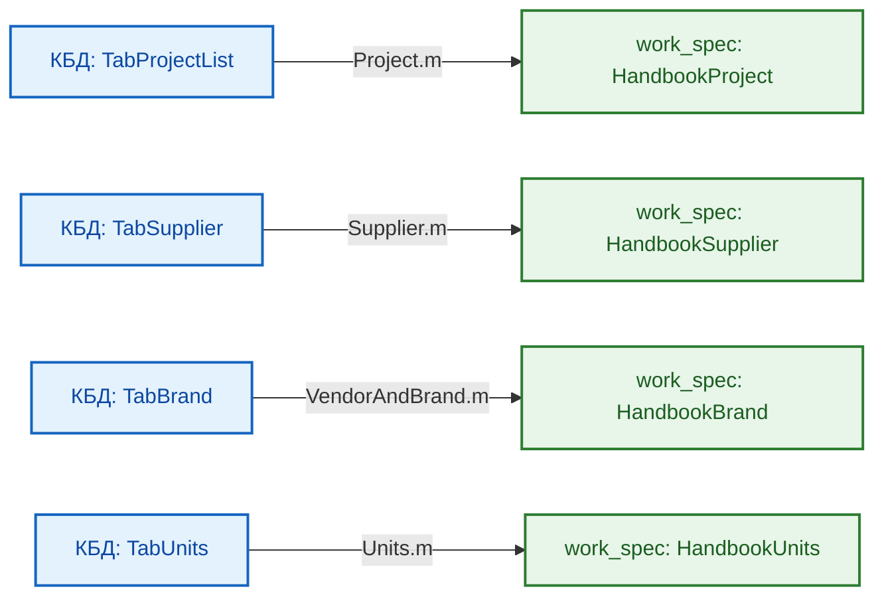

_Подробное описание 19 фондов КБД 1-го типа и логики работы M-адаптеров содержится в:_  
**[README-handbook-function.md](../../05__pq-script/01__general/04__handbook-function-processing/README-handbook-function.md)**

---

## 8. ПРАВИЛА МОДИФИКАЦИИ И АВТОМАТИЗАЦИИ

1.  **Категория 1 (Строгий ручной ввод):** Колонки описаний, артикулов, брендов, количеств и чистой цены закупки `PRICE UNIT $PURCHASE`.
2.  **Категория 2 (Строго автоматические):** Колонки `NUM ORDER`, `NUM FULL SET`, `HASH COLLECTION`, `COST PRICE $PURCHASE`, `COST PRICE VAT $PURCHASE`, расчетные налоговые столбцы НДС (`Col_8`, `Col_10`, `Col_11`, `Col_13`, `Col_14` в `Work_2`). Изменение формул запрещено.
3.  **Категория 3 (Автовычисление с возможностью переопределения):** Столбцы `QUANTITY TOTAL`, `PRICE UNIT $SALE`, `COST DEAL $SALE`, `DISCOUNT MONEY`, `PRICE UNIT $TOTAL`, `COST $TOTAL`. Допускают точечную ручную корректировку в особых коммерческих сценариях.

---

## 9. ГЕНЕРАЦИЯ JSON-КОНФИГУРАЦИЙ ДЛЯ ВАЛИДАЦИИ

Таблица `TabTableSchema` позволяет генерировать блоки правил `ValidationData` для языка `HorizonBI`:

- `TYPE DATASET = int` $\rightarrow$ функция `fvCheckIntegerRange_scalar` с параметрами `RANGE VALUES`.
- `TYPE DATASET = float` $\rightarrow$ функция `fvCheckFloatRange_scalar` с параметрами `RANGE VALUES`.
- `TYPE DATASET = text` $\rightarrow$ функция `fvCheckTextLength_scalar` с параметрами `RANGE VALUES`.
- `NULL VALUE = false` $\rightarrow$ обязательное добавление правила `fvCheckNonEmpty: []`.

---

## 10. ПРИМЕРЫ ИСПОЛЬЗОВАНИЯ И СЦЕНАРИИ HORIZONBI

### 10.1. Создание новой спецификации для проекта

1. Скопировать эталонный файл `Шаблон-спецификация work spec #2026.xlsx`.
2. Переименовать файл в формате `{NUM PROJECT}_work_spec.xlsx` (например, `1-2026-N2-МАС_work_spec.xlsx`).
3. Разместить в каталоге `05__Данные/{NUM PROJECT}/20__work_spec/`.
4. Заполнить данные в `TabSpecificationWork_1` и `TabSpecificationWork_2`.

---

### 10.2. Генерация ТКП для ОСНО: `40__to_customer_fin` (ООО «ГОРИЗОНТ», с НДС 22%)

```json
{
  "TabSpecificationWork": {
    "1": {
      "ColumnSetType": [
        { "NUM PROJECT": "text" },
        { "QUANTITY TOTAL": "int" },
        { "PRICE VAT UNIT $TOTAL": "float" },
        { "COST VAT $TOTAL": "float" }
      ],
      "ColumnFilterFreeData": [{ "NUM PROJECT": "1/2026-N2-ГОРИЗОНТ" }]
    },
    "2": {
      "RemoveXorColumn": [
        "NUM FULL SET",
        "NAME PRODUCT",
        "DESCRIPTION PRODUCT",
        "QUANTITY TOTAL",
        "UNITS",
        "PRICE VAT UNIT $TOTAL",
        "COST VAT $TOTAL",
        "DURATION SALE $TOTAL",
        "COMMENT CUSTOMER"
      ]
    },
    "3": {
      "RenameColumn": [
        { "NUM FULL SET": "№ п/п" },
        { "NAME PRODUCT": "Наименование оборудования" },
        { "DESCRIPTION PRODUCT": "Технические характеристики" },
        { "QUANTITY TOTAL": "Кол-во" },
        { "UNITS": "Ед. изм." },
        { "PRICE VAT UNIT $TOTAL": "Цена с НДС 22%, руб." },
        { "COST VAT $TOTAL": "Стоимость с НДС 22%, руб." },
        { "DURATION SALE $TOTAL": "Срок поставки (дней)" },
        { "COMMENT CUSTOMER": "Примечание" }
      ],
      "ReorderColumn": [
        "№ п/п",
        "Наименование оборудования",
        "Технические характеристики",
        "Кол-во",
        "Ед. изм.",
        "Цена с НДС 22%, руб.",
        "Стоимость с НДС 22%, руб.",
        "Срок поставки (дней)",
        "Примечание"
      ]
    }
  }
}
```

---

### 10.3. Генерация ТКП для УСН: `40__to_customer_fin` (ООО «МАС», без НДС)

```json
{
  "TabSpecificationWork": {
    "1": {
      "ColumnSetType": [
        { "NUM PROJECT": "text" },
        { "QUANTITY TOTAL": "int" },
        { "PRICE UNIT $TOTAL": "float" },
        { "COST $TOTAL": "float" }
      ],
      "ColumnFilterFreeData": [{ "NUM PROJECT": "1/2026-N2-МАС" }]
    },
    "2": {
      "RemoveXorColumn": [
        "NUM FULL SET",
        "NAME PRODUCT",
        "DESCRIPTION PRODUCT",
        "QUANTITY TOTAL",
        "UNITS",
        "PRICE UNIT $TOTAL",
        "COST $TOTAL",
        "DURATION SALE $TOTAL",
        "COMMENT CUSTOMER"
      ]
    },
    "3": {
      "RenameColumn": [
        { "NUM FULL SET": "№ п/п" },
        { "NAME PRODUCT": "Наименование" },
        { "DESCRIPTION PRODUCT": "Описание/Характеристики" },
        { "QUANTITY TOTAL": "Количество" },
        { "UNITS": "Ед. изм." },
        { "PRICE UNIT $TOTAL": "Цена без НДС, руб." },
        { "COST $TOTAL": "Стоимость без НДС, руб." },
        { "DURATION SALE $TOTAL": "Срок поставки, раб. дней" },
        { "COMMENT CUSTOMER": "Примечание" }
      ],
      "ReorderColumn": [
        "№ п/п",
        "Наименование",
        "Описание/Характеристики",
        "Количество",
        "Ед. изм.",
        "Цена без НДС, руб.",
        "Стоимость без НДС, руб.",
        "Срок поставки, раб. дней",
        "Примечание"
      ]
    }
  }
}
```

---

## 11. КАТАЛОГ СВЯЗЕЙ И ПЕРЕКРЁСТНЫЕ ССЫЛКИ

- [Головной навигатор проекта (README.md)](../../../README.md)
- [Руководство по эксплуатации ETL-процессора ProcessingTable](../../05__pq-script/01__general/03__ETL-processing/README-etl-processor.md)
- [Справочник функций НСИ (README-handbook-function.md)](../../05__pq-script/01__general/04__handbook-function-processing/README-handbook-function.md)
- [Библиотеки валидации и трансформаций (README-utils-function.md)](../../05__pq-script/01__general/02__utils-function-processing/README-utils-function.md)
- [Системные функции M (README-general-function.md)](../../05__pq-script/01__general/01__general-function-processing/README-general-function.md)
- **Производные спецификации ИРП:**
  - [Техническая спецификация: to_customer_tech (тип 30)](../30__to_customer_tech/README-to_customer_tech.md)
  - [Финансовая спецификация ТКП: to_customer_fin (тип 40)](../40__to_customer_fin/README-to_customer_fin.md)
  - [Правки заказчика: from_customer (тип 50)](../50__from_customer/README-from_customer.md)
  - [Запросы поставщикам: to_supplier (тип 60)](../60__to_supplier/README-to_supplier.md)
  - [Коммерческие предложения: from_supplier (тип 70)](../70__from_supplier/README-from_supplier.md)
  - [План-факт закупки: purchase (тип 80)](../80__purchase/README-purchase.md)
  - [План-факт отгрузки: shipment (тип 90)](../90__shipment/README-shipment.md)

---

# ИСТОЧНИК: README.md

# ПРОЕКТ 1/2026-N2-МАС: ЭКОСИСТЕМА «HORIZONBI»

**Универсальный инструментарий BI для управления проектами и заказами**  
**Группа компаний «ПЕРЕДОВЫЕ РЕШЕНИЯ»**

---

## ВВЕДЕНИЕ

**Проект 1/2026-N2-МАС** — это комплексная программно-методологическая разработка BI-инструментов для автоматизации бизнес-процессов договорной работы, закупок, логистики и финансового контроля Группы компаний «ПЕРЕДОВЫЕ РЕШЕНИЯ».

В центре экосистемы находится универсальный **ETL-процессор `ProcessingTable`** и система взаимосвязанных **спецификаций данных**, реализующих принцип единого источника истины (Single Source of Truth) для всех проектов холдинга.

Проект зарегистрирован как **Заказ №2** в рамках внутреннего рамочного договора **`1/2026-N0-МАС`** в контуре ООО «МАС».

### История и преемственность

Проект является прямым эволюционным развитием инициативы **PowerQueryScript**. Все наработки архитектуры M-кода, алгоритмы расчета контрольных сумм и принципы типизации полностью унаследованы, переработаны и расширены в текущей кодовой базе.

---

## ОБЗОР ПРОЕКТА

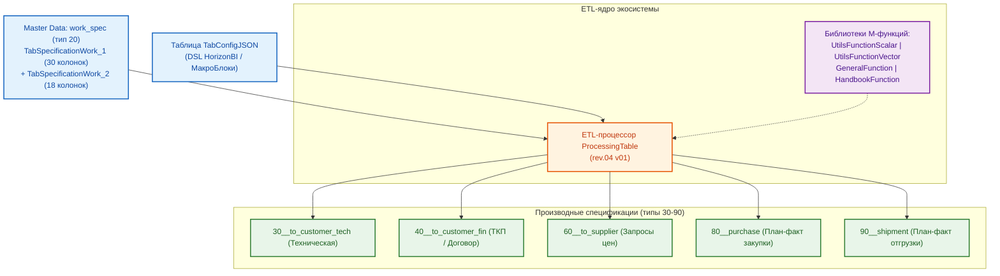

### Ключевые компоненты экосистемы HorizonBI

1. **Система спецификаций данных** — иерархическая структура документов: центральная мастер-спецификация `work_spec` в рамочном договоре (`N0`) и автоматическая генерация производных спецификаций в папках конкретных заказов (`N1`, `N2`...).
2. **ETL-процессор `ProcessingTable`** — декларативный процессор табличных данных Power Query (M), управляемый языком конфигураций `HorizonBI` (JSON DSL).
3. **Библиотеки функций Power Query (M)** — модульный стек из 4 библиотек: системные сервисы, скалярная валидация, векторные трансформации и работа со справочниками НСИ.
4. **Справочники (Handbooks)** — двухуровневая модель НСИ: 19 мастер-фондов в КБД «КИТ» и компактные прикладные проекции 2-го типа, встроенные в книги Excel.

### Бизнес-контекст ГК «ПЕРЕДОВЫЕ РЕШЕНИЯ»

Холдинг объединяет несколько юридических лиц с различными налоговыми режимами:

| Юридическое лицо                  | Налоговый режим | Ставка НДС       | Назначение в холдинге                                                     |
| :-------------------------------- | :-------------- | :--------------- | :------------------------------------------------------------------------ |
| **ООО «ГОРИЗОНТ»**                | ОСНО            | **22% НДС**      | Контракты с крупными корпоративными заказчиками, требующими выделения НДС |
| **ООО «МАС»**                     | УСН             | **0% (без НДС)** | Разработка ПО, НИОКР, системная интеграция, не облагаемая НДС             |
| **ИП «КУКУШКИН ИВАН НИКОЛАЕВИЧ»** | УСН             | **0% (без НДС)** | Инженерные услуги, консалтинг, малосерийное производство                  |

### Базовые архитектурные принципы

- **Принцип чистой базы:** Все внутренние расчеты себестоимости закупки, торговых наценок и маржинальности ведутся строго **БЕЗ НДС**. Налог рассчитывается и добавляется отдельным контуром на этапе определения цены реализации.
- **Абсолютная точность Master Data:** В мастер-спецификации `work_spec` финансовые показатели хранятся без принудительного математического округления для исключения накопления погрешности. Округление до копеек выполняется только при выгрузке клиентских документов.
- **Изоляция коммерческой тайны:** Клиентские спецификации (`to_customer_fin`, `to_customer_tech`) формируются по принципу белого списка (`RemoveXorColumn`), что гарантирует невозможность утечки закупочных цен и данных реальных поставщиков.

---

## СТРУКТУРА ИНФОРМАЦИОННОГО РЕСУРСА ПРОЕКТА (ИРП)

### 1. Правило формирования имени головного каталога проекта

Именование корневой папки проекта на файловом сервере компании строго регламентировано и формируется по шаблону:
$$\text{\{НОМЕР-ПРОЕКТА\}\_20xx-N\{НОМЕР-ЗАКАЗА\}-\{КОМПАНИЯ\}}$$

**Правило адаптации для файловой системы:**

- Официальный внутренний шифр проекта содержит прямой слэш `/` (например, `1/2026-N2-МАС`, `1/2024-N1-ГОРИЗОНТ`, `10/2024-N2-КУКУШКИН ИВАН НИКОЛАЕВИЧ`).
- Поскольку символ прямого слэша `/` является системным разделителем путей и запрещен к использованию в именах файлов и папок в ОС Windows/OneDrive/Linux, при создании каталога на сервере **знак слэша `/` всегда заменяется на знак нижнего подчеркивания `_`**.

**Примеры соответствия:**

- Проект `1/2026-N2-МАС` $\rightarrow$ Каталог: `1_2026-N2-МАС/`
- Проект `1/2024-N1-ГОРИЗОНТ` $\rightarrow$ Каталог: `1_2024-N1-ГОРИЗОНТ/`
- Проект `10/2024-N2-КУКУШКИН ИВАН НИКОЛАЕВИЧ` $\rightarrow$ Каталог: `10_2024-N2-КУКУШКИН ИВАН НИКОЛАЕВИЧ/`

---

### 2. Каноническая регламентная структура каталогов ИРП

Каждый проектный ресурс на сервере компании разворачивается в единой, унифицированной структуре папок:

```plain text
{НОМЕР-ПРОЕКТА}_20xx-N{НОМЕР-ЗАКАЗА}-{КОМПАНИЯ}/
├── 01__Документация/                    # Соглашения, доверенности, переписка и др. орг. документы проекта
├── 02__Спецификации/                    # Технические и коммерческие спецификации/показатели проекта
├── 03__Проект/                          # ОСНОВНОЙ РАБОЧИЙ КАТАЛОГ
│   ├── 01__ИД/                          # Исходные данные по задаче
│   ├── 02__ТЗ/                          # Технические задания
│   ├── 03__План-график/                 # Календарно-сетевые графики
│   └── 04__Документация/                # Инженерная документация
├── 04__Договор/                         # Юридически значимый договор
├── 05__Счета/                           # Счета и платежные поручения
├── 06__Затраты/                         # Затраты по вспомогательным приобретениям
├── 07__Логистика/                       # Отгрузка товаров, логистические документы
├── 08__Закрывающие документы/           # Все виды юридически значимых закрывающих документов
├── 09__Подписанные документы/           # Дополнительные, юридически значимые, подписанные документы
└── 10__Персонал/                        # Командировки, письма с допусками и т.п.
```

> **Примечание по размещению спецификаций (каталог `02__Спецификации/`):**
>
> - В ИРП рамочного договора (`N0`) каталог `02__Спецификации/02__Спецификации/` содержит мастер-спецификации: `01__raw_spec`, `10__csv_spec`, `20__work_spec`.
> - В ИРП конкретного заказа (`N1`, `N2`...) каталог `02__Спецификации/02__Спецификации/` содержит производные спецификации: `30__to_customer_tech`, `40__to_customer_fin`, `50__from_customer`, `60__to_supplier`, `70__from_supplier`, `80__purchase`, `90__shipment`.

---

### 3. Общекорпоративная инфраструктура данных: ИСК («КИТ»)

Помимо изолированных каталогов проектных ресурсов (ИРП), на корпоративном диске развернута централизованная инфраструктура **ИСК** (Информационные Системы Компании):

- **Корневой каталог:** `c:\OneDrive\01__LLC_MAS_2025\КИТ\`
- **Назначение:** Единый общекорпоративный источник мастер-данных, нормативно-справочной информации (НСИ) и эталонных шаблонов для всех проектов и юридических лиц ГК «ПЕРЕДОВЫЕ РЕШЕНИЯ».

```plain text
c:\OneDrive\01__LLC_MAS_2025\КИТ\
├── 01__КБД/                                 # Корпоративная База Данных (BI-датасеты и справочники)
│   ├── 01__SQL/                             # Реляционные базы данных, дампы и SQL-скрипты
│   ├── 02__NoSQL/                           # Неструктурированные и документоориентированные БД
│   └── 03__Excel/                           # Справочники 1-го типа (19 мастер-фондов НСИ)
│       ├── Corporation/                     # Реестр юридических лиц холдинга
│       ├── Counterparty/                    # База контрагентов
│       ├── Employee/                        # Справочник сотрудников
│       ├── Nomenclature/                    # Каталог стандартной номенклатуры
│       ├── Project/                         # Реестр проектов и заказов
│       ├── Supplier/                        # База поставщиков
│       ├── Units/                           # Классификатор единиц измерения (ОКЕИ)
│       ├── VendorAndBrand/                  # Справочник брендов и производителей
│       └── TableList/                       # Мета-реестр физического размещения (TabTableList)
└── 02__Шаблоны/                             # Общекорпоративный фонд регламентных шаблонов
    ├── 01__BI/                              # Шаблоны аналитических моделей и спецификаций
    ├── 02__База знаний/                     # Регламенты, стандарты и инструкции компании
    ├── 03__Файловая структура/              # Эталоны развертывания каталогов проектов
    ├── 04__Нумерация бизнес сущностей/      # Правила нумерации проектов, счетов, договоров
    ├── 05__Договора/                        # Типовые юридические шаблоны договоров
    ├── 07__Заявления/                       # Корпоративные бланки заявлений
    ├── 08__Бланки/                          # Унифицированные бланки первичных документов
    ├── 09__Отчеты/                          # Формы периодической и проектной отчетности
    └── 20__Разное/                          # Вспомогательные шаблоны и формы
```

> **Двухуровневая модель НСИ:** Запросы `HandbookFunction` и адаптер `UtilsGetPathTable` обращаются к реестру `c:\OneDrive\01__LLC_MAS_2025\КИТ\01__КБД\03__Excel\TableList\Таблицы-КБД список #2025.xlsx` для динамического извлечения легких проекций 2-го типа в спецификации.

---

## СИСТЕМА СПЕЦИФИКАЦИЙ

### 1. Главная спецификация: `work_spec` (тип 20)

**Назначение:** Центральный Master Data документ — единая точка истины по всему проекту и всем входящим в него заказам.

**Архитектура (Шаблон `rev.04 v03`):**

- Две связанные умные таблицы Excel (реляционная связь 1:1 по ключу `HASH COLLECTION`):
  - **`TabSpecificationWork_1` (30 колонок):** Идентификаторы, номенклатура, количества, закупки, чистая себестоимость БЕЗ НДС, входящий НДС на закупку (`VAT ADD PRICE $PURCHASE`), полная себестоимость с НДС (`COST PRICE VAT $PURCHASE`), логистика, ссылки на ТКП и фото.
  - **`TabSpecificationWork_2` (18 колонок):** Наценки, базовая реализация, скидки, налоговый блок НДС (`VAT RATE CONTRACTOR $TOTAL`, `PRICE VAT UNIT $TOTAL`, `COST VAT $TOTAL`), статусы поставки и комментарий заказчика.
- **`TabTableSchema` (48 записей):** Метаданные, диапазоны значений, признак обязательности (NULL), формулы и правила валидации для всех 48 столбцов спецификации.

**→ Подробная документация:** [README-work_spec.md](./03__Проект/07__template-excel/20__work_spec/README-work_spec.md)

---

### 2. Производные спецификации (типы 30–90)

| Тип    | Каталог / Имя          | Назначение                        | Особенности состава данных                                                                                 |
| :----- | :--------------------- | :-------------------------------- | :--------------------------------------------------------------------------------------------------------- |
| **30** | `30__to_customer_tech` | Техническое приложение к договору | Номенклатура, характеристики, количества, сроки. **Цены и поставщики скрыты.**                             |
| **40** | `40__to_customer_fin`  | Коммерческое предложение / ТКП    | Номенклатура, объемы, **цены и стоимость продажи** (с НДС для ОСНО / без НДС для УСН). **Закупки скрыты.** |
| **50** | `50__from_customer`    | Протокол согласования правок      | Фиксация встречных требований заказчика по количествам и аналогам.                                         |
| **60** | `60__to_supplier`      | Запрос коммерческого предложения  | Номенклатура и требуемые объемы для рассылки поставщикам. **Цены реализации скрыты.**                      |
| **70** | `70__from_supplier`    | Реестр входящих КП                | Сравнительный анализ предложений поставщиков для фиксации цены закупки в `work_spec`.                      |
| **80** | `80__purchase`         | Диспетчеризация закупок           | План-факт оплаты счетов поставщиков, контроль сроков поступления на склад.                                 |
| **90** | `90__shipment`         | Диспетчеризация отгрузок          | План-факт поставки позиций заказчику, контроль подписания закрывающих актов/УПД.                           |

---

## ETL-ПРОЦЕССОР «PROCESSINGTABLE»

### 1. Архитектура и принцип работы

**`ProcessingTable` (текущая версия ядра: `rev.04 v01`)** — параметризованная M-функция, считывающая конфигурационный JSON из таблицы `TabConfigJSON` текущей книги по ключу `_configJSONIndex` и выполняющая сквозной конвейер обработки данных для 1–4 таблиц Excel.

```m
ProcessingTable(
    _configJSONIndex as text,
    optional _pathExcelBook_1 as text,
    optional _pathExcelBook_2 as text,
    optional _pathExcelBook_3 as text,
    optional _pathExcelBook_4 as text
) as table => ...
```

### 2. Конвейер языка «HorizonBI» (15 этапов обработки внутри МакроБлока)

Внутри каждого нумерованного МакроБлока (`"1"`, `"2"`...) команды выполняются в строгом системном порядке:

1. **`ColumnSetType`** — Принудительная типизация столбцов (`text`, `int`, `float`, `bool`).
2. **`ColumnFilterFreeData`** — Строгая фильтрация строк по значению (`WHERE col = val`).
3. **`ColumnFilterUniqueData`** — Дедупликация датасета (`Table.Distinct` по ключевым столбцам).
4. **`RemoveRowOne`** — Удаление первой строки, совпавшей с критерием поиска.
5. **`RemoveRowAll`** — Удаление всех строк, совпавших с критерием поиска.
6. **`InsertColumn`** — Добавление новых пустых столбцов со значением `null`.
7. **`ColumnFillData`** — Массовое заполнение всего столбца константой.
8. **`ModifyData`** — Точечное обновление ячеек строки по ключевой паре поиск/замена.
9. **`RemoveXorColumn`** — Изоляция структуры: удаление всех колонок, кроме белого списка.
10. **`RemoveColumn`** — Удаление списка колонок по черному списку.
11. **`ClearColumn`** — Очистка значений столбцов (замена на `null` с сохранением колонки).
12. **`RenameColumn`** — Переименование списка колонок.
13. **`ReorderColumn`** — Переупорядочивание колонок слева направо.
14. **`RunLeftJOINstructure` / `RunRightJOINstructure` / `RunJOINdata`** — Глобальные операции слияния таблиц (по ключу `HASH COLLECTION` с авто-развертыванием `Table.ExpandTableColumn` или объединение строк `Table.Combine`).
15. **`ValidationData`** — Финальная верификация данных с генерацией сервисного столбца `VALIDATION`.

**→ Полное руководство по эксплуатации:** [README-etl-processor.md](./03__Проект/05__pq-script/01__general/03__ETL-processing/README-etl-processor.md)

---

## БИБЛИОТЕКИ ФУНКЦИЙ POWER QUERY (M)

Модульный стек M-скриптов расположен в каталоге `03__Проект/05__pq-script/01__general/`:

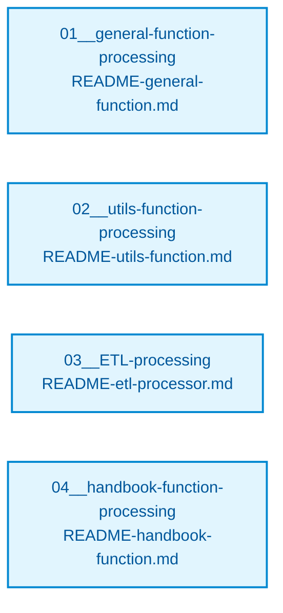

### 1. `GeneralFunction` (Системные сервисы)

- **Файл:** `01__general-function-processing/GeneralFunction rev.02 v01.m`
- **Назначение:** Низкоуровневые функции загрузки таблиц (`fnLoadWorkbookTable`), валидации путей (`fnResolveFilePath`), безопасного парсинга JSON (`fnParseJSONSafe`) и форматирования ошибок.
- **→ Документация:** [README-general-function.md](./03__Проект/05__pq-script/01__general/01__general-function-processing/README-general-function.md)

### 2. `UtilsFunction` (Валидаторы и трансформеры)

- **Файлы:** `UtilsFunctionScalar.m` (18 скалярных проверок `true`/`false`) и `UtilsFunctionVector.m` (9 трансформаций + `fvCheckID`).
- **Назначение:** Атомарные проверки ИНН (10 и 12 знаков с контрольными суммами), СНИЛС, КПП, телефонов, email, паспортов РФ, диапазонов чисел и дат, нормализация ФИО и дат.
- **→ Документация:** [README-utils-function.md](./03__Проект/05__pq-script/01__general/02__utils-function-processing/README-utils-function.md)

### 3. `HandbookFunction` (Функции нормализации НСИ)

- **Файл:** `04__handbook-function-processing/HandbookFunction rev.02 v01.m`
- **Назначение:** Автоопределение ставки НДС по коду юрлица (`fhGetContractorTaxRate`), нормализация единиц измерения ОКЕИ (`fhNormalizeUnit`), валидация номеров проектов, поставщиков и брендов.
- **→ Документация:** [README-handbook-function.md](./03__Проект/05__pq-script/01__general/04__handbook-function-processing/README-handbook-function.md)

---

## СВОДНЫЙ КАТАЛОГ ДОКУМЕНТАЦИИ ПРОЕКТА

### Руководства по ETL-инструментарию (M-код)

- 📘 **[Руководство по эксплуатации ETL-процессора ProcessingTable](./03__Проект/05__pq-script/01__general/03__ETL-processing/README-etl-processor.md)**
- 📗 **[Справочник функций валидации и трансформации UtilsFunction](./03__Проект/05__pq-script/01__general/02__utils-function-processing/README-utils-function.md)**
- 📙 **[Справочник системных сервисных функций GeneralFunction](./03__Проект/05__pq-script/01__general/01__general-function-processing/README-general-function.md)**
- 📕 **[Справочник функций нормативно-справочной информации HandbookFunction](./03__Проект/05__pq-script/01__general/04__handbook-function-processing/README-handbook-function.md)**

### Руководства по спецификациям Excel

- 📊 **[Спецификация Master Data: work_spec (тип 20)](./03__Проект/07__template-excel/20__work_spec/README-work_spec.md)**
- 📄 **[Техническая спецификация: to_customer_tech (тип 30)](./03__Проект/07__template-excel/30__to_customer_tech/README-to_customer_tech.md)**
- 💰 **[Финансовая спецификация ТКП: to_customer_fin (тип 40)](./03__Проект/07__template-excel/40__to_customer_fin/README-to_customer_fin.md)**
- 📝 **[Правки заказчика: from_customer (тип 50)](./03__Проект/07__template-excel/50__from_customer/README-from_customer.md)**
- 📨 **[Запросы поставщикам: to_supplier (тип 60)](./03__Проект/07__template-excel/60__to_supplier/README-to_supplier.md)**
- 📩 **[Предложения поставщиков: from_supplier (тип 70)](./03__Проект/07__template-excel/70__from_supplier/README-from_supplier.md)**
- 📦 **[Контроль закупок: purchase (тип 80)](./03__Проект/07__template-excel/80__purchase/README-purchase.md)**
- 🚚 **[Контроль отгрузок: shipment (тип 90)](./03__Проект/07__template-excel/90__shipment/README-shipment.md)**

---

## ТЕХНОЛОГИЧЕСКИЙ СТЕК

- **Язык функционального программирования:** Power Query (M)
- **Среда хранения и исполнения:** Microsoft Excel 2016+ / Microsoft 365 (Personal / Family OneDrive sync)
- **Декларативный язык управления:** JSON DSL (`HorizonBI`)
- **Система контроля версий:** Git / GitHub
- **Среда разработки и AI-оркестрации:** Visual Studio Code (AI-агент `Antigravity`) & Google AI Studio (AI-аналитик `Люся`)

---

## КОНТАКТЫ И РЕКВИЗИТЫ

- **Организация-исполнитель:** ООО «МАС» (ГК «ПЕРЕДОВЫЕ РЕШЕНИЯ»)
- **Шифр проекта:** 1/2026-N2-МАС (Заказ №2)
- **Родительский договор:** 1/2026-N0-МАС
- **Репозиторий проекта:** [github.com/Konkery/Project-1_2026-N2-MAS](https://github.com/Konkery/Project-1_2026-N2-MAS)

---

**Версия документации:** 2.1 (Синхронизировано с ядром `rev.04 v01` и шаблоном `rev.04 v03`)  
**Дата актуализации:** 21 сентября 2026 г.


---

