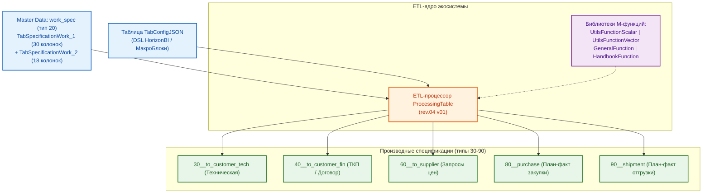
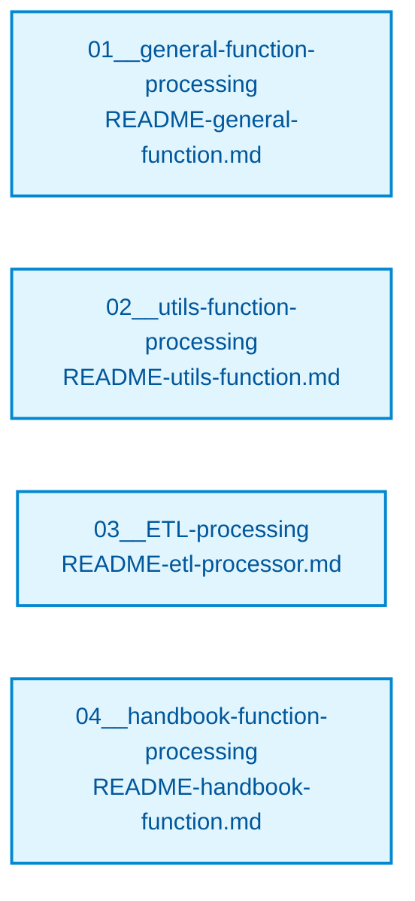

# ПРОЕКТ 1/2026-N2-МАС: ЭКОСИСТЕМА «HORIZONBI»

**Универсальный инструментарий BI для управления проектами и заказами**  
**Группа компаний «ПЕРЕДОВЫЕ РЕШЕНИЯ»**

---

## ВВЕДЕНИЕ

**Проект 1/2026-N2-МАС** — это комплексная программно-методологическая разработка BI-инструментов для автоматизации бизнес-процессов договорной работы, закупок, логистики и финансового контроля Группы компаний «ПЕРЕДОВЫЕ РЕШЕНИЯ».

В центре экосистемы находится универсальный **ETL-процессор `ProcessingTable`** и система взаимосвязанных **спецификаций данных**, реализующих принцип единого источника истины (Single Source of Truth) для всех проектов холдинга.

Проект зарегистрирован как **Заказ №2** в рамках внутреннего рамочного договора **`1/2026-N0-МАС`** в контуре ООО «МАС».

### История и преемственность

Проект является прямым эволюционным развитием инициативы **PowerQueryScript**. Все наработки архитектуры M-кода, алгоритмы расчета контрольных сумм и принципы типизации полностью унаследованы, переработаны и расширены в текущей кодовой базе.

---

## ОБЗОР ПРОЕКТА



### Ключевые компоненты экосистемы HorizonBI

1. **Система спецификаций данных** — иерархическая структура документов: центральная мастер-спецификация `work_spec` в рамочном договоре (`N0`) и автоматическая генерация производных спецификаций в папках конкретных заказов (`N1`, `N2`...).
2. **ETL-процессор `ProcessingTable`** — декларативный процессор табличных данных Power Query (M), управляемый языком конфигураций `HorizonBI` (JSON DSL).
3. **Библиотеки функций Power Query (M)** — модульный стек из 4 библиотек: системные сервисы, скалярная валидация, векторные трансформации и работа со справочниками НСИ.
4. **Справочники (Handbooks)** — двухуровневая модель НСИ: 19 мастер-фондов в КБД «КИТ» и компактные прикладные проекции 2-го типа, встроенные в книги Excel.

### Бизнес-контекст ГК «ПЕРЕДОВЫЕ РЕШЕНИЯ»

Холдинг объединяет несколько юридических лиц с различными налоговыми режимами:

| Юридическое лицо                  | Налоговый режим | Ставка НДС       | Назначение в холдинге                                                     |
| :-------------------------------- | :-------------- | :--------------- | :------------------------------------------------------------------------ |
| **ООО «ГОРИЗОНТ»**                | ОСНО            | **22% НДС**      | Контракты с крупными корпоративными заказчиками, требующими выделения НДС |
| **ООО «МАС»**                     | УСН             | **0% (без НДС)** | Разработка ПО, НИОКР, системная интеграция, не облагаемая НДС             |
| **ИП «КУКУШКИН ИВАН НИКОЛАЕВИЧ»** | УСН             | **0% (без НДС)** | Инженерные услуги, консалтинг, малосерийное производство                  |

### Базовые архитектурные принципы

- **Принцип чистой базы:** Все внутренние расчеты себестоимости закупки, торговых наценок и маржинальности ведутся строго **БЕЗ НДС**. Налог рассчитывается и добавляется отдельным контуром на этапе определения цены реализации.
- **Абсолютная точность Master Data:** В мастер-спецификации `work_spec` финансовые показатели хранятся без принудительного математического округления для исключения накопления погрешности. Округление до копеек выполняется только при выгрузке клиентских документов.
- **Изоляция коммерческой тайны:** Клиентские спецификации (`to_customer_fin`, `to_customer_tech`) формируются по принципу белого списка (`RemoveXorColumn`), что гарантирует невозможность утечки закупочных цен и данных реальных поставщиков.

---

## СТРУКТУРА ИНФОРМАЦИОННОГО РЕСУРСА ПРОЕКТА (ИРП)

### 1. Правило формирования имени головного каталога проекта

Именование корневой папки проекта на файловом сервере компании строго регламентировано и формируется по шаблону:
$$\text{\{НОМЕР-ПРОЕКТА\}\_20xx-N\{НОМЕР-ЗАКАЗА\}-\{КОМПАНИЯ\}}$$

**Правило адаптации для файловой системы:**

- Официальный внутренний шифр проекта содержит прямой слэш `/` (например, `1/2026-N2-МАС`, `1/2024-N1-ГОРИЗОНТ`, `10/2024-N2-КУКУШКИН ИВАН НИКОЛАЕВИЧ`).
- Поскольку символ прямого слэша `/` является системным разделителем путей и запрещен к использованию в именах файлов и папок в ОС Windows/OneDrive/Linux, при создании каталога на сервере **знак слэша `/` всегда заменяется на знак нижнего подчеркивания `_`**.

**Примеры соответствия:**

- Проект `1/2026-N2-МАС` $\rightarrow$ Каталог: `1_2026-N2-МАС/`
- Проект `1/2024-N1-ГОРИЗОНТ` $\rightarrow$ Каталог: `1_2024-N1-ГОРИЗОНТ/`
- Проект `10/2024-N2-КУКУШКИН ИВАН НИКОЛАЕВИЧ` $\rightarrow$ Каталог: `10_2024-N2-КУКУШКИН ИВАН НИКОЛАЕВИЧ/`

---

### 2. Каноническая регламентная структура каталогов ИРП

Каждый проектный ресурс на сервере компании разворачивается в единой, унифицированной структуре папок:

```plain text
{НОМЕР-ПРОЕКТА}_20xx-N{НОМЕР-ЗАКАЗА}-{КОМПАНИЯ}/
├── 01__Документация/                    # Соглашения, доверенности, переписка и др. орг. документы проекта
├── 02__Спецификации/                    # Технические и коммерческие спецификации/показатели проекта
├── 03__Проект/                          # ОСНОВНОЙ РАБОЧИЙ КАТАЛОГ
│   ├── 01__ИД/                          # Исходные данные по задаче
│   ├── 02__ТЗ/                          # Технические задания
│   ├── 03__План-график/                 # Календарно-сетевые графики
│   └── 04__Документация/                # Инженерная документация
├── 04__Договор/                         # Юридически значимый договор
├── 05__Счета/                           # Счета и платежные поручения
├── 06__Затраты/                         # Затраты по вспомогательным приобретениям
├── 07__Логистика/                       # Отгрузка товаров, логистические документы
├── 08__Закрывающие документы/           # Все виды юридически значимых закрывающих документов
├── 09__Подписанные документы/           # Дополнительные, юридически значимые, подписанные документы
└── 10__Персонал/                        # Командировки, письма с допусками и т.п.
```

> **Примечание по размещению спецификаций (каталог `02__Спецификации/`):**
>
> - В ИРП рамочного договора (`N0`) каталог `02__Спецификации/02__Спецификации/` содержит мастер-спецификации: `01__raw_spec`, `10__csv_spec`, `20__work_spec`.
> - В ИРП конкретного заказа (`N1`, `N2`...) каталог `02__Спецификации/02__Спецификации/` содержит производные спецификации: `30__to_customer_tech`, `40__to_customer_fin`, `50__from_customer`, `60__to_supplier`, `70__from_supplier`, `80__purchase`, `90__shipment`.

---

### 3. Общекорпоративная инфраструктура данных: ИСК («КИТ»)

Помимо изолированных каталогов проектных ресурсов (ИРП), на корпоративном диске развернута централизованная инфраструктура **ИСК** (Информационные Системы Компании):

- **Корневой каталог:** `c:\OneDrive\01__LLC_MAS_2025\КИТ\`
- **Назначение:** Единый общекорпоративный источник мастер-данных, нормативно-справочной информации (НСИ) и эталонных шаблонов для всех проектов и юридических лиц ГК «ПЕРЕДОВЫЕ РЕШЕНИЯ».

```plain text
c:\OneDrive\01__LLC_MAS_2025\КИТ\
├── 01__КБД/                                 # Корпоративная База Данных (BI-датасеты и справочники)
│   ├── 01__SQL/                             # Реляционные базы данных, дампы и SQL-скрипты
│   ├── 02__NoSQL/                           # Неструктурированные и документоориентированные БД
│   └── 03__Excel/                           # Справочники 1-го типа (19 мастер-фондов НСИ)
│       ├── Corporation/                     # Реестр юридических лиц холдинга
│       ├── Counterparty/                    # База контрагентов
│       ├── Employee/                        # Справочник сотрудников
│       ├── Nomenclature/                    # Каталог стандартной номенклатуры
│       ├── Project/                         # Реестр проектов и заказов
│       ├── Supplier/                        # База поставщиков
│       ├── Units/                           # Классификатор единиц измерения (ОКЕИ)
│       ├── VendorAndBrand/                  # Справочник брендов и производителей
│       └── TableList/                       # Мета-реестр физического размещения (TabTableList)
└── 02__Шаблоны/                             # Общекорпоративный фонд регламентных шаблонов
    ├── 01__BI/                              # Шаблоны аналитических моделей и спецификаций
    ├── 02__База знаний/                     # Регламенты, стандарты и инструкции компании
    ├── 03__Файловая структура/              # Эталоны развертывания каталогов проектов
    ├── 04__Нумерация бизнес сущностей/      # Правила нумерации проектов, счетов, договоров
    ├── 05__Договора/                        # Типовые юридические шаблоны договоров
    ├── 07__Заявления/                       # Корпоративные бланки заявлений
    ├── 08__Бланки/                          # Унифицированные бланки первичных документов
    ├── 09__Отчеты/                          # Формы периодической и проектной отчетности
    └── 20__Разное/                          # Вспомогательные шаблоны и формы
```

> **Двухуровневая модель НСИ:** Запросы `HandbookFunction` и адаптер `UtilsGetPathTable` обращаются к реестру `c:\OneDrive\01__LLC_MAS_2025\КИТ\01__КБД\03__Excel\TableList\Таблицы-КБД список #2025.xlsx` для динамического извлечения легких проекций 2-го типа в спецификации.

---

## СИСТЕМА СПЕЦИФИКАЦИЙ

### 1. Главная спецификация: `work_spec` (тип 20)

**Назначение:** Центральный Master Data документ — единая точка истины по всему проекту и всем входящим в него заказам.

**Архитектура (Шаблон `rev.04 v03`):**

- Две связанные умные таблицы Excel (реляционная связь 1:1 по ключу `HASH COLLECTION`):
  - **`TabSpecificationWork_1` (30 колонок):** Идентификаторы, номенклатура, количества, закупки, чистая себестоимость БЕЗ НДС, входящий НДС на закупку (`VAT ADD PRICE $PURCHASE`), полная себестоимость с НДС (`COST PRICE VAT $PURCHASE`), логистика, ссылки на ТКП и фото.
  - **`TabSpecificationWork_2` (18 колонок):** Наценки, базовая реализация, скидки, налоговый блок НДС (`VAT RATE CONTRACTOR $TOTAL`, `PRICE VAT UNIT $TOTAL`, `COST VAT $TOTAL`), статусы поставки и комментарий заказчика.
- **`TabTableSchema` (48 записей):** Метаданные, диапазоны значений, признак обязательности (NULL), формулы и правила валидации для всех 48 столбцов спецификации.

**→ Подробная документация:** [README-work_spec.md](./03__Проект/07__template-excel/20__work_spec/README-work_spec.md)

---

### 2. Производные спецификации (типы 30–90)

| Тип    | Каталог / Имя          | Назначение                        | Особенности состава данных                                                                                 |
| :----- | :--------------------- | :-------------------------------- | :--------------------------------------------------------------------------------------------------------- |
| **30** | `30__to_customer_tech` | Техническое приложение к договору | Номенклатура, характеристики, количества, сроки. **Цены и поставщики скрыты.**                             |
| **40** | `40__to_customer_fin`  | Коммерческое предложение / ТКП    | Номенклатура, объемы, **цены и стоимость продажи** (с НДС для ОСНО / без НДС для УСН). **Закупки скрыты.** |
| **50** | `50__from_customer`    | Протокол согласования правок      | Фиксация встречных требований заказчика по количествам и аналогам.                                         |
| **60** | `60__to_supplier`      | Запрос коммерческого предложения  | Номенклатура и требуемые объемы для рассылки поставщикам. **Цены реализации скрыты.**                      |
| **70** | `70__from_supplier`    | Реестр входящих КП                | Сравнительный анализ предложений поставщиков для фиксации цены закупки в `work_spec`.                      |
| **80** | `80__purchase`         | Диспетчеризация закупок           | План-факт оплаты счетов поставщиков, контроль сроков поступления на склад.                                 |
| **90** | `90__shipment`         | Диспетчеризация отгрузок          | План-факт поставки позиций заказчику, контроль подписания закрывающих актов/УПД.                           |

---

## ETL-ПРОЦЕССОР «PROCESSINGTABLE»

### 1. Архитектура и принцип работы

**`ProcessingTable` (текущая версия ядра: `rev.04 v01`)** — параметризованная M-функция, считывающая конфигурационный JSON из таблицы `TabConfigJSON` текущей книги по ключу `_configJSONIndex` и выполняющая сквозной конвейер обработки данных для 1–4 таблиц Excel.

```m
ProcessingTable(
    _configJSONIndex as text,
    optional _pathExcelBook_1 as text,
    optional _pathExcelBook_2 as text,
    optional _pathExcelBook_3 as text,
    optional _pathExcelBook_4 as text
) as table => ...
```

### 2. Конвейер языка «HorizonBI» (14 этапов обработки внутри МакроБлока)

Внутри каждого нумерованного МакроБлока (`"1"`, `"2"`...) команды выполняются в строгом системном порядке:

1. **`ColumnSetType`** — Принудительная типизация столбцов (`text`, `int`, `float`, `bool`).
2. **`ColumnFilterFreeData`** — Строгая фильтрация строк по значению (`WHERE col = val`).
3. **`ColumnFilterUniqueData`** — Дедупликация датасета (`Table.Distinct` по ключевым столбцам).
4. **`RemoveRowOne`** — Удаление первой строки, совпавшей с критерием поиска.
5. **`RemoveRowAll`** — Удаление всех строк, совпавших с критерием поиска.
6. **`InsertColumn`** — Добавление новых пустых столбцов со значением `null`.
7. **`ColumnFillData`** — Массовое заполнение всего столбца константой.
8. **`ModifyData`** — Точечное обновление ячеек строки по ключевой паре поиск/замена.
9. **`RemoveXorColumn`** — Изоляция структуры: удаление всех колонок, кроме белого списка.
10. **`RemoveColumn`** — Удаление списка колонок по черному списку.
11. **`ClearColumn`** — Очистка значений столбцов (замена на `null` с сохранением колонки).
12. **`RenameColumn`** — Переименование списка колонок.
13. **`ReorderColumn`** — Переупорядочивание колонок слева направо.
14. **`RunLeftJOINstructure` / `RunRightJOINstructure` / `RunJOINdata`** — Глобальные операции слияния таблиц (по ключу `HASH COLLECTION` с авто-развертыванием `Table.ExpandTableColumn` или объединение строк `Table.Combine`).
15. **`ValidationData`** — Финальная верификация данных с генерацией сервисного столбца `VALIDATION`.

**→ Полное руководство по эксплуатации:** [README-etl-processor.md](./03__Проект/05__pq-script/01__general/03__ETL-processing/README-etl-processor.md)

---

## БИБЛИОТЕКИ ФУНКЦИЙ POWER QUERY (M)

Модульный стек M-скриптов расположен в каталоге `03__Проект/05__pq-script/01__general/`:



### 1. `GeneralFunction` (Системные сервисы)

- **Файл:** `01__general-function-processing/GeneralFunction rev.02 v01.m`
- **Назначение:** Низкоуровневые функции загрузки таблиц (`fnLoadWorkbookTable`), валидации путей (`fnResolveFilePath`), безопасного парсинга JSON (`fnParseJSONSafe`) и форматирования ошибок.
- **→ Документация:** [README-general-function.md](./03__Проект/05__pq-script/01__general/01__general-function-processing/README-general-function.md)

### 2. `UtilsFunction` (Валидаторы и трансформеры)

- **Файлы:** `UtilsFunctionScalar.m` (18 скалярных проверок `true`/`false`) и `UtilsFunctionVector.m` (9 трансформаций + `fvCheckID`).
- **Назначение:** Атомарные проверки ИНН (10 и 12 знаков с контрольными суммами), СНИЛС, КПП, телефонов, email, паспортов РФ, диапазонов чисел и дат, нормализация ФИО и дат.
- **→ Документация:** [README-utils-function.md](./03__Проект/05__pq-script/01__general/02__utils-function-processing/README-utils-function.md)

### 3. `HandbookFunction` (Функции нормализации НСИ)

- **Файл:** `04__handbook-function-processing/HandbookFunction rev.02 v01.m`
- **Назначение:** Автоопределение ставки НДС по коду юрлица (`fhGetContractorTaxRate`), нормализация единиц измерения ОКЕИ (`fhNormalizeUnit`), валидация номеров проектов, поставщиков и брендов.
- **→ Документация:** [README-handbook-function.md](./03__Проект/05__pq-script/01__general/04__handbook-function-processing/README-handbook-function.md)

---

## СВОДНЫЙ КАТАЛОГ ДОКУМЕНТАЦИИ ПРОЕКТА

### Руководства по ETL-инструментарию (M-код)

- 📘 **[Руководство по эксплуатации ETL-процессора ProcessingTable](./03__Проект/05__pq-script/01__general/03__ETL-processing/README-etl-processor.md)**
- 📗 **[Справочник функций валидации и трансформации UtilsFunction](./03__Проект/05__pq-script/01__general/02__utils-function-processing/README-utils-function.md)**
- 📙 **[Справочник системных сервисных функций GeneralFunction](./03__Проект/05__pq-script/01__general/01__general-function-processing/README-general-function.md)**
- 📕 **[Справочник функций нормативно-справочной информации HandbookFunction](./03__Проект/05__pq-script/01__general/04__handbook-function-processing/README-handbook-function.md)**

### Руководства по спецификациям Excel

- 📊 **[Спецификация Master Data: work_spec (тип 20)](./03__Проект/07__template-excel/20__work_spec/README-work_spec.md)**
- 📄 **[Техническая спецификация: to_customer_tech (тип 30)](./03__Проект/07__template-excel/30__to_customer_tech/README-to_customer_tech.md)**
- 💰 **[Финансовая спецификация ТКП: to_customer_fin (тип 40)](./03__Проект/07__template-excel/40__to_customer_fin/README-to_customer_fin.md)**
- 📝 **[Правки заказчика: from_customer (тип 50)](./03__Проект/07__template-excel/50__from_customer/README-from_customer.md)**
- 📨 **[Запросы поставщикам: to_supplier (тип 60)](./03__Проект/07__template-excel/60__to_supplier/README-to_supplier.md)**
- 📩 **[Предложения поставщиков: from_supplier (тип 70)](./03__Проект/07__template-excel/70__from_supplier/README-from_supplier.md)**
- 📦 **[Контроль закупок: purchase (тип 80)](./03__Проект/07__template-excel/80__purchase/README-purchase.md)**
- 🚚 **[Контроль отгрузок: shipment (тип 90)](./03__Проект/07__template-excel/90__shipment/README-shipment.md)**

---

## ТЕХНОЛОГИЧЕСКИЙ СТЕК

- **Язык функционального программирования:** Power Query (M)
- **Среда хранения и исполнения:** Microsoft Excel 2016+ / Microsoft 365 (Personal / Family OneDrive sync)
- **Декларативный язык управления:** JSON DSL (`HorizonBI`)
- **Система контроля версий:** Git / GitHub
- **Среда разработки и AI-оркестрации:** Visual Studio Code (AI-агент `Antigravity`) & Google AI Studio (AI-аналитик `Люся`)

---

## КОНТАКТЫ И РЕКВИЗИТЫ

- **Организация-исполнитель:** ООО «МАС» (ГК «ПЕРЕДОВЫЕ РЕШЕНИЯ»)
- **Шифр проекта:** 1/2026-N2-МАС (Заказ №2)
- **Родительский договор:** 1/2026-N0-МАС
- **Репозиторий проекта:** [github.com/Konkery/Project-1_2026-N2-MAS](https://github.com/Konkery/Project-1_2026-N2-MAS)

---

**Версия документации:** 2.1 (Синхронизировано с ядром `rev.04 v01` и шаблоном `rev.04 v03`)  
**Дата актуализации:** 21 сентября 2026 г.
